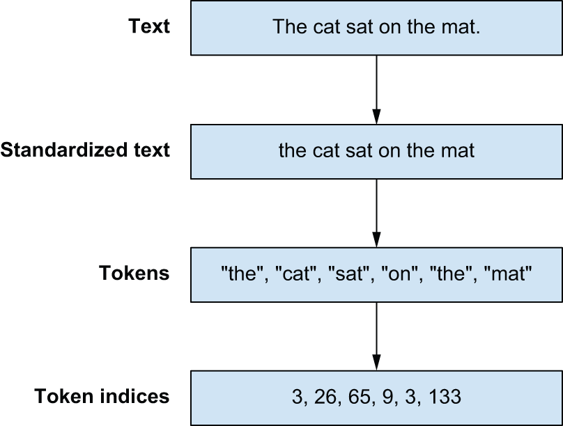
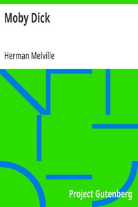
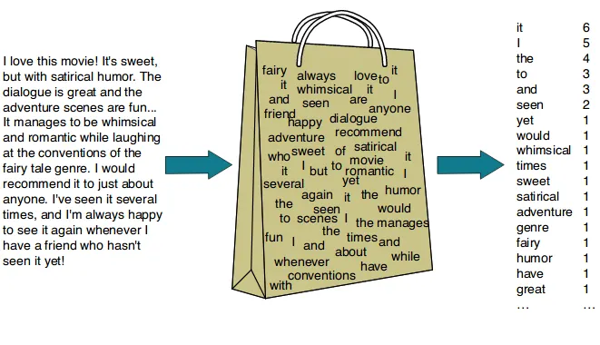
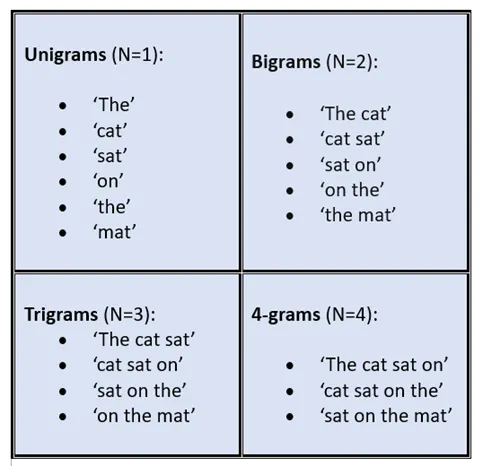

```{r}
#| echo: false
#| message: false
#| warning: false

library("gt")
```


# Overview

This is a glance at the materials in Chapter 14---**Text Classification**---of [Deep Learning with Python](https://deeplearningwithpython.io/chapters/) by Francois Chollet and Matthew Watson

Previously:

* Chapter 3: PyTorch
* Chapter 8: Image Classification
* Chapter 13: Time Series Forecasting


# History

::: {.callout-note}
## Natural Languages

> With human language, it’s the reverse: usage comes first, and rules arise later. **Natural language** was shaped by an evolutionary process, much like biological organisms — that’s what makes it “natural.” Its “rules,” like the grammar of English, were formalized after the fact

:::

:::: {.columns}

::: {.column width="45%"}
## Rules-Based NLP	

* 1950s: grammar rules
* 1990s: decision trees
:::

::: {.column width="10%"}
	
:::

::: {.column width="45%"}
## Statistics-Based NLP

* 1990s: logistic regression
* 2010s: LSTMs
:::

::::

::: {.callout-note}
## Applications

* text classification
* translation
* language modeling

:::


# Preparing Text Data

## Regular Expressions

### Character Split

```{python}
#| eval: FALSE

import regex as re

def split_chars(text):
    return re.findall(r".", text)
    
chars = split_chars("The quick brown fox jumped over the lazy dog.")
chars[:12]
# ["T", "h", "e", " ", "q", "u", "i", "c", "k", " ", "b", "r"]    
```


### Word Split

```{python}
#| eval: FALSE

def split_words(text):
    return re.findall(r"[\w]+|[.,!?;]", text)
    
split_words("The quick brown fox jumped over the dog.")
# ["The", "quick", "brown", "fox", "jumped", "over", "the", "dog", "."]   
```

## Vocabulary

::: {.callout-note collapse="true"}
### Vocabulary

```{python}
#| eval: FALSE
vocabulary = {
    "[UNK]": 0,
    "the": 1,
    "quick": 2,
    "brown": 3,
    "fox": 4,
    "jumped": 5,
    "over": 6,
    "dog": 7,
    ".": 8,
}
```
:::

```{python}
#| eval: FALSE
words = split_words("The quick brown fox jumped over the lazy dog.")
indices = [vocabulary.get(word, 0) for word in words]
# [0, 2, 3, 4, 5, 6, 1, 0, 7, 8]
```

::: {.callout-tip}
## Three Stages for Preprocessing Text

:::: {style = "font-size:2.0em;"}
:::: {.columns}

::: {.column width="45%"}
1. Standardization
2. Splitting
3. Indexing
:::

::: {.column width="10%"}
	
:::

::: {.column width="45%"}

:::

::::
::::
:::

## Case Study: Moby Dick

:::: {.columns}

::: {.column width="45%"}
	
:::

::: {.column width="10%"}
	
:::

::: {.column width="45%"}

:::

::::

```{python}
#| eval: FALSE
filename = keras.utils.get_file(
    origin="https://www.gutenberg.org/cache/epub/2701/pg2701.txt", #updated link
)
moby_dick = list(open(filename, "r"))
```

# Tokenizers

## Character Tokenization

::: {.callout-note collapse="true"}
### CharTokenizer

```{python}
#| eval: FALSE
class CharTokenizer:
    def __init__(self, vocabulary):
        self.vocabulary = vocabulary
        self.unk_id = vocabulary["[UNK]"]

    def standardize(self, inputs):
        return inputs.lower()

    def split(self, inputs):
        return re.findall(r".", inputs)

    def index(self, tokens):
        return [self.vocabulary.get(t, self.unk_id) for t in tokens]

    def __call__(self, inputs):
        inputs = self.standardize(inputs)
        tokens = self.split(inputs)
        indices = self.index(tokens)
        return indices

def compute_char_vocabulary(inputs, max_size):
    char_counts = collections.Counter()
    for x in inputs:
        x = x.lower()
        tokens = re.findall(r".", x)
        char_counts.update(tokens)
    vocabulary = ["[UNK]"]
    most_common = char_counts.most_common(max_size - len(vocabulary))
    for token, count in most_common:
        vocabulary.append(token)
    return dict((token, i) for i, token in enumerate(vocabulary))
```
:::

```{python}
#| eval: FALSE
vocabulary = compute_char_vocabulary(moby_dick, max_size=100)
char_tokenizer = CharTokenizer(vocabulary)
print("Line length:", len(char_tokenizer("Call me Ishmael. Some years ago--never mind how long precisely.")))
```

```
Vocabulary length: 80
Vocabulary start: ['[UNK]', ' ', 'e', 't', 'a', 'o', 'n', 'i', 's', 'h']
Vocabulary end: ['ו', '\u200e', 'ϰ', 'η', 'τ', 'ο', 'ς', 'â', '%', '+']
Line length: 63
```

## Word Tokenization

::: {.callout-note collapse="true"}
### WordTokenizer

```{python}
#| eval: FALSE
class WordTokenizer:
    def __init__(self, vocabulary):
        self.vocabulary = vocabulary
        self.unk_id = vocabulary["[UNK]"]

    def standardize(self, inputs):
        return inputs.lower()

    def split(self, inputs):
        return re.findall(r"[\w]+|[.,!?;]", inputs)

    def index(self, tokens):
        return [self.vocabulary.get(t, self.unk_id) for t in tokens]

    def __call__(self, inputs):
        inputs = self.standardize(inputs)
        tokens = self.split(inputs)
        indices = self.index(tokens)
        return indices

def compute_word_vocabulary(inputs, max_size):
    word_counts = collections.Counter()
    for x in inputs:
        x = x.lower()
        tokens = re.findall(r"[\w]+|[.,!?;]", x)
        word_counts.update(tokens)
    vocabulary = ["[UNK]"]
    most_common = word_counts.most_common(max_size - len(vocabulary))
    for token, count in most_common:
        vocabulary.append(token)
    return dict((token, i) for i, token in enumerate(vocabulary))
```
:::

```{python}
#| eval: FALSE
vocabulary = compute_word_vocabulary(moby_dick, max_size=2_000)
word_tokenizer = WordTokenizer(vocabulary)
print("Line length:", len(word_tokenizer("Call me Ishmael. Some years ago--never mind how long precisely.")))
```

```
Vocabulary length: 2000
Vocabulary start: ['[UNK]', ',', 'the', '.', 'of']
Vocabulary end: ['fashion', 'lovely', 'steadily', 'fastened', 'birds']
Line length: 13
```

::::: {.panel-tabset}

## Choice

::: {.callout-warning}
### Which Route do we Choose?

:::: {style = "font-size:1.5em;"}
:::: {.columns}

::: {.column width="45%"}
#### Characters

* smaller vocabulary
* limited semantics

:::

::: {.column width="10%"}
	
:::

::: {.column width="45%"}
#### Words

* scalable vocabulary
* exponential growth
:::

::::
::::
:::

## Advice

::: {.callout-tip}
### Goldilocks Principle!

:::: {style = "font-size:3.0em;"}
* Subword Tokenization
* Byte-Pair Encoding (BPE)
::::
:::

:::::


## Byte-Pair Encoding

::: {.callout-note collapse="true"}
### BPE

```{python}
#| eval: FALSE
def count_pairs(counts):
    pairs = collections.Counter()
    for word, freq in counts.items():
        symbols = word.split()
        for pair in zip(symbols[:-1], symbols[1:]):
            pairs[pair] += freq
    return pairs

def merge_pair(counts, first, second):
    # Matches an unmerged pair
    split = re.compile(f"(?<!\S){first} {second}(?!\S)")
    # Replaces all occurances with a merged version
    merged = f"{first}{second}"
    return {split.sub(merged, word): count for word, count in counts.items()}
  
for i in range(10):
    pairs = count_pairs(counts)
    first, second = max(pairs, key=pairs.get)
    counts = merge_pair(counts, first, second)
    print(list(counts.keys()))
```
:::

```
['t h e', 'q u i c k', 'b r ow n', 'f o x', 's l ow', 'f o x h o u n d']
['th e', 'q u i c k', 'b r ow n', 'f o x', 's l ow', 'f o x h o u n d']
['the', 'q u i c k', 'b r ow n', 'f o x', 's l ow', 'f o x h o u n d']
['the', 'q u i c k', 'br ow n', 'f o x', 's l ow', 'f o x h o u n d']
['the', 'q u i c k', 'brow n', 'f o x', 's l ow', 'f o x h o u n d']
['the', 'q u i c k', 'brown', 'f o x', 's l ow', 'f o x h o u n d']
['the', 'q u i c k', 'brown', 'fo x', 's l ow', 'fo x h o u n d']
['the', 'q u i c k', 'brown', 'fox', 's l ow', 'fox h o u n d']
['the', 'qu i c k', 'brown', 'fox', 's l ow', 'fox h o u n d']
['the', 'qui c k', 'brown', 'fox', 's l ow', 'fox h o u n d']
```


## Subword Tokenization

::: {.callout-note collapse="true"}
### Subword Tokenizer

```{python}
#| eval: FALSE
def compute_sub_word_vocabulary(dataset, vocab_size):
    counts = count_and_split_words(dataset)

    char_counts = collections.Counter()
    for word in counts:
        for char in word.split():
            char_counts[char] += counts[word]
    most_common = char_counts.most_common()
    vocab = ["[UNK]"] + [char for char, freq in most_common]
    merges = []

    while len(vocab) < vocab_size:
        pairs = count_pairs(counts)
        if not pairs:
            break
        first, second = max(pairs, key=pairs.get)
        counts = merge_pair(counts, first, second)
        vocab.append(f"{first}{second}")
        merges.append(f"{first} {second}")

    vocab = dict((token, index) for index, token in enumerate(vocab))
    merges = dict((token, rank) for rank, token in enumerate(merges))
    return vocab, merges
  
class SubWordTokenizer:
    def __init__(self, vocabulary, merges):
        self.vocabulary = vocabulary
        self.merges = merges
        self.unk_id = vocabulary["[UNK]"]

    def standardize(self, inputs):
        return inputs.lower()

    def bpe_merge(self, word):
        while True:
            # Matches all symbol pairs in the text
            pairs = re.findall(r"(?<!\S)\S+ \S+(?!\S)", word, overlapped=True)
            if not pairs:
                break
            # We apply merge rules in "rank" order. More frequent pairs
            # are merged first.
            best = min(pairs, key=lambda pair: self.merges.get(pair, 1e9))
            if best not in self.merges:
                break
            first, second = best.split()
            split = re.compile(f"(?<!\S){first} {second}(?!\S)")
            merged = f"{first}{second}"
            word = split.sub(merged, word)
        return word

    def split(self, inputs):
        tokens = []
        # Split words
        for word in re.findall(r"[\w]+|[.,!?;]", inputs):
            # Joins all characters with a space
            word = " ".join(re.findall(r".", word))
            # Applies byte-pair encoding merge rules
            word = self.bpe_merge(word)
            tokens.extend(word.split())
        return tokens

    def index(self, tokens):
        return [self.vocabulary.get(t, self.unk_id) for t in tokens]

    def __call__(self, inputs):
        inputs = self.standardize(inputs)
        tokens = self.split(inputs)
        indices = self.index(tokens)
        return indices
```
:::

```
Vocabulary length: 2000
Vocabulary start: ['[UNK]', 'e', 't', 'a', 'o', 'n', 'i', 's', 'h', 'r']
Vocabulary end: ['mariners', 'height', 'certainly', 'sor', 'sist', 'similar', 'aught']
Line length: 16
Time elapsed: 89.45 seconds

```

# Sets

## Case Study: IMDb Reviews

:::: {.columns}

::: {.column width="30%"}


### Classification

* positive?
* negative?
:::

::: {.column width="10%"}
	
:::

::: {.column width="60%"}
```{python}
#| eval: false

print(textwrap.fill(
    open(imdb_extract_dir / "train" / "pos" / "4078_10.txt", "r").read(),
    width = 60))
```

> This is one of my all time favorite movies, PERIOD. I can't
think of another movie that combines so many nice movie
qualities like this one does. This flick has it all: Action,
Adventure, Science Fiction, Good vs. Bad and even some
Romance (without even an innocent "peck" on the cheek
between the Pazu and Sheeta). Maybe best of all, you don't
have to be in Mensa to "get it" and enjoy the movie like you
do with some of Miyazaki's other movies (I don't know about
you, but I watch movies to take a break from thinking). This
is just a flat-out enjoyable movie that everyone will like,
so do yourself a favor and go buy it. The only sour note is
the American Dubbing. I found Vander-Geek to be just plain
annoying. But all is not lost, the original Japanese version
is on the two-disc set and it rocks! Who cares if you can't
understand spoken Japanese? If you can read at a second-
grade level then watch the original Japanese recording with
English subtitles. You won't regret it.

:::

::::


## Bag of Words (BOW)

:::: {.columns}

::: {.column width="45%"}


* image source: [Rahul Sharma](https://medium.com/@coffee_and_notes/nlp-explain-bag-of-words-3b9fc4f211e8)	
:::

::: {.column width="10%"}
	
:::

::: {.column width="45%"}
* batch size: 32
* vocabulary size: 20000 words

::: {.callout-warning}
# limitation

Bag-of-words models ignore word *order*
:::

:::

::::

## Bigrams

:::: {.columns}

::: {.column width="45%"}


* image source: [Omar Hankare](https://ompramod.medium.com/exploring-n-grams-the-building-blocks-of-natural-language-understanding-d40a7a309d12)	
:::

::: {.column width="10%"}
	
:::

::: {.column width="45%"}
* batch size: 32
* vocabulary size: 30000 bigrams

::: {.callout-warning}
# limitation

n-gram models grow rapidly
:::

:::

::::


# Sequences

## Padding

::: {.callout-tip}
### Padding

Ensure that sequences have the same length to speed up training
:::

```{python}
#| eval: false

print(x.shape)
print(x)
```


```
(32, 600)
[[   11   139    26 ...     0     0     0]
 [    7     9   372 ...     0     0     0]
 [14107    16   419 ...     0     0     0]
 ...
 [   10   152   920 ...     0     0     0]
 [    2    64     5 ...     0     0     0]
 [    2   116    14 ...     0     0     0]]
```

# Sequence Models

::: {.callout-note}
# Device

> Text preprocessing is unique because it must always run on a CPU. GPUs strictly
handle numeric inputs, so all tokenization must happen before your GPU’s train step.

:::

::: {.callout-tip}
# Bottleneck

> The name of the game when preprocessing text input on the fly is to be “fast enough.” You want to ensure your expensive GPUs always have a new batch of preprocessed data to ingest. If you do that, the GPU is the bottleneck, and there is nothing to gain by improving your tokenization speed.

:::

# Wrap Up

```{r}
#| echo: false
model_name <- c("bag of words", "bigram", "LSTM with one-hot", "LSTM with embedding", "CBOW, pre-trained embedding")
param_count <- c("20k", "30k", "15.4M", "2.0M", "3.9M")
time_sec <- c(2, 2.1, NA, 33, 32)
test_acc <- c(0.8890, 0.9021, 0.8481, 0.8122, 0.8247)

results_df <- data.frame(
  model_name, param_count, time_sec, test_acc
)
```

```{r}
#| echo: false
results_df |>
  gt() |>
  cols_align(align = "center") |>
  tab_footnote(footnote = "training time, in seconds, per epoch",
               locations = cells_column_labels(columns = time_sec)) |>
  tab_footnote(footnote = "Source: Deep Learning with Python") |>
  tab_header(
    title = "Text Classification",
    subtitle = "IMDb Reviews Dataset"
  ) |>
  tab_style(
    style = cell_text(weight = "bold"),
    locations = cells_column_labels()
  ) |>
  tab_style(
    style = list(cell_fill(color = "#E77500"),
                 cell_text(color = "#121212",
                           weight = "bold")),
    locations = cells_body(columns = model_name)
  ) |>
  tab_style(
    style = list(cell_fill(color = "#E77500"),
                 cell_text(color = "#121212",
                           weight = "bold")),
    locations = cells_body(columns = test_acc,
                           rows = test_acc == max(test_acc))
  )
```


::: {.callout-note collapse="true"}
# Session Info

```{r}
sessionInfo()
```
:::


:::: {.columns}

::: {.column width="45%"}
	
:::

::: {.column width="10%"}
	
:::

::: {.column width="45%"}

:::

::::

::::: {.panel-tabset}


:::::