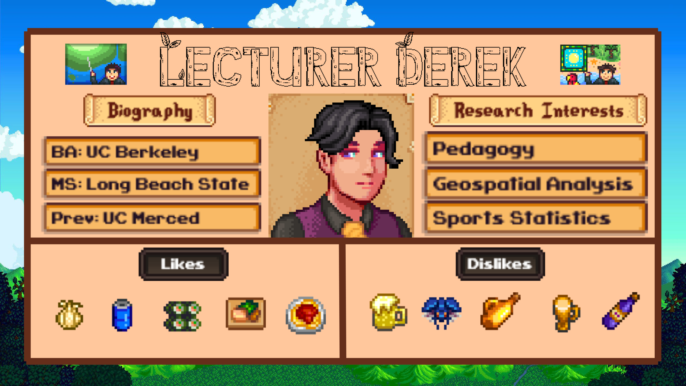
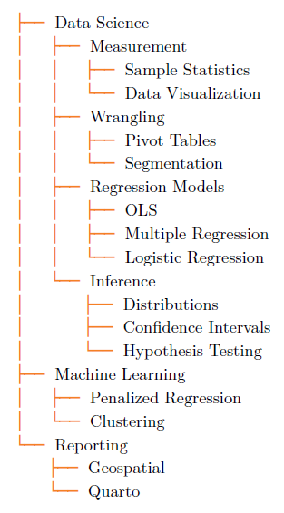
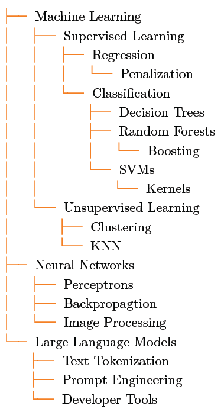
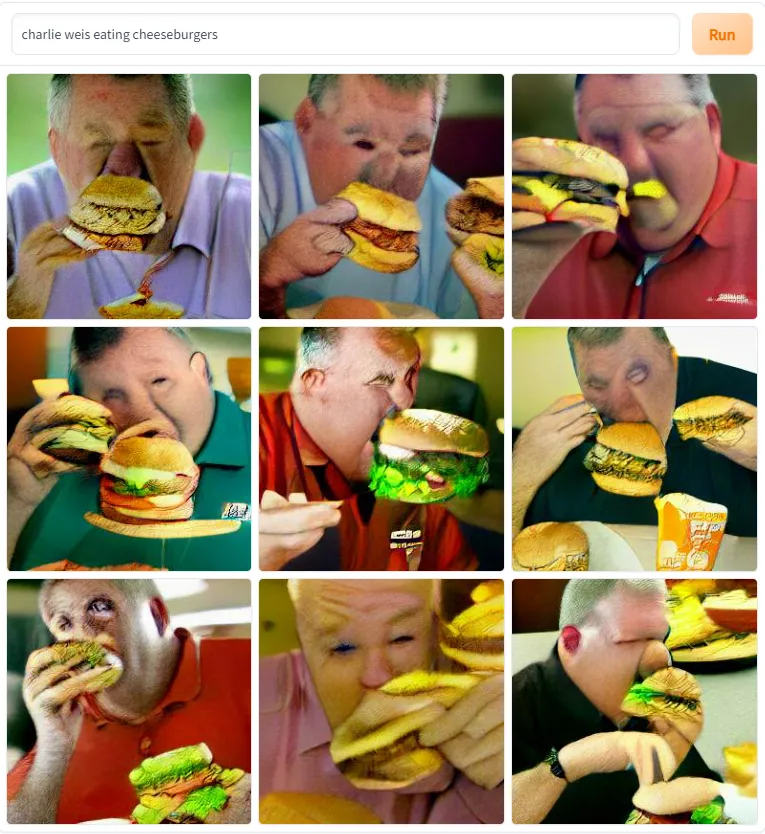
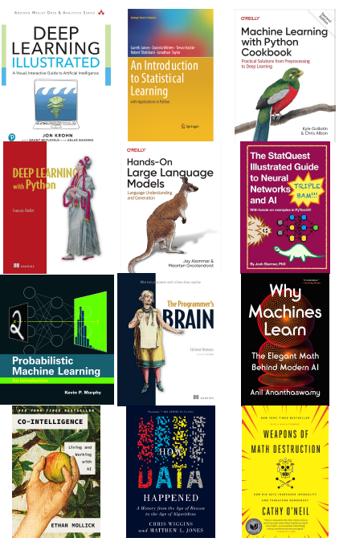
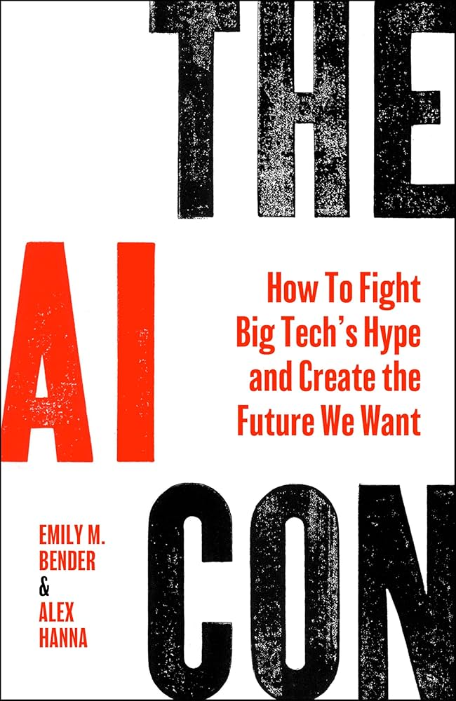
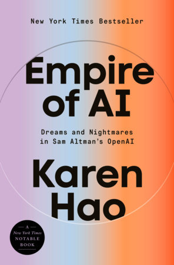
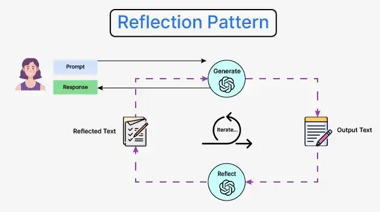
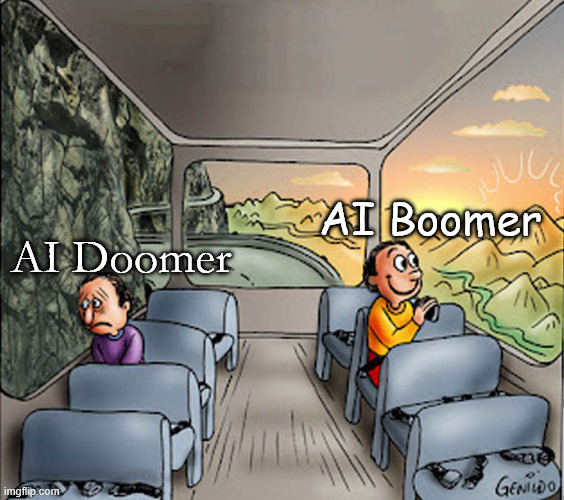

 ---
title: "NIST FALCON: AI Chat"
author: "Derek Sollberger"
date: "2026-03-27"
format:
  html:
    toc: true
---

# Instructors' Statements of Artificial Intelligence Use in the Classroom

# Introductions

:::: {.columns}

::: {.column width="60%"}
## NIST FALCON
### AI Chat

**Seminar Goal**: update educator community about current trends in artificial intelligence

**Seminar Objectives**:

* recap generative AI
* ponder AI resilience
* draft syllabi statements
* answer concerns

:::

::: {.column width="10%"}
	
:::

::: {.column width="30%"}


* image source: [NIST FALCON](https://www.niscientificteaching.org/event-details/instructors-statements-of-artificial-intelligence-use-in-the-classroom)
:::

::::


## Presentor



## Princeton Courses

:::: {.columns}

::: {.column width="45%"}

* sophomore level
* 160 students


:::

::: {.column width="10%"}
	
:::

::: {.column width="45%"}

* junior level
* 60 students


:::

::::


## Definitions

:::: {.columns}

::: {.column width="60%"}
**Statistics**:  Models that express probabilistic approaches

**Machine Learning**: Algorithms that modify models and parameters

**Artificial Intelligence**: Reshaping models and hyperparameters
:::

::: {.column width="10%"}
	
:::

::: {.column width="30%"}


[image source](https://www.onefootdown.com/2022/6/21/23175949/notre-dame-football-immersive-and-horrifying-dall-e-mini-art-experience-gumbo-pitbull-cheeseburgers)
:::

::::


## Generative AI

:::: {.columns}

::: {.column width="45%"}
**Generative artificial intelligence** methods produce novel text, images, sound, video, etc.; from training data.	
:::

::: {.column width="10%"}
	
:::

::: {.column width="45%"}


[image source](https://www.geeky-gadgets.com/stable-diffusion-sdxl-beginners-guide/)
:::

::::


## Journey

:::: {.columns}

::: {.column width="45%"}

:::::: {style="font-size: 1.5em;"}
Over the past 3 years, I have read over 20 books about artificial intelligence.	
::::::

:::

::: {.column width="10%"}
	
:::

::: {.column width="45%"}

:::

::::


# Explorations

## Games

:::: {.columns}

::: {.column width="45%"}
	
:::

::: {.column width="10%"}
	
:::

::: {.column width="45%"}
"In 1990, AI researcher and Dartmouth conference attendee John McCarthy popularized Soviet mathematician Aleksandr Kronrad's phrase

> chess is the *Drosophila* of AI

because, he believed, the game was an efficient way to do rapid experimentation towards a long-term goal." --- page 154
:::

::::

## Progression

:::: {.columns}

::: {.column width="45%"}


[image source](https://www.onefootdown.com/2022/6/21/23175949/notre-dame-football-immersive-and-horrifying-dall-e-mini-art-experience-gumbo-pitbull-cheeseburgers)	
:::

::: {.column width="10%"}
	
:::

::: {.column width="45%"}


[image source](https://www.geeky-gadgets.com/stable-diffusion-sdxl-beginners-guide/)
:::

::::


## Synthesis

:::: {.columns}

::: {.column width="45%"}

:::

::: {.column width="10%"}
	
:::

::: {.column width="45%"}
* "June 2022 ... [Bill Gates] told the team that he would only start paying attention once GPT-4 **scored a 5 on an AP Biology test**---AP Bio because he felt it tested critical scientific thinking rather than a memorization of facts." --- page 245

* "By late August ...
:::

::::


## Plagiarism

:::: {.columns}

::: {.column width="30%"}

:::

::: {.column width="10%"}
	
:::

::: {.column width="60%"}
* "**Turnitin**, one of the most popular plagiarism detection systems (so much so that it is integrated with many learning management systems), released an AI detection tool that they argue is highly accurate. So accurate, they say, that it has a 1 percent false-positive rate."
* "**OpenAI** itself has admitted, in a blog post geared toward educators, that AI detectors don't work, or at least are not reliable enought to be used by educators to accuse students of using the tools." --- page 93
:::

::::


## Think Pair Share

:::: {.columns}

::: {.column width="45%"}

:::::: {style="font-size: 1.5em;"}
What have been some of your concerns about generative AI as the progression in technology have affected educators and students?	
::::::
	
:::

::: {.column width="10%"}
	
:::

::: {.column width="45%"}


* image credit: [The English Classroom](https://the-english-classroom.com/blog/think-pair-share-formative-assessment-for-the-classroom/)
:::

::::


# Syllabi Statements

## Broad Examples

The following examples are from The McGraw Center for Teaching and Learning at Princeton University.

::: {.callout-note collapse="true"}
### Example 1

All assignments (including drafts) you submit for this course must be your own work, and not generated by AI. Representing output generated by or derived from GAI as your own work is a violation of the University’s academic regulations (see RRR 2.4.6.). You may use AI for background research – not content generation – in which case you are responsible for verifying the output and disclosing your use by including a record of your prompts and the AI’s output along with your assignment. Please note that you may not make use of AI tools to summarize course readings or to edit your prose. 
:::

::: {.callout-note collapse="true"}
### Example 2

Intellectual honesty is vital to an academic community and for my fair evaluation of your work. All work submitted in this course (including drafts) must be your own, completed in accordance with the University’s rules, which stipulate that representing output generated by or derived from GAI as your own work is a violation of the University’s academic regulations (see RRR 2.4.6.).
:::

::: {.callout-note collapse="true"}
### Example 3

You may make use of AI tools under limited circumstances. You may use AI on problem sets to check for errors and debug code, and – if you do – you must disclose this use, naming the tool (e.g., “checked for errors using Copilot”). You may not make use of AI to generate code or complete the problems. Failure to comply with this policy constitutes a violation of the University’s academic regulations (see RRR 2.4.6.). Please note that the exams in the course will be timed in-class exams that you will complete without AI assistance of any kind. Failure to comply with this policy constitutes a violation of the University’s academic regulations (see RRR 2.4.6.). 
:::

::: {.callout-note collapse="true"}
### Example 4

This course makes use of Bots++, an AI powered chatbot that has been trained on our course material and can answer questions about course concepts, terminology, and logistics. Your interaction with this chatbot is the only permissible use of AI in the course. In other words, you may not use AI to answer homework questions, complete lab reports, or assist you on the quizzes and exams. Doing so is a violation of the University’s academic regulations (see RRR 2.4.6). 
:::


## Student Concerns

:::: {.columns}

::: {.column width="45%"}

:::::: {style="font-size: 1.25em;"}
When I asked my students (Fall 2025, $n = 60$) to rank the following concerns about data and AI, the results were
::::::
	
:::

::: {.column width="10%"}
	
:::

::: {.column width="45%"}

:::::: {style="font-size: 1.25em;"}
1. Privacy
2. Authenticity
3. Safety
4. Regulation
5. Economics
::::::

:::

::::


## Derek's Syllabus

::: {.callout-important collapse="true"}
## Generative AI Usage by Students

My general guidance for students in SML 201 is that it is permitted to use artificial intelligence tools (such as ChatGPT or Claude large-language models (LLMs) to coach on broad concepts. Students may not have software answer homework or project tasks directly. Students may not upload data sets, exercise questions, data visualization, or model results into LLMs.

Permitted discourse includes

* “How do I make a bar chart in R and ggplot?”
* “Can you help me understand the concept of heteroskedasticity?”
* “For exam preparation, create some multiple-choice questions about confidence intervals”

Prohibited discourse includes:

* “Use this data set and give me summary statistics of the columns”
* “Summarize this graph and give me advice on how to improve it”
* “From the model results, how do we describe the null hypothesis?”
:::

::: {.callout-tip collapse="true"}
## Generative AI Usage from Instructors

Here I want to disclose how the teaching staff may use artificial intelligence tools over the semester.

* Responses for ‘During Class Prompts’ will be summarized through an AI technique called Topic Modeling
* Gradescope submissions are collected and grouped by similar responses and handwriting to speed up grading of common answers.
* Instructors use open-source foundation models offline to ensure student work will not be disseminated to the wider internet nor used to train future foundation models.
* Project data scenarios may be explored through literature searches to see how other researchers approached the data.
:::


## Think Pair Share

:::: {.columns}

::: {.column width="45%"}

:::::: {style="font-size: 1.5em;"}
How have you been refining your syllabi to address the presence of generative AI?
::::::
	
:::

::: {.column width="10%"}
	
:::

::: {.column width="45%"}


* image credit: [The English Classroom](https://the-english-classroom.com/blog/think-pair-share-formative-assessment-for-the-classroom/)
:::

::::


# Quo Vadimus?

## Agentic AI



**Agentic AI** (like having a librarian help you write an essay) creates a feedback loop that

* verifies sources
* refines writing
* strengthens connections between sections
* builds longer essays and reports


## AI Resilience

:::: {.columns}

::: {.column width="45%"}

:::::: {style="font-size: 1.25em;"}
My advice for "AI resilience" and adapting to the ever-changing tech is to simply continue what you have been doing.
::::::
	
:::

::: {.column width="10%"}
	
:::

::: {.column width="45%"}

:::::: {style="font-size: 1.25em;"}
* Flipped classrooms
* Alternative grading
* Universal design for learning
::::::

:::

::::


## Stuck in the Middle



* image source: [Genildo Ronchi](https://knowyourmeme.com/memes/two-guys-on-a-bus)

::: {.callout-tip}
## Takeaway Message

* You can be an AI boomer
* You can be an AI doomer

**Be neither**
:::

## Thanks!

:::: {.columns}

::: {.column width="30%"}

:::

::: {.column width="10%"}
	
:::

::: {.column width="60%"}
Derek Sollberger

* Lecturer of Data Science
* Princeton University

    * Center for Statistics and Machine Learning
    
* dsollberger[at]princeton[dot]edu
:::

::::


::: {.callout-note collapse="true"}
## Session Info

```{r}
sessionInfo()
```
:::


:::: {.columns}

::: {.column width="45%"}
	
:::

::: {.column width="10%"}
	
:::

::: {.column width="45%"}

:::

::::

::::: {.panel-tabset}


:::::