One of my silly side-projects is to organize the dependency chart in the Settlement Survival video game into a `mermaid` diagram (or a similar flow chart). 

```{r}
library("DiagrammeR")
```

I called this settlement "Eugene" since I am currently reading *Crying in H Mart* by Michelle Zauner.  Otherwise, this city creation has nothing to do with the real Oregon town.

I was also reading another history book called *Salt*, and Settlement Survival will allow me to simulate a community that relies on salt exports.

# Settings

I simply play this game on "easy" difficulty settings to relax.  That mainly means that natural disasters will not fall onto Eugene

::: {.callout-note collapse="true"}
## Settings

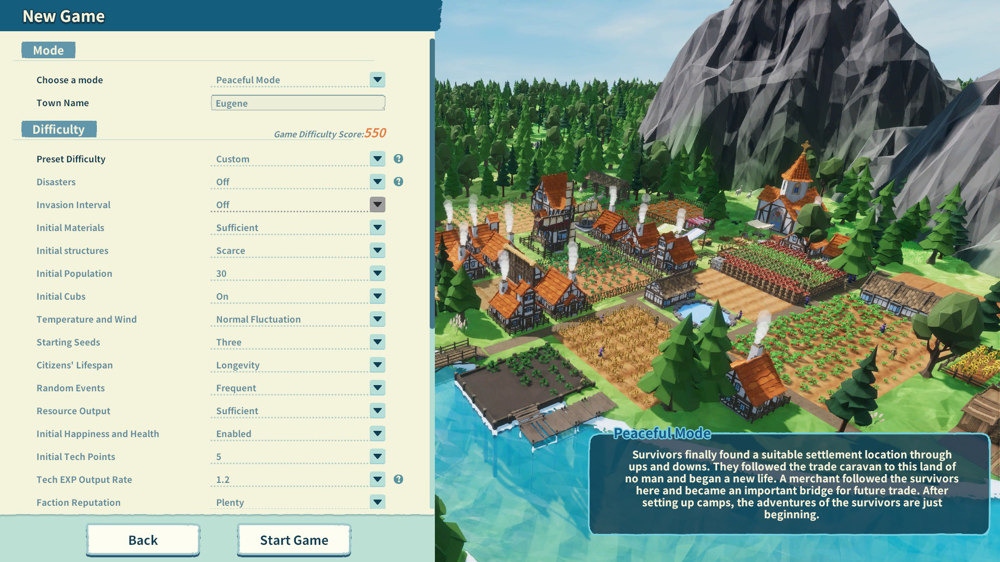

:::

# Settlement

Today, I will start with the beginning of the game---that is, what tends to be built in the first "year".  I am going to take some liberties and actually *add* more prerequisites in the beginning (otherwise, the graph simply starts with about 9 unlinked nodes).

We choose a place that appeared to have promising grounds for hunting and farming while still near to some mountains.

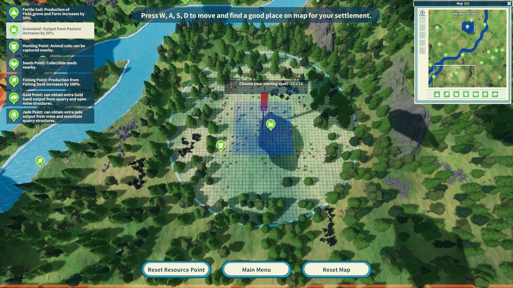

::::: {.panel-tabset}

## Flowchart

```{r}
#| echo: false
#| eval: true
year_1_tree <- DiagrammeR::mermaid("
  graph TD
  start[Select Location]
  
  house1[1 House]
  fields[3 Standard Fields]
  water[Big Well]
  forest_hut[Forester's Hut]
  gather_hut[Gatherer's Hut]
  hunter_hut[Hunter's Hut]
  chopping_house[Chopping House]
  house10[10 Houses]
  
  start --> house1
  start --> fields
  start --> water
  start --> hunter_hut
  
  house1 --> house10
  fields --> forest_hut
  water --> gather_hut
  hunter_hut --> chopping_house
")

# print
year_1_tree
```

## Code

```{r}
#| echo: true
#| eval: false
year_1_tree <- DiagrammeR::mermaid("
  graph TD
  start[Select Location]
  
  house1[1 House]
  fields[3 Standard Fields]
  water[Big Well]
  forest_hut[Forester's Hut]
  gather_hut[Gatherer's Hut]
  hunter_hut[Hunter's Hut]
  chopping_house[Chopping House]
  house10[10 Houses]
  
  start --> house1
  start --> fields
  start --> water
  start --> hunter_hut
  
  house1 --> house10
  fields --> forest_hut
  water --> gather_hut
  hunter_hut --> chopping_house
")

# print
year_1_tree
```

:::::

## Houses and Farms

The initial 30 settlers want at least `7 houses` to comfortably live with their families.

Meanwhile, we start with `3 standard fields` to grow food

* 2 fields of cabbages
* one field of chili peppers

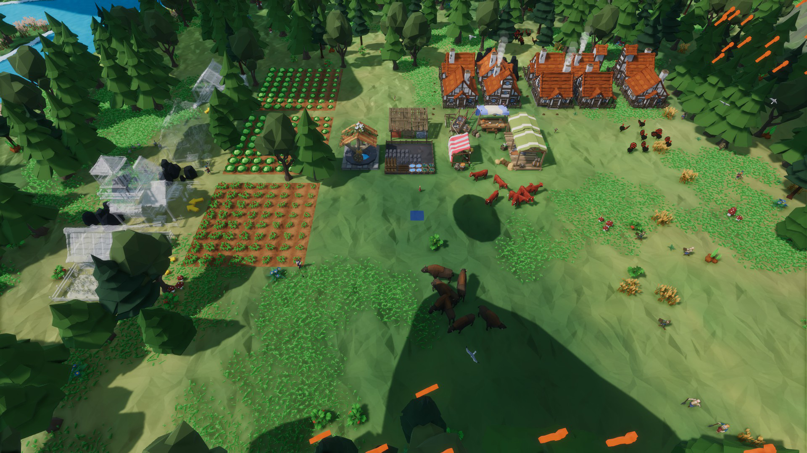

## Division of Labor

After the farmers sow seeds for the year, I send some to build a `Forester's Hut` out in the woods to coordinate the chopping down of trees to get fuel for to survive the first winter.

Some folks quickly make a `Big Well` and one of them works as a water deliverer.  Others move out to the forest too to build a `Gatherer's Hut` to gather wild herbs and berries.

::: {.callout-tip collapse="true"}
## Forestry

You can toggle the desire for the foresters to

* fell trees
* plant trees

For instance, by telling the forester to not chop down trees, a lush forest will grow around the `Forester's Hut`, which may be better for the *nearby* `Gatherer's Hut`.  You can always ask the townsfolk at large to chop down trees when needed.

:::

A hunter also went out in to the woods to build a `Hunter's Hut`, but the town has a higher priority to have firewood, so the crew is sent back into the main village to build a `Chopping House`.

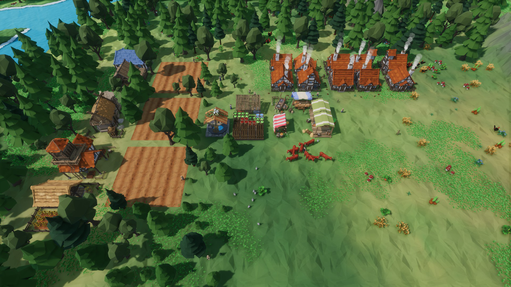

Early ambition leads to some surplus of supplies, so we spend a **tech point** to learn how to build a `Warehouse` for storage.


# Community

After surviving the first winter on the inventory that we arrived with at the marketplace, our main priorities are to grow crops for sustenance and chopping wood for survival.  Nevertheless, the townsfolk want to build a community, so let us build 

* a `Chapel` (for the game mechanic of happiness)
* a `Clinic` (for the game mechanic of health)
* a `School` (game mechanic where educated people are more productive at their jobs)
* 2 `Latrine` (a lot of city planning is "Where does the poop go?")

::::: {.panel-tabset}

## Flowchart

```{r}
#| echo: false
#| eval: true
year_2_tree <- DiagrammeR::mermaid("
  graph TD
  start[Select Location]
  
  house1[1 House]
  fields[3 Standard Fields]
  water[Big Well]
  forest_hut[Forester's Hut]
  gather_hut[Gatherer's Hut]
  hunter_hut[Hunter's Hut]
  chopping_house[Chopping House]
  house10[10 Houses]
  chapel[Chapel]
  clinic[Clinic]
  school[School]
  latrine[2 Latrines]
  
  start --> house1
  start --> fields
  start --> water
  start --> hunter_hut
  
  house1 --> house10
  fields --> forest_hut
  water --> gather_hut
  hunter_hut --> chopping_house
  
  house10 --> chapel
  forest_hut --> clinic
  gather_hut --> school
  chopping_house --> latrine
")

# print
year_2_tree
```

## Code

```{r}
#| echo: true
#| eval: false
year_2_tree <- DiagrammeR::mermaid("
  graph TD
  start[Select Location]
  
  house1[1 House]
  fields[3 Standard Fields]
  water[Big Well]
  forest_hut[Forester's Hut]
  gather_hut[Gatherer's Hut]
  hunter_hut[Hunter's Hut]
  chopping_house[Chopping House]
  house10[10 Houses]
  chapel[Chapel]
  clinic[Clinic]
  school[School]
  latrine[2 Latrines]
  
  start --> house1
  start --> fields
  start --> water
  start --> hunter_hut
  
  house1 --> house10
  fields --> forest_hut
  water --> gather_hut
  hunter_hut --> chopping_house
  
  house10 --> chapel
  forest_hut --> clinic
  gather_hut --> school
  chopping_house --> latrine
")

# print
year_2_tree
```

:::::

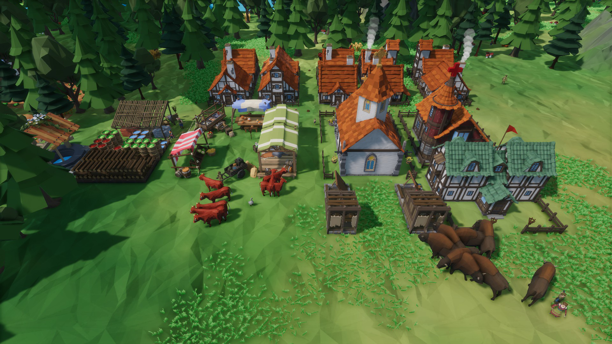


# Immigration

The original settlers are a little homesick and want some more of the variety that their former towns had.  Alas, we don't have many people leftover to take on new jobs, so we need to welcome immigrants to our settlement.  This means demand for new homes to house them all and a `Town Hall` for these official matters.

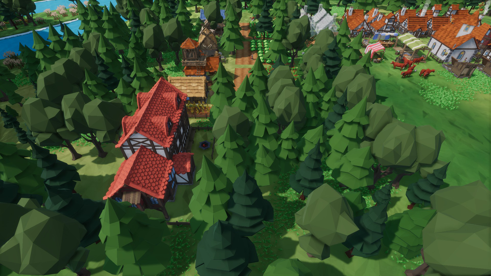

::::: {.panel-tabset}

## Flowchart

```{r}
#| echo: false
#| eval: true
year_3_tree <- DiagrammeR::mermaid("
  graph TD
  start[Select Location]
  
  house1[1 House]
  fields[3 Standard Fields]
  water[Big Well]
  forest_hut[Forester's Hut]
  gather_hut[Gatherer's Hut]
  hunter_hut[Hunter's Hut]
  chopping_house[Chopping House]
  house10[10 Houses]
  chapel[Chapel]
  clinic[Clinic]
  school[School]
  latrine[2 Latrines]
  town_hall[Town Hall]
  
  start --> house1
  start --> fields
  start --> water
  start --> hunter_hut
  
  house1 --> house10
  fields --> forest_hut
  water --> gather_hut
  hunter_hut --> chopping_house
  
  house10 --> chapel
  forest_hut --> clinic
  gather_hut --> school
  chopping_house --> latrine
  
  chapel --> town_hall
  clinic --> town_hall
  school --> town_hall
  latrine --> town_hall
")

# print
year_3_tree
```

## Code

```{r}
#| echo: true
#| eval: false
year_3_tree <- DiagrammeR::mermaid("
  graph TD
  start[Select Location]
  
  house1[1 House]
  fields[3 Standard Fields]
  water[Big Well]
  forest_hut[Forester's Hut]
  gather_hut[Gatherer's Hut]
  hunter_hut[Hunter's Hut]
  chopping_house[Chopping House]
  house10[10 Houses]
  chapel[Chapel]
  clinic[Clinic]
  school[School]
  latrine[2 Latrines]
  town_hall[Town Hall]
  
  start --> house1
  start --> fields
  start --> water
  start --> hunter_hut
  
  house1 --> house10
  fields --> forest_hut
  water --> gather_hut
  hunter_hut --> chopping_house
  
  house10 --> chapel
  forest_hut --> clinic
  gather_hut --> school
  chopping_house --> latrine
  
  chapel --> town_hall
  clinic --> town_hall
  school --> town_hall
  latrine --> town_hall
")

# print
year_3_tree
```


## Admin

:::: {.columns}

::: {.column width="50%"}
Upon reaching a population of 50, we elected an administrator to start to oversee matters.  The wise Elma uses her scholarly expertise to increase processing proficiency.

The other candidate was personable too, but ran on a platform of increased mercantile arrivals (but we don't have any docks yet).
:::

::: {.column width="10%"}
<!-- empty column to create gap -->
:::

::: {.column width="40%"}
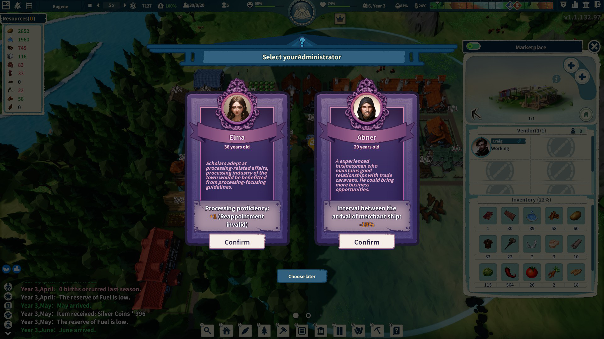
:::

::::

:::::


# Clothes

The next priority is producing clothes.  The villagers have the tailor skills to make `rough clothes`, but they also need a supply chain of leather, so we define a 6x6 space for a `pasture`.  The villagers then herded the cows into the pasture.

::::: {.panel-tabset}

## Flowchart

```{r}
#| echo: false
#| eval: true
tailor_tree <- DiagrammeR::mermaid("
  graph TD
  town_hall[Town Hall]
  pasture[Pasture]
  tailor[Tailor]
  
  town_hall --> pasture
  pasture --> tailor
")

# print
tailor_tree 
```

## Code

```{r}
#| echo: true
#| eval: false
tailor_tree <- DiagrammeR::mermaid("
  graph TD
  town_hall[Town Hall]
  pasture[Pasture]
  tailor[Tailor]
  
  town_hall --> pasture
  pasture --> tailor
")

# print
tailor_tree 
```

:::::

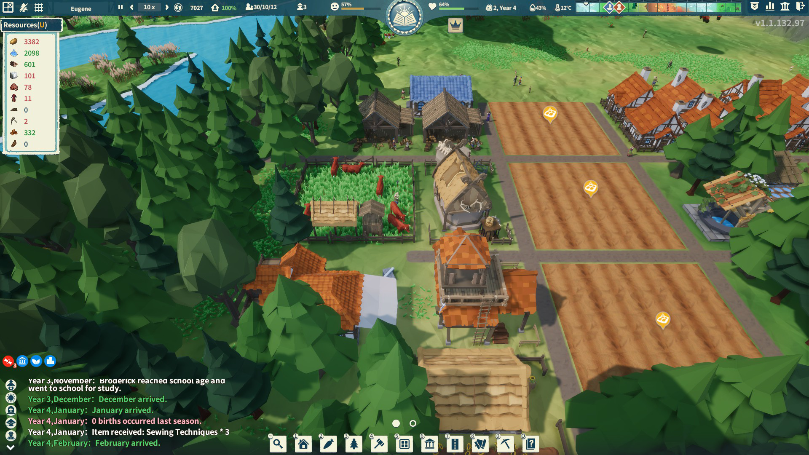

We also welcomed our first set of immigrants.  Alas, there was one who might have a bit of cholera, but fortunately we have a doctor who is working on that case (along with the usual workplace injuries.)

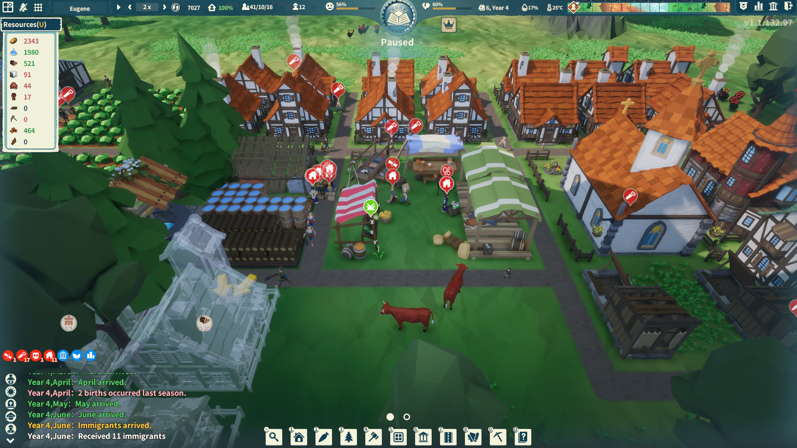


# Mining

In this magical land, the trees grow back quickly, so having enough lumber is easy to achieve.  However, stone and iron ore do not replenish in the grassy valleys, so we ask the young laborers to excavate 

* a `Mine` in a mountainside
* a `Quarry` across the road

Both are indestructible (cannot reclaim the land nor materials), so we placed both features far from the main community areas.

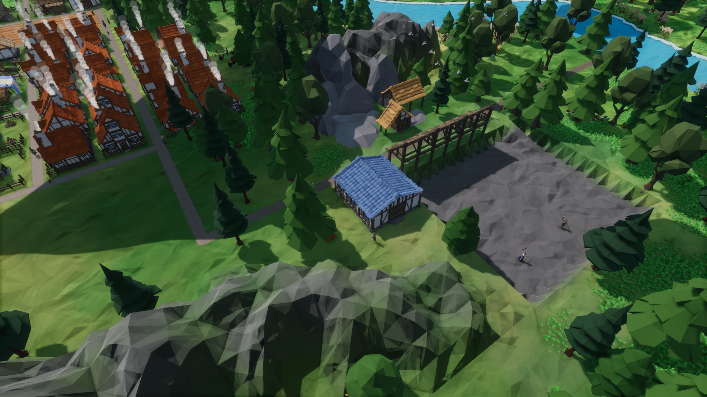

::::: {.panel-tabset}

## Flowchart

```{r}
#| echo: false
#| eval: true
mining_tree <- DiagrammeR::mermaid("
  graph TD
  town_hall[Town Hall]
  mine[Mine]
  pasture[Pasture]
  quarry[Quarry]
  tailor[Tailor]
  smithy[Smithy]
  
  town_hall --> pasture
  pasture --> tailor
  town_hall --> quarry
  quarry --> mine
  mine --> smithy
")

# print
mining_tree 
```

## Code

```{r}
#| echo: true
#| eval: false
mining_tree <- DiagrammeR::mermaid("
  graph TD
  town_hall[Town Hall]
  mine[Mine]
  pasture[Pasture]
  quarry[Quarry]
  tailor[Tailor]
  smithy[Smithy]
  
  town_hall --> pasture
  pasture --> tailor
  town_hall --> quarry
  quarry --> mine
  mine --> smithy
")

# print
mining_tree 
```

:::::


# Dredge

With a steady supply of stone and iron ore (for now), we can look toward the river for more resources.  The clever townsfolk construct 2 `Sandpit`---one to gather sand, and another to gather clay. The sand pits are placed near the warehouses for quick storage.

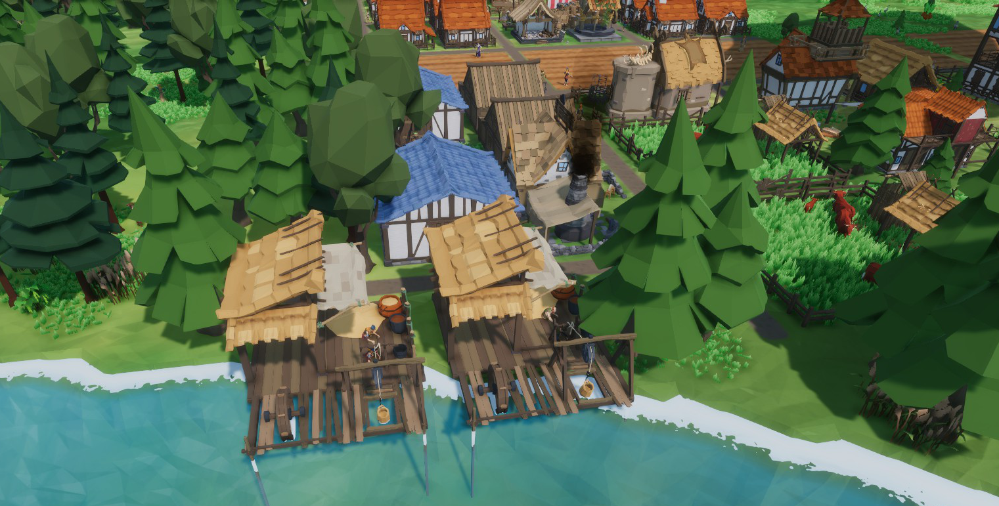


::::: {.panel-tabset}

## Flowchart

```{r}
#| echo: false
#| eval: true
dredge_tree <- DiagrammeR::mermaid("
  graph TD
  town_hall[Town Hall]
  mine[Mine]
  pasture[Pasture]
  quarry[Quarry]
  tailor[Tailor]
  sandpit_clay[Sandpit: Clay]
  sandpit_sand[Sandpit: Sand]
  smithy[Smithy]
  
  town_hall --> pasture
  pasture --> tailor
  
  town_hall --> quarry
  quarry --> mine
  mine --> smithy
  
  quarry --> sandpit_clay
  mine --> sandpit_clay
  quarry --> sandpit_sand
  mine --> sandpit_sand
")

# print
dredge_tree 
```

## Code

```{r}
#| echo: true
#| eval: false
dredge_tree <- DiagrammeR::mermaid("
  graph TD
  town_hall[Town Hall]
  mine[Mine]
  pasture[Pasture]
  quarry[Quarry]
  tailor[Tailor]
  sandpit_clay[Sandpit: Clay]
  sandpit_sand[Sandpit: Sand]
  smithy[Smithy]
  
  town_hall --> pasture
  pasture --> tailor
  
  town_hall --> quarry
  quarry --> mine
  mine --> smithy
  
  quarry --> sandpit_clay
  mine --> sandpit_clay
  quarry --> sandpit_sand
  mine --> sandpit_sand
")

# print
dredge_tree 
```

:::::


# Apriaries

A fad grabbed the attention of entreprenuerial townsfolk, and they built a couple of `Apiary` to raise bees.  We can either gather honey or beeswax at apiaries, and we focus on the latter now by storing surplus beeswax in the warehouses.

::: {.callout-note collapse="true"}
## Commentary on Apiaries

I liked the apiaries in-game because the trade value of beeswax.  However, patches of the game nerfed some abilities to accelerate the growth of settlements (while enhancing other aspects of the game).  Now, the beeswax is no more valuable than selling crops from the fields.  I chose to build 2 apiaries here (along with assigning 3 villagers to each) out of nostalgia.  Furthermore, I liked having a crop (beeswax) that was separate from our main food supplies.

:::

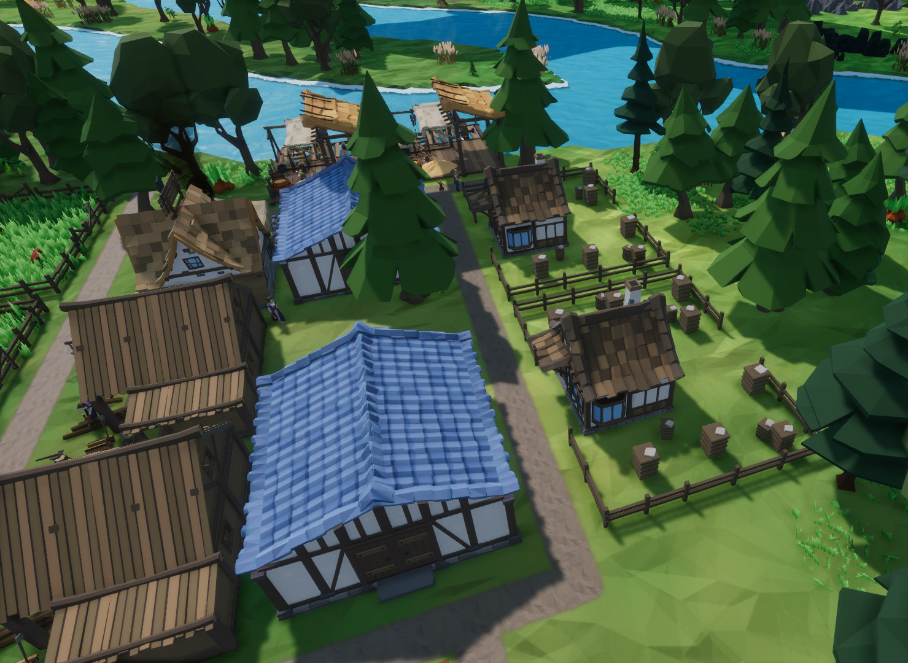

Also, with the growing town, finding animals through the `Hunters Hut` did not produce enough materials for the `Tailor`, so we dedicated some land as a `Pasture` to raise some cows to eventually get a steady supply of fur, fat, and meat.

::::: {.panel-tabset}

## Flowchart

```{r}
#| echo: false
#| eval: true
apiaries_tree <- DiagrammeR::mermaid("
  graph TD
  town_hall[Town Hall]
  mine[Mine]
  quarry[Quarry]
  sandpit_sand[Sand Pit: Sand]
  sandpit_clay[Sand Pit: Clay]
  tailor[Tailor]
  smithy[Smithy]
  apiary[Apriary]
  pasture[Pasture]
  
  town_hall --> mine
  town_hall --> quarry
  
  mine --> sandpit_sand
  quarry --> sandpit_sand
  mine --> sandpit_clay
  quarry --> sandpit_clay
  town_hall --> pasture
  quarry --> smithy
  
  sandpit_sand --> apiary
  sandpit_clay --> apiary
  pasture --> tailor
")

# print
apiaries_tree
```

## Code

```{r}
#| echo: true
#| eval: false
apiaries_tree <- DiagrammeR::mermaid("
  graph TD
  town_hall[Town Hall]
  mine[Mine]
  quarry[Quarry]
  sandpit_sand[Sand Pit: Sand]
  sandpit_clay[Sand Pit: Clay]
  tailor[Tailor]
  smithy[Smithy]
  apiary[Apriary]
  pasture[Pasture]
  
  town_hall --> mine
  town_hall --> quarry
  
  mine --> sandpit_sand
  quarry --> sandpit_sand
  mine --> sandpit_clay
  quarry --> sandpit_clay
  town_hall --> pasture
  quarry --> smithy
  
  sandpit_sand --> apiary
  sandpit_clay --> apiary
  pasture --> tailor
")

# print
apiaries_tree
```

:::::


# Cemetary

A few years into the settlement, alas, some of the villagers passed away.  They requested having ways to mourn the losses, so now there is a cemetary in the corner.

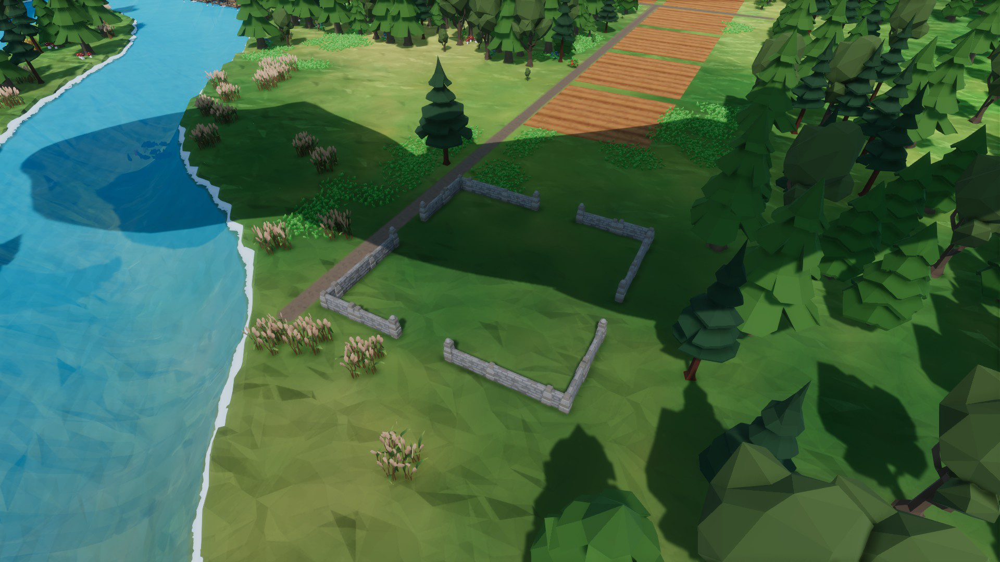

Also, the population growth got close to running out of food, so all of the unemployed villagers where assigned to new farms.

::::: {.panel-tabset}

## Flowchart

```{r}
#| echo: false
#| eval: true
cemetary_tree <- DiagrammeR::mermaid("
  graph TD
  town_hall[Town Hall]
  mine[Mine]
  quarry[Quarry]
  sandpit_sand[Sand Pit: Sand]
  sandpit_clay[Sand Pit: Clay]
  tailor[Tailor]
  smithy[Smithy]
  apiary[Apriary]
  pasture[Pasture]
  cemetary[Cemetary]
  
  town_hall --> mine
  town_hall --> quarry
  
  mine --> sandpit_sand
  quarry --> sandpit_sand
  mine --> sandpit_clay
  quarry --> sandpit_clay
  town_hall --> pasture
  quarry --> smithy
  
  sandpit_sand --> apiary
  sandpit_clay --> apiary
  pasture --> tailor
  smithy --> cemetary
")

# print
cemetary_tree
```

## Code

```{r}
#| echo: true
#| eval: false
cemetary_tree <- DiagrammeR::mermaid("
  graph TD
  town_hall[Town Hall]
  mine[Mine]
  quarry[Quarry]
  sandpit_sand[Sand Pit: Sand]
  sandpit_clay[Sand Pit: Clay]
  tailor[Tailor]
  smithy[Smithy]
  apiary[Apriary]
  pasture[Pasture]
  cemetary[Cemetary]
  
  town_hall --> mine
  town_hall --> quarry
  
  mine --> sandpit_sand
  quarry --> sandpit_sand
  mine --> sandpit_clay
  quarry --> sandpit_clay
  town_hall --> pasture
  quarry --> smithy
  
  sandpit_sand --> apiary
  sandpit_clay --> apiary
  pasture --> tailor
  smithy --> cemetary
")

# print
cemetary_tree
```

:::::


# Trade

While the tailor and smithy are valued members of the community, it seems that production of clothes and tools respectively will not match the needs for a growing settlement. We build a `Small Trading Post` and send out caravans (7 villagers each) to buy those supplies.  We have plenty of flax (from the initial settlement supplies) and beeswax (from the apiaries) to sell in the processes.  I try to obtain each desired good at an amount of double the current population, but also mindful to try to make the caravan have a positive gain in silver coins.

::: {.callout-note collapse="true"}
## Commentary on Insurance

Yes, it seems to be good to always get the insurance (small cost now, but pays out if the caravan trip does not return).  The game has been refined to make the insurance worth it.

We also invest in tech points to augment trade (in the left column of the technology-trade menu):

* Insurance
* Quick Preparation
* Superior Insurance
* Well-Known Reputation

:::

::::: {.panel-tabset}

## Flowchart

```{r}
#| echo: false
#| eval: true
trading_post_tree <- DiagrammeR::mermaid("
  graph TD
  town_hall[Town Hall]
  mine[Mine]
  quarry[Quarry]
  sandpit_sand[Sand Pit: Sand]
  sandpit_clay[Sand Pit: Clay]
  tailor[Tailor]
  smithy[Smithy]
  apiary[Apriary]
  pasture[Pasture]
  cemetary[Cemetary]
  small_trading_post[Small Trading Post]
  
  town_hall --> mine
  town_hall --> quarry
  
  mine --> sandpit_sand
  quarry --> sandpit_sand
  mine --> sandpit_clay
  quarry --> sandpit_clay
  town_hall --> pasture
  quarry --> smithy
  
  sandpit_sand --> apiary
  sandpit_clay --> apiary
  pasture --> tailor
  smithy --> cemetary
  
  apiary --> small_trading_post
")

# print
trading_post_tree
```

## Code

```{r}
#| echo: true
#| eval: false
trading_post_tree <- DiagrammeR::mermaid("
  graph TD
  town_hall[Town Hall]
  mine[Mine]
  quarry[Quarry]
  sandpit_sand[Sand Pit: Sand]
  sandpit_clay[Sand Pit: Clay]
  tailor[Tailor]
  smithy[Smithy]
  apiary[Apriary]
  pasture[Pasture]
  cemetary[Cemetary]
  small_trading_post[Small Trading Post]
  
  town_hall --> mine
  town_hall --> quarry
  
  mine --> sandpit_sand
  quarry --> sandpit_sand
  mine --> sandpit_clay
  quarry --> sandpit_clay
  town_hall --> pasture
  quarry --> smithy
  
  sandpit_sand --> apiary
  sandpit_clay --> apiary
  pasture --> tailor
  smithy --> cemetary
  
  apiary --> small_trading_post
")

# print
trading_post_tree
```

:::::

The first trade sent beeswax and flax to Lorenzo's faction in exchange for iron tools.

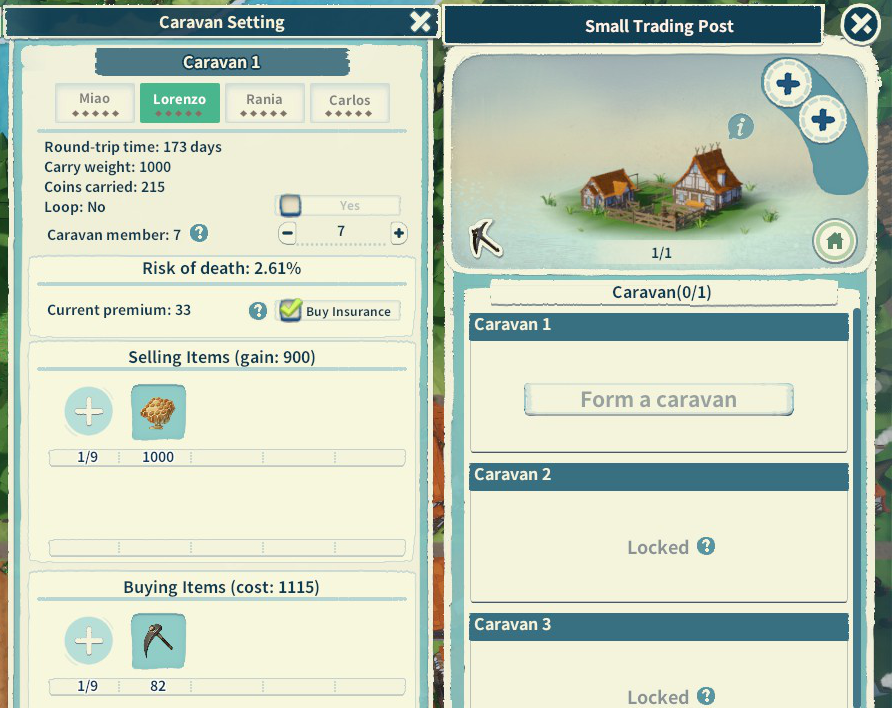


# Cattle

Raw materials for the tailor were running low ---namely: leather---so we allocated more space for a couple of `pasture` to raise the cattle calves that the hunter found.  This will lead to a steady supply of beef, leather, and dung.

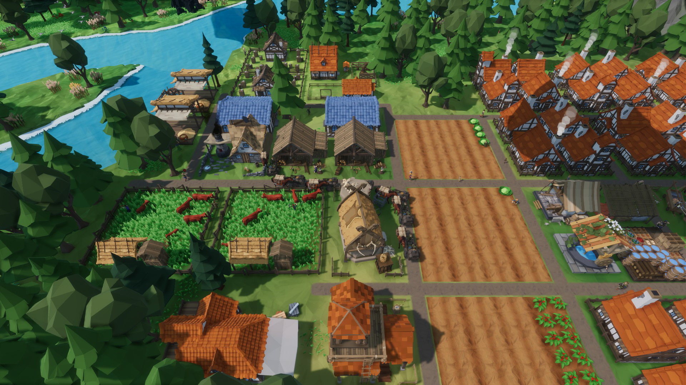

::::: {.panel-tabset}

## Flowchart

```{r}
#| echo: false
#| eval: true
pasture_tree <- DiagrammeR::mermaid("
  graph TD
  town_hall[Town Hall]
  mine[Mine]
  quarry[Quarry]
  sandpit_sand[Sand Pit: Sand]
  sandpit_clay[Sand Pit: Clay]
  tailor[Tailor]
  smithy[Smithy]
  apiary[Apriary]
  pasture[Pasture]
  cemetary[Cemetary]
  small_trading_post[Small Trading Post]
  
  town_hall --> mine
  town_hall --> quarry
  
  mine --> sandpit_sand
  quarry --> sandpit_sand
  mine --> sandpit_clay
  quarry --> sandpit_clay
  town_hall --> pasture
  quarry --> smithy
  
  sandpit_sand --> apiary
  sandpit_clay --> apiary
  pasture --> tailor
  smithy --> cemetary
  
  apiary --> small_trading_post
")

# print
pasture_tree
```

## Code

```{r}
#| echo: true
#| eval: false
pasture_tree <- DiagrammeR::mermaid("
  graph TD
  town_hall[Town Hall]
  mine[Mine]
  quarry[Quarry]
  sandpit_sand[Sand Pit: Sand]
  sandpit_clay[Sand Pit: Clay]
  tailor[Tailor]
  smithy[Smithy]
  apiary[Apriary]
  pasture[Pasture]
  cemetary[Cemetary]
  small_trading_post[Small Trading Post]
  
  town_hall --> mine
  town_hall --> quarry
  
  mine --> sandpit_sand
  quarry --> sandpit_sand
  mine --> sandpit_clay
  quarry --> sandpit_clay
  town_hall --> pasture
  quarry --> smithy
  
  sandpit_sand --> apiary
  sandpit_clay --> apiary
  pasture --> tailor
  smithy --> cemetary
  
  apiary --> small_trading_post
")

# print
pasture_tree
```

:::::


# Lumber

We upgraded the `chopping houses` to `sawmills` in order to refine the lumber into **planks**.

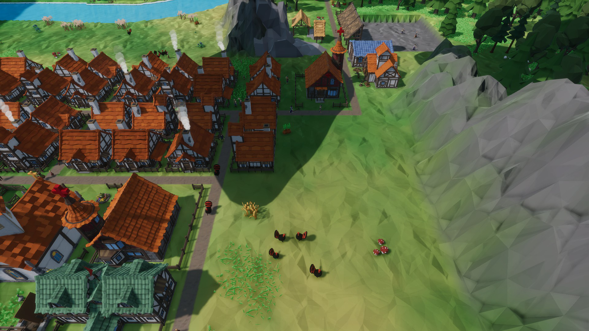

::::: {.panel-tabset}

## Flowchart

```{r}
#| echo: false
#| eval: true
lumber_tree <- DiagrammeR::mermaid("
  graph TD
  town_hall[Town Hall]
  mine[Mine]
  quarry[Quarry]
  sandpit_sand[Sand Pit: Sand]
  sandpit_clay[Sand Pit: Clay]
  tailor[Tailor]
  smithy[Smithy]
  apiary[Apriary]
  pasture[Pasture]
  cemetary[Cemetary]
  small_trading_post[Small Trading Post]
  sawmill[Sawmill]
  
  town_hall --> mine
  town_hall --> quarry
  
  mine --> sandpit_sand
  quarry --> sandpit_sand
  mine --> sandpit_clay
  quarry --> sandpit_clay
  town_hall --> pasture
  quarry --> smithy
  
  sandpit_sand --> apiary
  sandpit_clay --> apiary
  pasture --> tailor
  smithy --> cemetary
  
  apiary --> small_trading_post
  tailor --> sawmill
")

# print
lumber_tree
```

## Code

```{r}
#| echo: true
#| eval: false
lumber_tree <- DiagrammeR::mermaid("
  graph TD
  town_hall[Town Hall]
  mine[Mine]
  quarry[Quarry]
  sandpit_sand[Sand Pit: Sand]
  sandpit_clay[Sand Pit: Clay]
  tailor[Tailor]
  smithy[Smithy]
  apiary[Apriary]
  pasture[Pasture]
  cemetary[Cemetary]
  small_trading_post[Small Trading Post]
  sawmill[Sawmill]
  
  town_hall --> mine
  town_hall --> quarry
  
  mine --> sandpit_sand
  quarry --> sandpit_sand
  mine --> sandpit_clay
  quarry --> sandpit_clay
  town_hall --> pasture
  quarry --> smithy
  
  sandpit_sand --> apiary
  sandpit_clay --> apiary
  pasture --> tailor
  smithy --> cemetary
  
  apiary --> small_trading_post
  tailor --> sawmill
")

# print
lumber_tree
```

:::::


# Fishing

Now that we have a steady supply of `plank`, it is time to build a fishing dock.  Scouts reported a particular place in the river that was rife with fish, so the fishermen would be able to obtain fish at a higher rate.

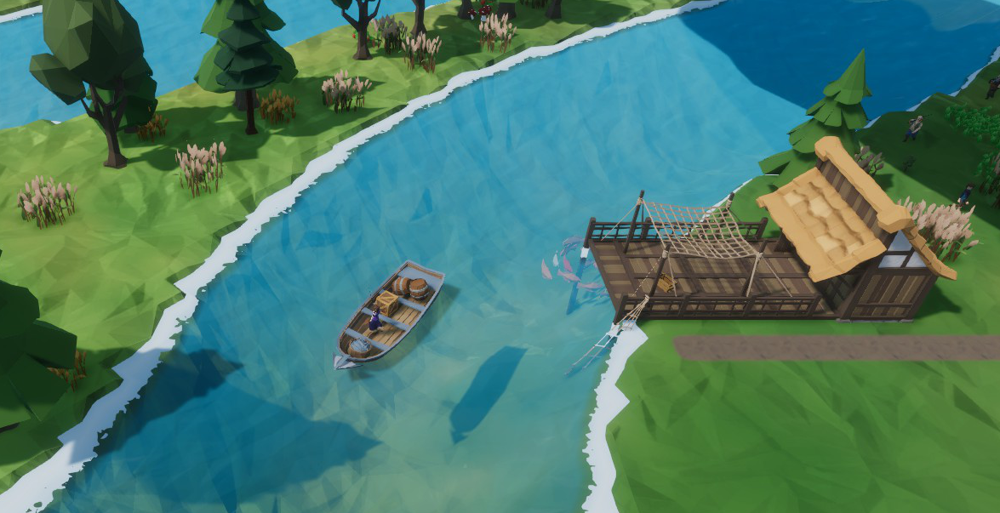

::::: {.panel-tabset}

## Flowchart

```{r}
#| echo: false
#| eval: true
dock_tree <- DiagrammeR::mermaid("
  graph TD
  town_hall[Town Hall]
  mine[Mine]
  quarry[Quarry]
  sandpit_sand[Sand Pit: Sand]
  sandpit_clay[Sand Pit: Clay]
  tailor[Tailor]
  smithy[Smithy]
  apiary[Apriary]
  pasture[Pasture]
  cemetary[Cemetary]
  small_trading_post[Small Trading Post]
  sawmill[Sawmill]
  dock[Dock]
  
  town_hall --> mine
  town_hall --> quarry
  
  mine --> sandpit_sand
  quarry --> sandpit_sand
  mine --> sandpit_clay
  quarry --> sandpit_clay
  town_hall --> pasture
  quarry --> smithy
  
  sandpit_sand --> apiary
  sandpit_clay --> apiary
  pasture --> tailor
  smithy --> cemetary
  
  apiary --> small_trading_post
  tailor --> sawmill
  sawmill --> dock
")

# print
dock_tree
```

## Code

```{r}
#| echo: true
#| eval: false
dock_tree <- DiagrammeR::mermaid("
  graph TD
  town_hall[Town Hall]
  mine[Mine]
  quarry[Quarry]
  sandpit_sand[Sand Pit: Sand]
  sandpit_clay[Sand Pit: Clay]
  tailor[Tailor]
  smithy[Smithy]
  apiary[Apriary]
  pasture[Pasture]
  cemetary[Cemetary]
  small_trading_post[Small Trading Post]
  sawmill[Sawmill]
  dock[Dock]
  
  town_hall --> mine
  town_hall --> quarry
  
  mine --> sandpit_sand
  quarry --> sandpit_sand
  mine --> sandpit_clay
  quarry --> sandpit_clay
  town_hall --> pasture
  quarry --> smithy
  
  sandpit_sand --> apiary
  sandpit_clay --> apiary
  pasture --> tailor
  smithy --> cemetary
  
  apiary --> small_trading_post
  tailor --> sawmill
  sawmill --> dock
")

# print
dock_tree
```

:::::

As the population surpassed 100 residents, we also elected our second administrator.  We chose Baldwin, who promised to bring in soybean crops, which are said to be quite nutritious.

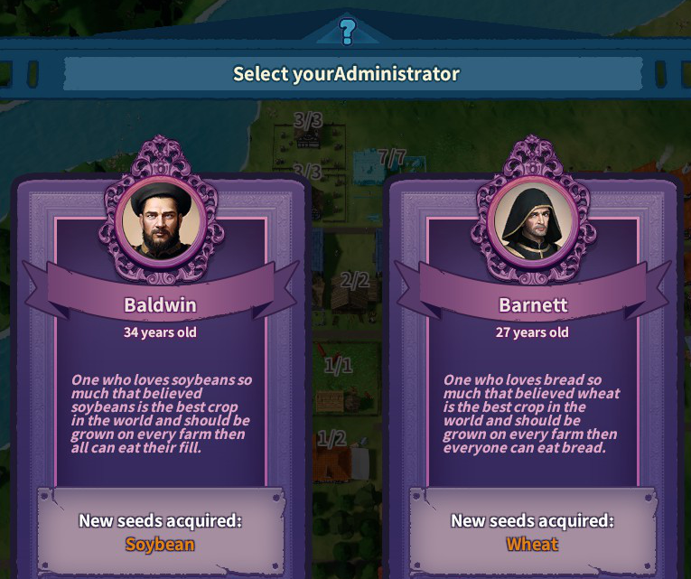


# Salt

It's finally time to get into the salt industry!  Continuing to use the supply of `plank`, we built a pair of `saltworks` on the riverbank to the north.

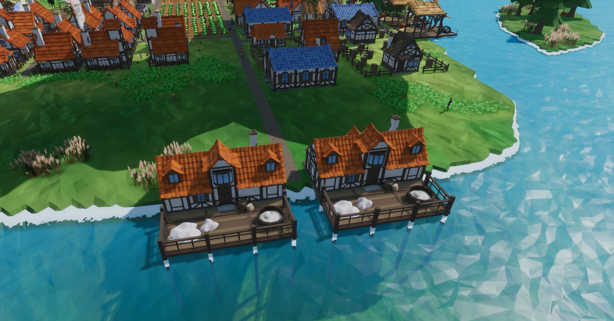

::::: {.panel-tabset}

## Flowchart

```{r}
#| echo: false
#| eval: true
salt_tree <- DiagrammeR::mermaid("
  graph TD
  town_hall[Town Hall]
  mine[Mine]
  quarry[Quarry]
  sandpit_sand[Sand Pit: Sand]
  sandpit_clay[Sand Pit: Clay]
  tailor[Tailor]
  smithy[Smithy]
  apiary[Apriary]
  pasture[Pasture]
  cemetary[Cemetary]
  small_trading_post[Small Trading Post]
  sawmill[Sawmill]
  dock[Dock]
  saltworks[Saltworks]
  
  town_hall --> mine
  town_hall --> quarry
  
  mine --> sandpit_sand
  quarry --> sandpit_sand
  mine --> sandpit_clay
  quarry --> sandpit_clay
  town_hall --> pasture
  quarry --> smithy
  
  sandpit_sand --> apiary
  sandpit_clay --> apiary
  pasture --> tailor
  smithy --> cemetary
  
  apiary --> small_trading_post
  tailor --> sawmill
  sawmill --> dock
  sawmill --> saltworks
")

# print
salt_tree
```

## Code

```{r}
#| echo: true
#| eval: false
salt_tree <- DiagrammeR::mermaid("
  graph TD
  town_hall[Town Hall]
  mine[Mine]
  quarry[Quarry]
  sandpit_sand[Sand Pit: Sand]
  sandpit_clay[Sand Pit: Clay]
  tailor[Tailor]
  smithy[Smithy]
  apiary[Apriary]
  pasture[Pasture]
  cemetary[Cemetary]
  small_trading_post[Small Trading Post]
  sawmill[Sawmill]
  dock[Dock]
  saltworks[Saltworks]
  
  town_hall --> mine
  town_hall --> quarry
  
  mine --> sandpit_sand
  quarry --> sandpit_sand
  mine --> sandpit_clay
  quarry --> sandpit_clay
  town_hall --> pasture
  quarry --> smithy
  
  sandpit_sand --> apiary
  sandpit_clay --> apiary
  pasture --> tailor
  smithy --> cemetary
  
  apiary --> small_trading_post
  tailor --> sawmill
  sawmill --> dock
  sawmill --> saltworks
")

# print
salt_tree
```

:::::

The salt proved to be more valuable, so this replaced the beeswax as our trading goods.


# Masonry

As our town progresses and folks want more advanced buildings, the scholars designed and built a `Masonry Workshop` to refine the quarry products into `cut stone`.

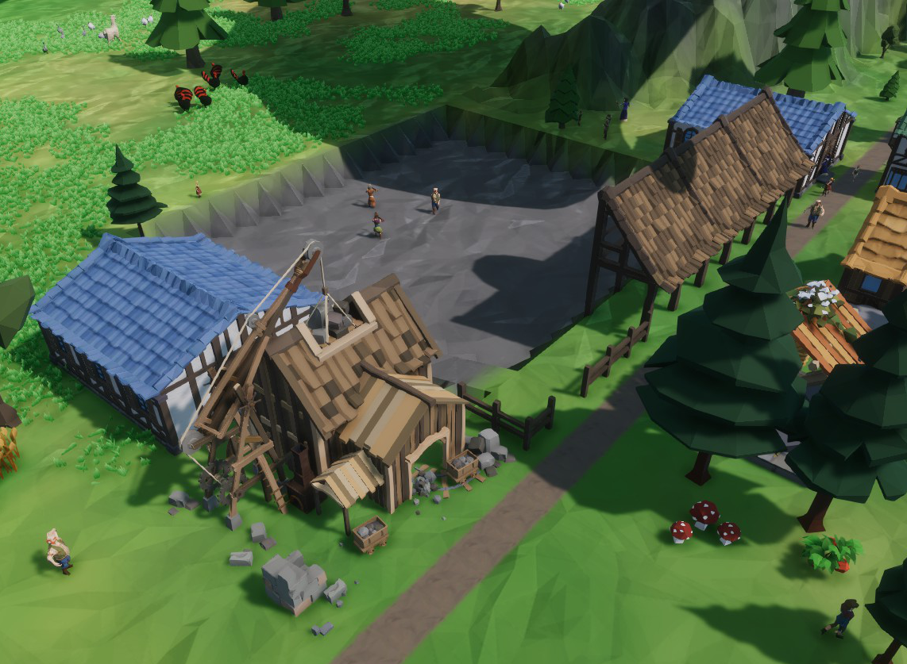

::::: {.panel-tabset}

## Flowchart

```{r}
#| echo: false
#| eval: true
masonry_tree <- DiagrammeR::mermaid("
  graph TD
  town_hall[Town Hall]
  mine[Mine]
  quarry[Quarry]
  sandpit_sand[Sand Pit: Sand]
  sandpit_clay[Sand Pit: Clay]
  tailor[Tailor]
  smithy[Smithy]
  apiary[Apriary]
  pasture[Pasture]
  cemetary[Cemetary]
  small_trading_post[Small Trading Post]
  sawmill[Sawmill]
  dock[Dock]
  saltworks[Saltworks]
  masonry[Mason Workshop]
  
  town_hall --> mine
  town_hall --> quarry
  
  mine --> sandpit_sand
  quarry --> sandpit_sand
  mine --> sandpit_clay
  quarry --> sandpit_clay
  town_hall --> pasture
  quarry --> smithy
  
  sandpit_sand --> apiary
  sandpit_clay --> apiary
  pasture --> tailor
  smithy --> cemetary
  
  apiary --> small_trading_post
  tailor --> sawmill
  sawmill --> dock
  sawmill --> saltworks
  cemetary --> masonry
")

# print
masonry_tree
```

## Code

```{r}
#| echo: true
#| eval: false
masonry_tree <- DiagrammeR::mermaid("
  graph TD
  town_hall[Town Hall]
  mine[Mine]
  quarry[Quarry]
  sandpit_sand[Sand Pit: Sand]
  sandpit_clay[Sand Pit: Clay]
  tailor[Tailor]
  smithy[Smithy]
  apiary[Apriary]
  pasture[Pasture]
  cemetary[Cemetary]
  small_trading_post[Small Trading Post]
  sawmill[Sawmill]
  dock[Dock]
  saltworks[Saltworks]
  masonry[Mason Workshop]
  
  town_hall --> mine
  town_hall --> quarry
  
  mine --> sandpit_sand
  quarry --> sandpit_sand
  mine --> sandpit_clay
  quarry --> sandpit_clay
  town_hall --> pasture
  quarry --> smithy
  
  sandpit_sand --> apiary
  sandpit_clay --> apiary
  pasture --> tailor
  smithy --> cemetary
  
  apiary --> small_trading_post
  tailor --> sawmill
  sawmill --> dock
  sawmill --> saltworks
  cemetary --> masonry
")

# print
masonry_tree
```

:::::


# Security

Now that we have `cut stone` from the masonry, we can build a `police station`.  This building houses a sherrif that can arrest criminals and, if need be, *banish* a person (e.g. remove a sick person before an outbreak occurs).

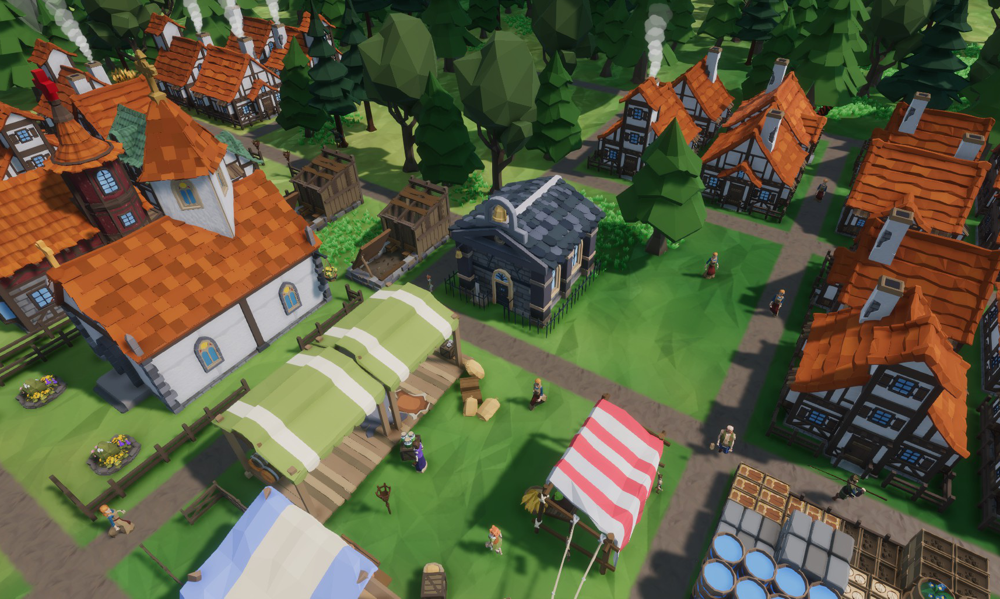

::::: {.panel-tabset}

## Flowchart

```{r}
#| echo: false
#| eval: true
police_tree <- DiagrammeR::mermaid("
  graph TD
  town_hall[Town Hall]
  mine[Mine]
  quarry[Quarry]
  sandpit_sand[Sand Pit: Sand]
  sandpit_clay[Sand Pit: Clay]
  tailor[Tailor]
  smithy[Smithy]
  apiary[Apriary]
  pasture[Pasture]
  cemetary[Cemetary]
  small_trading_post[Small Trading Post]
  sawmill[Sawmill]
  dock[Dock]
  saltworks[Saltworks]
  masonry[Mason Workshop]
  police[Police Station]
  
  town_hall --> mine
  town_hall --> quarry
  
  mine --> sandpit_sand
  quarry --> sandpit_sand
  mine --> sandpit_clay
  quarry --> sandpit_clay
  town_hall --> pasture
  quarry --> smithy
  
  sandpit_sand --> apiary
  sandpit_clay --> apiary
  pasture --> tailor
  smithy --> cemetary
  
  apiary --> small_trading_post
  tailor --> sawmill
  sawmill --> dock
  sawmill --> saltworks
  cemetary --> masonry
  
  masonry --> police
")

# print
police_tree
```

## Code

```{r}
#| echo: true
#| eval: false
police_tree <- DiagrammeR::mermaid("
  graph TD
  town_hall[Town Hall]
  mine[Mine]
  quarry[Quarry]
  sandpit_sand[Sand Pit: Sand]
  sandpit_clay[Sand Pit: Clay]
  tailor[Tailor]
  smithy[Smithy]
  apiary[Apriary]
  pasture[Pasture]
  cemetary[Cemetary]
  small_trading_post[Small Trading Post]
  sawmill[Sawmill]
  dock[Dock]
  saltworks[Saltworks]
  masonry[Mason Workshop]
  police[Police Station]
  
  town_hall --> mine
  town_hall --> quarry
  
  mine --> sandpit_sand
  quarry --> sandpit_sand
  mine --> sandpit_clay
  quarry --> sandpit_clay
  town_hall --> pasture
  quarry --> smithy
  
  sandpit_sand --> apiary
  sandpit_clay --> apiary
  pasture --> tailor
  smithy --> cemetary
  
  apiary --> small_trading_post
  tailor --> sawmill
  sawmill --> dock
  sawmill --> saltworks
  cemetary --> masonry
  
  masonry --> police
")

# print
police_tree
```

:::::


# Heating

The town survived the first few winters, but `fuel` is not easy to obtain.  The push into newer technology allowed us to build a `Boiler` whose radius will heat nearly every house in the town.

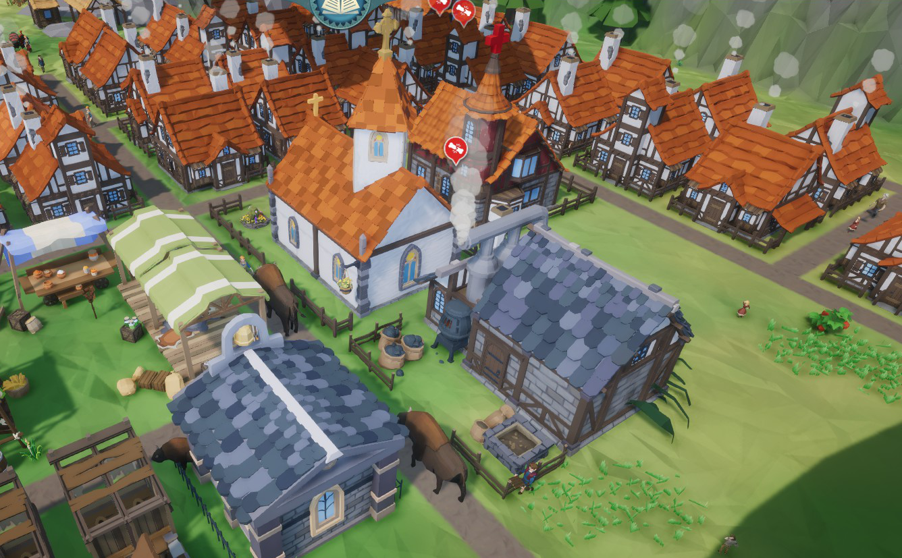

::::: {.panel-tabset}

## Flowchart

```{r}
#| echo: false
#| eval: true
boiler_tree <- DiagrammeR::mermaid("
  graph TD
  town_hall[Town Hall]
  mine[Mine]
  quarry[Quarry]
  sandpit_sand[Sand Pit: Sand]
  sandpit_clay[Sand Pit: Clay]
  tailor[Tailor]
  smithy[Smithy]
  apiary[Apriary]
  pasture[Pasture]
  cemetary[Cemetary]
  small_trading_post[Small Trading Post]
  sawmill[Sawmill]
  dock[Dock]
  saltworks[Saltworks]
  masonry[Mason Workshop]
  police[Police Station]
  boiler[Boiler]
  
  town_hall --> mine
  town_hall --> quarry
  
  mine --> sandpit_sand
  quarry --> sandpit_sand
  mine --> sandpit_clay
  quarry --> sandpit_clay
  town_hall --> pasture
  quarry --> smithy
  
  sandpit_sand --> apiary
  sandpit_clay --> apiary
  pasture --> tailor
  smithy --> cemetary
  
  apiary --> small_trading_post
  tailor --> sawmill
  sawmill --> dock
  sawmill --> saltworks
  cemetary --> masonry
  
  masonry --> police
  masonry --> boiler
")

# print
boiler_tree
```

## Code

```{r}
#| echo: true
#| eval: false
boiler_tree <- DiagrammeR::mermaid("
  graph TD
  town_hall[Town Hall]
  mine[Mine]
  quarry[Quarry]
  sandpit_sand[Sand Pit: Sand]
  sandpit_clay[Sand Pit: Clay]
  tailor[Tailor]
  smithy[Smithy]
  apiary[Apriary]
  pasture[Pasture]
  cemetary[Cemetary]
  small_trading_post[Small Trading Post]
  sawmill[Sawmill]
  dock[Dock]
  saltworks[Saltworks]
  masonry[Mason Workshop]
  police[Police Station]
  boiler[Boiler]
  
  town_hall --> mine
  town_hall --> quarry
  
  mine --> sandpit_sand
  quarry --> sandpit_sand
  mine --> sandpit_clay
  quarry --> sandpit_clay
  town_hall --> pasture
  quarry --> smithy
  
  sandpit_sand --> apiary
  sandpit_clay --> apiary
  pasture --> tailor
  smithy --> cemetary
  
  apiary --> small_trading_post
  tailor --> sawmill
  sawmill --> dock
  sawmill --> saltworks
  cemetary --> masonry
  
  masonry --> police
  masonry --> boiler
")

# print
boiler_tree
```

:::::

We also invested a technology point into "School Expansion" (from 15 to 20 students each) which also increases the research rate from schools.


# Research

For technology points (one of the game mechanics), we were running low, so we built some `Research Institute`.  With 3 buildings, we garner a technology point about every 2 minutes IRL.

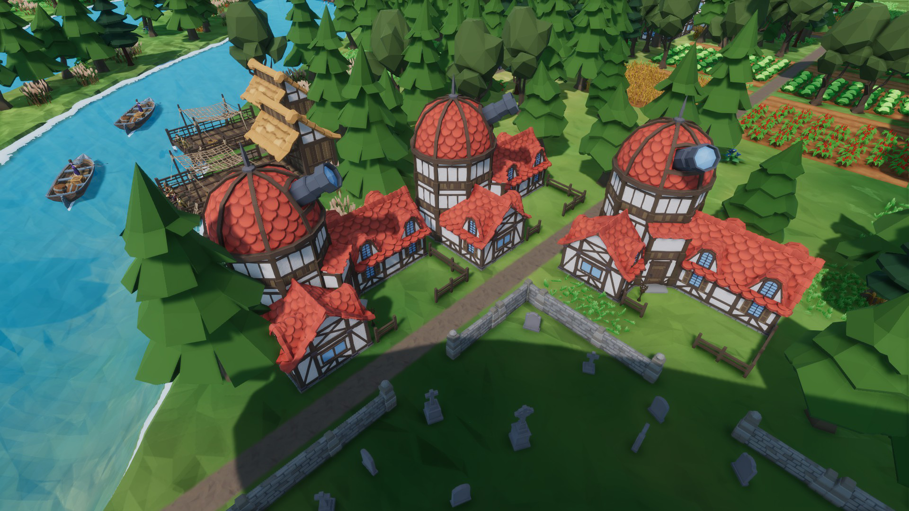

::::: {.panel-tabset}

## Flowchart

```{r}
#| echo: false
#| eval: true
research_tree <- DiagrammeR::mermaid("
  graph TD
  town_hall[Town Hall]
  mine[Mine]
  quarry[Quarry]
  sandpit_sand[Sand Pit: Sand]
  sandpit_clay[Sand Pit: Clay]
  tailor[Tailor]
  smithy[Smithy]
  apiary[Apriary]
  pasture[Pasture]
  cemetary[Cemetary]
  small_trading_post[Small Trading Post]
  sawmill[Sawmill]
  dock[Dock]
  saltworks[Saltworks]
  masonry[Mason Workshop]
  police[Police Station]
  boiler[Boiler]
  research[Research Institute]
  
  town_hall --> mine
  town_hall --> quarry
  
  mine --> sandpit_sand
  quarry --> sandpit_sand
  mine --> sandpit_clay
  quarry --> sandpit_clay
  town_hall --> pasture
  quarry --> smithy
  
  sandpit_sand --> apiary
  sandpit_clay --> apiary
  pasture --> tailor
  smithy --> cemetary
  
  apiary --> small_trading_post
  tailor --> sawmill
  sawmill --> dock
  sawmill --> saltworks
  cemetary --> masonry
  
  masonry --> police
  masonry --> boiler
  masonry --> research
")

# print
research_tree
```

## Code

```{r}
#| echo: true
#| eval: false
research_tree <- DiagrammeR::mermaid("
  graph TD
  town_hall[Town Hall]
  mine[Mine]
  quarry[Quarry]
  sandpit_sand[Sand Pit: Sand]
  sandpit_clay[Sand Pit: Clay]
  tailor[Tailor]
  smithy[Smithy]
  apiary[Apriary]
  pasture[Pasture]
  cemetary[Cemetary]
  small_trading_post[Small Trading Post]
  sawmill[Sawmill]
  dock[Dock]
  saltworks[Saltworks]
  masonry[Mason Workshop]
  police[Police Station]
  boiler[Boiler]
  research[Research Institute]
  
  town_hall --> mine
  town_hall --> quarry
  
  mine --> sandpit_sand
  quarry --> sandpit_sand
  mine --> sandpit_clay
  quarry --> sandpit_clay
  town_hall --> pasture
  quarry --> smithy
  
  sandpit_sand --> apiary
  sandpit_clay --> apiary
  pasture --> tailor
  smithy --> cemetary
  
  apiary --> small_trading_post
  tailor --> sawmill
  sawmill --> dock
  sawmill --> saltworks
  cemetary --> masonry
  
  masonry --> police
  masonry --> boiler
  masonry --> research
")

# print
research_tree
```

:::::


# Storage Logistics

One of my favorite buildings in the game is the `Storage Center`.  Each is an eyesore that has the floor space of about seven houses, but its storage capacity makes the gamer's life easier.

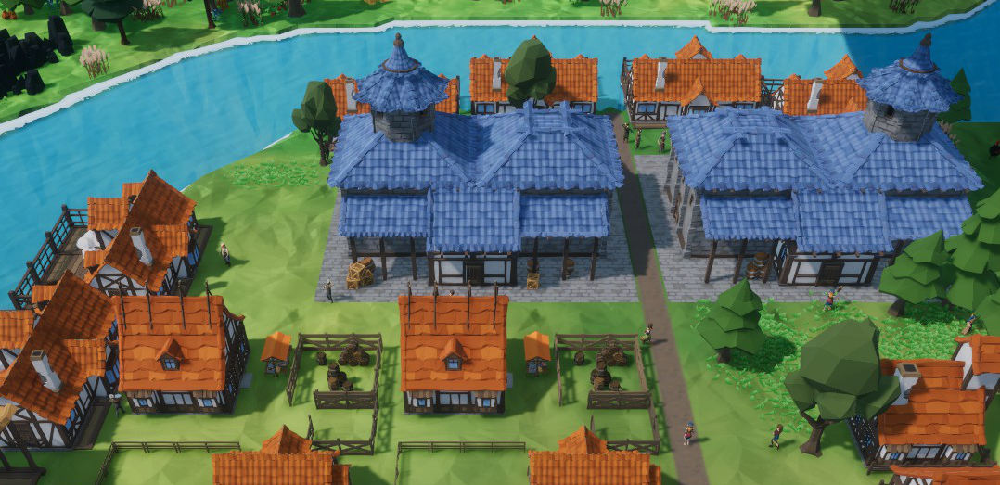

::::: {.panel-tabset}

## Flowchart

```{r}
#| echo: false
#| eval: true
storage_tree <- DiagrammeR::mermaid("
  graph TD
  town_hall[Town Hall]
  mine[Mine]
  quarry[Quarry]
  sandpit_sand[Sand Pit: Sand]
  sandpit_clay[Sand Pit: Clay]
  tailor[Tailor]
  smithy[Smithy]
  apiary[Apriary]
  pasture[Pasture]
  cemetary[Cemetary]
  small_trading_post[Small Trading Post]
  sawmill[Sawmill]
  dock[Dock]
  saltworks[Saltworks]
  masonry[Mason Workshop]
  police[Police Station]
  boiler[Boiler]
  research[Research Institute]
  storage[Storage Center]
  
  
  town_hall --> mine
  town_hall --> quarry
  
  mine --> sandpit_sand
  quarry --> sandpit_sand
  mine --> sandpit_clay
  quarry --> sandpit_clay
  town_hall --> pasture
  quarry --> smithy
  
  sandpit_sand --> apiary
  sandpit_clay --> apiary
  pasture --> tailor
  smithy --> cemetary
  
  apiary --> small_trading_post
  tailor --> sawmill
  sawmill --> dock
  sawmill --> saltworks
  cemetary --> masonry
  
  masonry --> police
  masonry --> boiler
  masonry --> research
  
  small_trading_post --> storage
  dock --> storage
  saltworks --> storage
")

# print
storage_tree
```

## Code

```{r}
#| echo: true
#| eval: false
storage_tree <- DiagrammeR::mermaid("
  graph TD
  town_hall[Town Hall]
  mine[Mine]
  quarry[Quarry]
  sandpit_sand[Sand Pit: Sand]
  sandpit_clay[Sand Pit: Clay]
  tailor[Tailor]
  smithy[Smithy]
  apiary[Apriary]
  pasture[Pasture]
  cemetary[Cemetary]
  small_trading_post[Small Trading Post]
  sawmill[Sawmill]
  dock[Dock]
  saltworks[Saltworks]
  masonry[Mason Workshop]
  police[Police Station]
  boiler[Boiler]
  research[Research Institute]
  storage[Storage Center]
  
  
  town_hall --> mine
  town_hall --> quarry
  
  mine --> sandpit_sand
  quarry --> sandpit_sand
  mine --> sandpit_clay
  quarry --> sandpit_clay
  town_hall --> pasture
  quarry --> smithy
  
  sandpit_sand --> apiary
  sandpit_clay --> apiary
  pasture --> tailor
  smithy --> cemetary
  
  apiary --> small_trading_post
  tailor --> sawmill
  sawmill --> dock
  sawmill --> saltworks
  cemetary --> masonry
  
  masonry --> police
  masonry --> boiler
  masonry --> research
  
  small_trading_post --> storage
  dock --> storage
  saltworks --> storage
")

# print
storage_tree
```

:::::


# Synergy

Continuing to be mindful of game mechanics, one of the game patches for Settlement Survival introduced some synergy between the structures. We plan as such.

1. Fertilizer may be used to boost farms
2. Farms may produce fodder (e.g. from oats, beans, or cactus)
3. Fodder may be used to boost pastures
4. Pastures produce fertilizer---completing a cycle

With that in mind, we plan out 21x21 plots

* `Compost Facility` in the middle of 4 `Farm` since the compost facility boosts those nearby farms
* `Mill` in the middle of 4 `Eco-Pasture` since the mill boosts those nearby eco-pastures

In the gaps, I have so far infilled the areas with `Warehouse`, `School`, and `Cactus Workshop` (from reaching level one prestige with Carlos through trade)

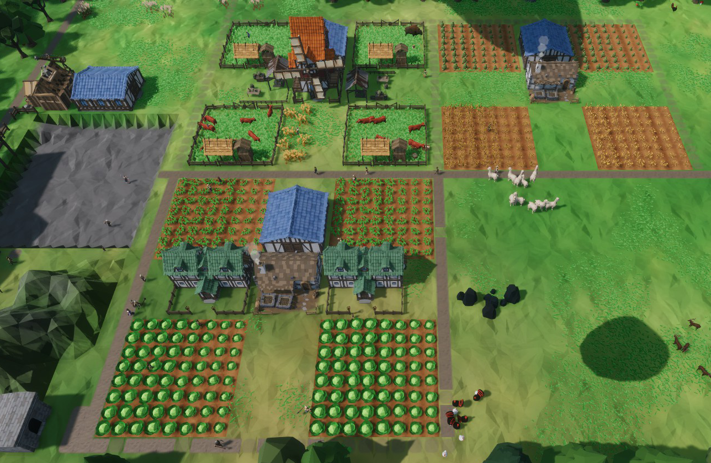

We also created some `reed farm` to move into a rope-based economy.

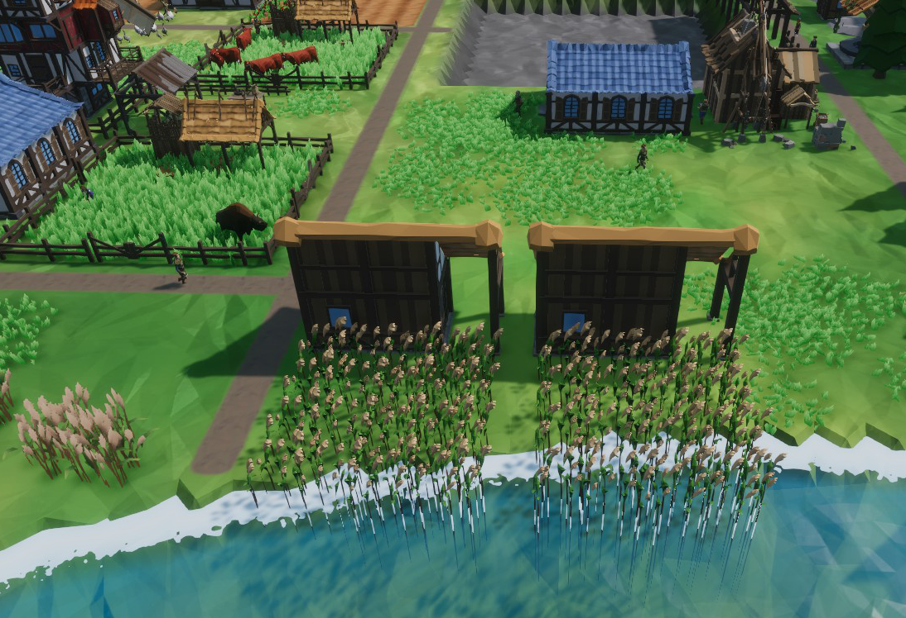

For brevity, I once again restart the flowchart.

::::: {.panel-tabset}

## Flowchart

```{r}
#| echo: false
#| eval: true
synergy_tree <- DiagrammeR::mermaid("
  graph TD
  cactus[Cactus Workshop]
  fodder[Compost Facility]
  mill[Mill]
  reed[Reed]
  storage[Storage Center]
  
  storage --> cactus
  storage --> fodder
  storage --> mill
  storage --> reed
")

# print
synergy_tree
```

## Code

```{r}
#| echo: true
#| eval: false
synergy_tree <- DiagrammeR::mermaid("
  graph TD
  cactus[Cactus Workshop]
  fodder[Compost Facility]
  mill[Mill]
  reed[Reed]
  storage[Storage Center]
  
  storage --> cactus
  storage --> fodder
  storage --> mill
  storage --> reed
")

# print
synergy_tree
```

:::::


# Fuel

The Industrial movement is underway, and the engineers want to turn the coal into `refined fuel`, so we built a `refinery` by the mines and quarry.

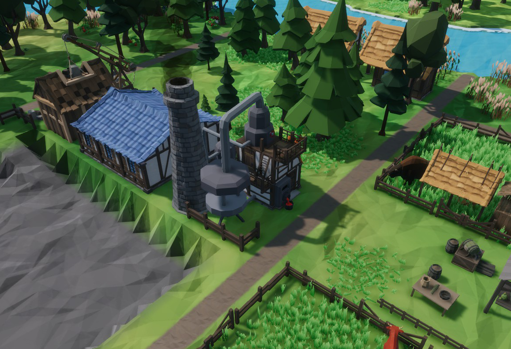

::::: {.panel-tabset}

## Flowchart

```{r}
#| echo: false
#| eval: true
refinery_tree <- DiagrammeR::mermaid("
  graph TD
  cactus[Cactus Workshop]
  fodder[Compost Facility]
  mill[Mill]
  reed[Reed]
  refinery[Refinery]
  storage[Storage Center]
  
  storage --> cactus
  storage --> fodder
  storage --> mill
  storage --> reed
  
  cactus --> refinery
  fodder --> refinery
  mill --> refinery
  reed --> refinery
")

# print
refinery_tree
```

## Code

```{r}
#| echo: true
#| eval: false
refinery_tree <- DiagrammeR::mermaid("
  graph TD
  cactus[Cactus Workshop]
  fodder[Compost Facility]
  mill[Mill]
  reed[Reed]
  refinery[Refinery]
  storage[Storage Center]
  
  storage --> cactus
  storage --> fodder
  storage --> mill
  storage --> reed
  
  cactus --> refinery
  fodder --> refinery
  mill --> refinery
  reed --> refinery
")

# print
refinery_tree
```

:::::


# Deep Mines

Eventually, we need `lanterns` for better mining, so we start out by building some `Lighting Factory` to process fat (from the pastures) into `lamp oil`

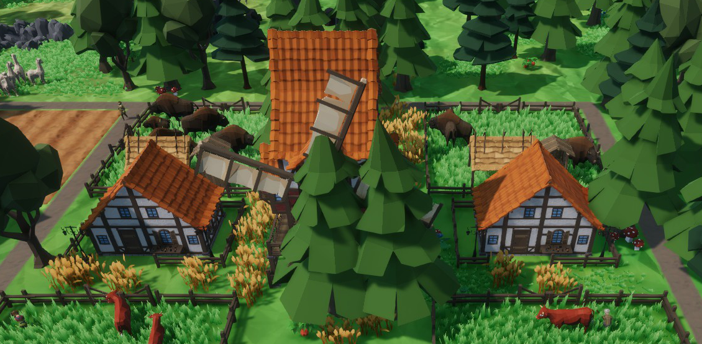

The engineers learned to build `Deep Mines`, each needing

* 60 `building kits`
* 60 `steel` beams
* 120 `lanterns`

(acquired through trade since our factories are not built yet).

Now that we have started moving into the Industrial Age, we focus on securing a long-term supply of industrial materials.

* `Deep Mine` for `coal`
* `Deep Mine` for `ore`

Meanwhile, we had built up level 3 trade reputation with Rania and Carlos, so we were also able to respectively build

* `Gem Mine`
* `Obsidian Mine`

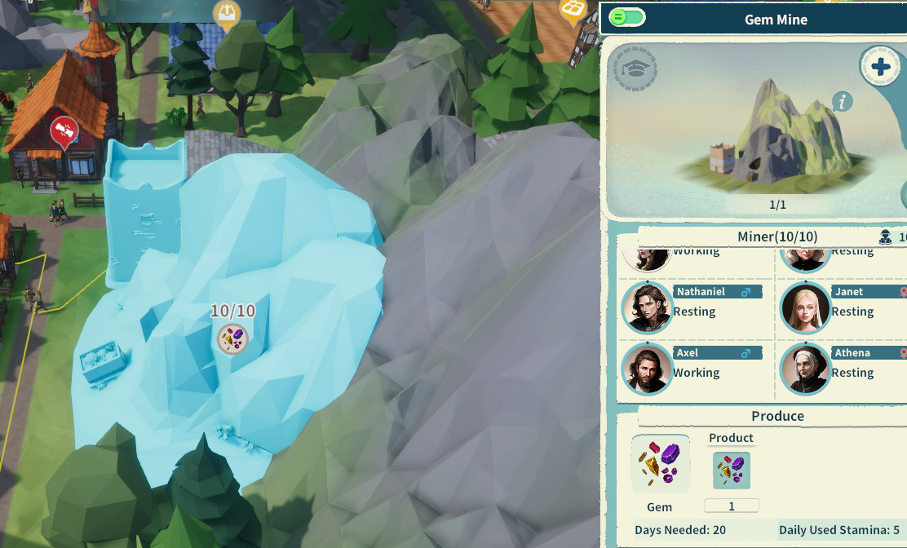

::::: {.panel-tabset}

## Flowchart

```{r}
#| echo: false
#| eval: true
deep_mine_tree <- DiagrammeR::mermaid("
  graph TD
  coal[Deep Mine: Coal]
  gems[Gem Mine]
  lighting[Lighting Factory]
  obsidian[Obsidian Mine]
  ore[Deep Mine: Ore]
  refinery[Refinery]

  refinery --> lighting
  lighting --> coal
  lighting --> ore
  coal --> gems
  ore --> obsidian
")

# print
deep_mine_tree
```

## Code

```{r}
#| echo: true
#| eval: false
deep_mine_tree <- DiagrammeR::mermaid("
  graph TD
  coal[Deep Mine: Coal]
  gems[Gem Mine]
  lighting[Lighting Factory]
  obsidian[Obsidian Mine]
  ore[Deep Mine: Ore]
  refinery[Refinery]

  refinery --> lighting
  lighting --> coal
  lighting --> ore
  coal --> gems
  ore --> obsidian
")

# print
deep_mine_tree
```

:::::


# Hospitals

With all of the mining going on, we upgraded the `Clinics` to `Hospitals`.

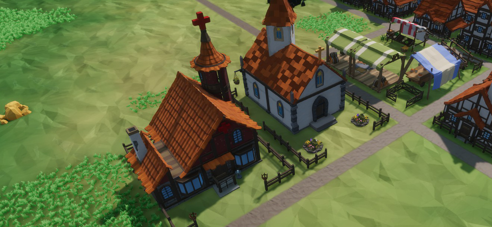

::::: {.panel-tabset}

## Flowchart

```{r}
#| echo: false
#| eval: true
hospital_tree <- DiagrammeR::mermaid("
  graph TD
  coal[Deep Mine: Coal]
  gems[Gem Mine]
  hospital[Hospital]
  lighting[Lighting Factory]
  obsidian[Obsidian Mine]
  ore[Deep Mine: Ore]
  refinery[Refinery]

  refinery --> lighting
  lighting --> coal
  lighting --> ore
  coal --> gems
  obsidian --> hospital
  ore --> obsidian
")

# print
hospital_tree
```

## Code

```{r}
#| echo: true
#| eval: false
hospital_tree <- DiagrammeR::mermaid("
  graph TD
  coal[Deep Mine: Coal]
  gems[Gem Mine]
  hospital[Hospital]
  lighting[Lighting Factory]
  obsidian[Obsidian Mine]
  ore[Deep Mine: Ore]
  refinery[Refinery]

  refinery --> lighting
  lighting --> coal
  lighting --> ore
  coal --> gems
  obsidian --> hospital
  ore --> obsidian
")

# print
hospital_tree
```

:::::


# Bazaar

With the `gem` supply---and reading level 3 trading with Rania---we built a `bazaar`.  Instead of a `small trading post` that handles one caravan of 7 villagers with 1300 weight, the bazaar allows two caravans each with 11 villagers and 4200 weight.

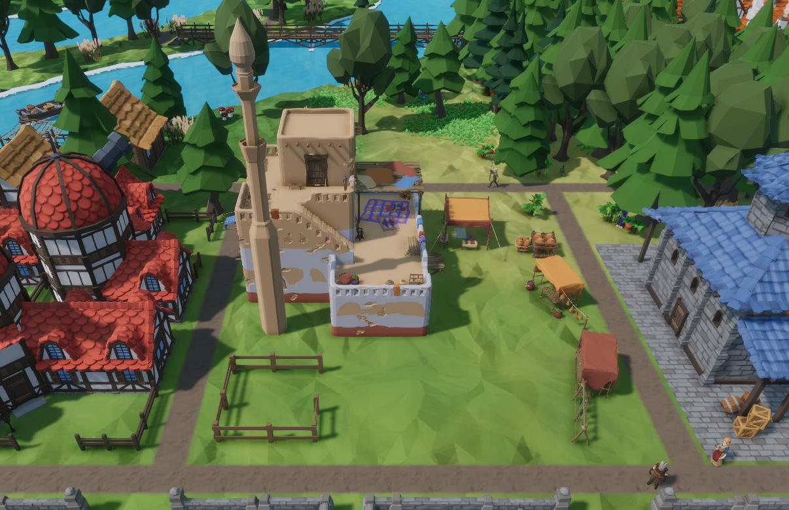

::::: {.panel-tabset}

## Flowchart

```{r}
#| echo: false
#| eval: true
bazaar_tree <- DiagrammeR::mermaid("
  graph TD
  bazaar[Bazaar]
  coal[Deep Mine: Coal]
  gems[Gem Mine]
  hospital[Hospital]
  lighting[Lighting Factory]
  obsidian[Obsidian Mine]
  ore[Deep Mine: Ore]
  refinery[Refinery]

  refinery --> lighting
  lighting --> coal
  lighting --> ore
  coal --> gems
  ore --> obsidian
  
  gems --> bazaar
  obsidian --> hospital
")

# print
bazaar_tree
```

## Code

```{r}
#| echo: true
#| eval: false
bazaar_tree <- DiagrammeR::mermaid("
  graph TD
  bazaar[Bazaar]
  coal[Deep Mine: Coal]
  gems[Gem Mine]
  hospital[Hospital]
  lighting[Lighting Factory]
  obsidian[Obsidian Mine]
  ore[Deep Mine: Ore]
  refinery[Refinery]

  refinery --> lighting
  lighting --> coal
  lighting --> ore
  coal --> gems
  ore --> obsidian
  
  gems --> bazaar
  obsidian --> hospital
")

# print
bazaar_tree
```

:::::


# Materials

Rumors of `Dense Farm` tech are here.  We need materials (such as `glass` and `brick`) to be able to cultivate these fields.

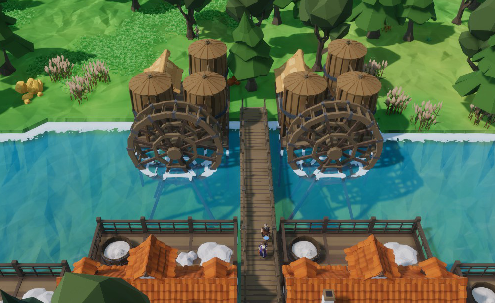

::::: {.panel-tabset}

## Flowchart

```{r}
#| echo: false
#| eval: true
materials_tree <- DiagrammeR::mermaid("
  graph TD
  bazaar[Bazaar]
  bottles[Kiln: Glass Bottles]
  brick[Kiln: Brick]
  coal[Deep Mine: Coal]
  gems[Gem Mine]
  glass[Kiln: Glass]
  hospital[Hospital]
  lighting[Lighting Factory]
  obsidian[Obsidian Mine]
  ore[Deep Mine: Ore]
  refinery[Refinery]
  resevoir[Resevoir]

  refinery --> lighting
  lighting --> coal
  lighting --> ore
  coal --> gems
  ore --> obsidian
  
  gems --> bazaar
  obsidian --> hospital
  
  refinery --> resevoir
  resevoir --> brick
  brick --> glass
  glass --> bottles
")

# print
materials_tree
```

## Code

```{r}
#| echo: true
#| eval: false
materials_tree <- DiagrammeR::mermaid("
  graph TD
  bazaar[Bazaar]
  bottles[Kiln: Glass Bottles]
  brick[Kiln: Brick]
  coal[Deep Mine: Coal]
  gems[Gem Mine]
  glass[Kiln: Glass]
  hospital[Hospital]
  lighting[Lighting Factory]
  obsidian[Obsidian Mine]
  ore[Deep Mine: Ore]
  refinery[Refinery]
  resevoir[Resevoir]

  refinery --> lighting
  lighting --> coal
  lighting --> ore
  coal --> gems
  ore --> obsidian
  
  gems --> bazaar
  obsidian --> hospital
  
  refinery --> resevoir
  resevoir --> brick
  brick --> glass
  glass --> bottles
")

# print
materials_tree
```

:::::

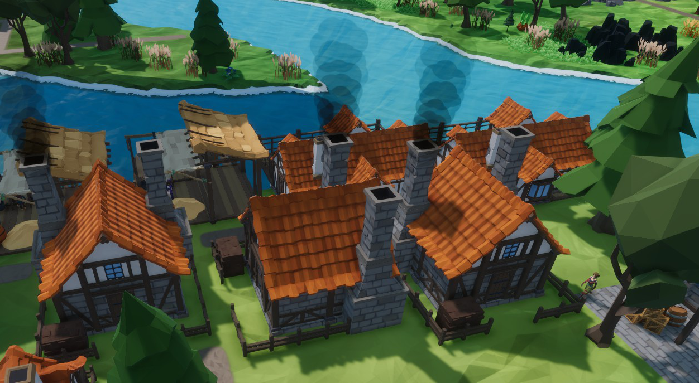


# Bamboo

After a few years of training with Miao, we were granted some `bamboo` seeds.  These are grown on a `Forest Farm`, so we needed to learn more agriculture to get there.

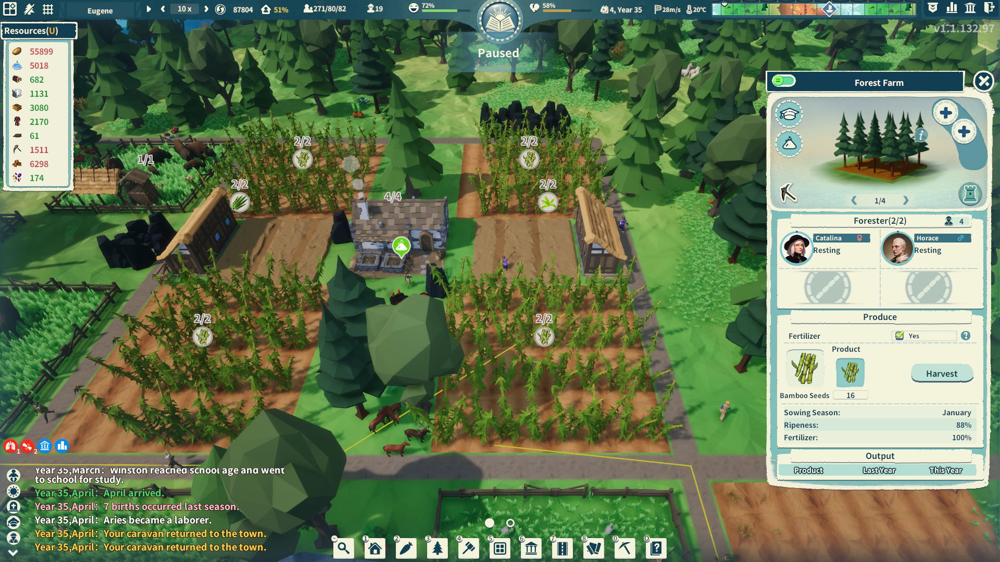

Meanwhile, we also set up a couple of `Nurseries` with `agave` and `tobacco`

::::: {.panel-tabset}

## Flowchart

```{r}
#| echo: false
#| eval: true
bamboo_tree <- DiagrammeR::mermaid("
  graph TD
  bamboo[Bamboo]
  bazaar[Bazaar]
  bottles[Kiln: Glass Bottles]
  brick[Kiln: Brick]
  coal[Deep Mine: Coal]
  forest[Forest Farm]
  gems[Gem Mine]
  glass[Kiln: Glass]
  grove[Grove]
  hospital[Hospital]
  lighting[Lighting Factory]
  nursery[Nursery]
  obsidian[Obsidian Mine]
  ore[Deep Mine: Ore]
  refinery[Refinery]
  resevoir[Resevoir]

  refinery --> lighting
  lighting --> coal
  lighting --> ore
  coal --> gems
  ore --> obsidian
  
  gems --> bazaar
  obsidian --> hospital
  
  refinery --> resevoir
  resevoir --> brick
  brick --> glass
  glass --> bottles
  
  refinery --> grove
  grove --> nursery
  nursery --> forest
  forest --> bamboo
")

# print
bamboo_tree
```

## Code

```{r}
#| echo: false
#| eval: true
bamboo_tree <- DiagrammeR::mermaid("
  graph TD
  bamboo[Bamboo]
  bazaar[Bazaar]
  bottles[Kiln: Glass Bottles]
  brick[Kiln: Brick]
  coal[Deep Mine: Coal]
  forest[Forest Farm]
  gems[Gem Mine]
  glass[Kiln: Glass]
  grove[Grove]
  hospital[Hospital]
  lighting[Lighting Factory]
  nursery[Nursery]
  obsidian[Obsidian Mine]
  ore[Deep Mine: Ore]
  refinery[Refinery]
  resevoir[Resevoir]

  refinery --> lighting
  lighting --> coal
  lighting --> ore
  coal --> gems
  ore --> obsidian
  
  gems --> bazaar
  obsidian --> hospital
  
  refinery --> resevoir
  resevoir --> brick
  brick --> glass
  glass --> bottles
  
  refinery --> grove
  grove --> nursery
  nursery --> forest
  forest --> bamboo
")

# print
bamboo_tree
```

:::::


# Better Farming

Further trading knowledge from Miao got access to the `Dense Farm`, which greatly increases agriculture output (important for a growing population).  We had needed `glass`, `brick` and `bamboo` to build each dense farm.

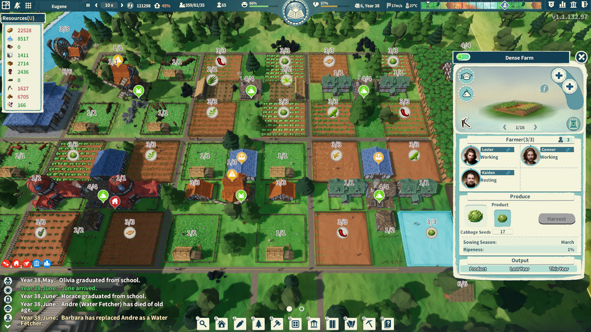

::::: {.panel-tabset}

## Flowchart

```{r}
#| echo: false
#| eval: true
dense_farm_tree <- DiagrammeR::mermaid("
  graph TD
  bamboo[Bamboo]
  bazaar[Bazaar]
  bottles[Kiln: Glass Bottles]
  brick[Kiln: Brick]
  coal[Deep Mine: Coal]
  densefarm[Dense Farm]
  forest[Forest Farm]
  gems[Gem Mine]
  glass[Kiln: Glass]
  grove[Grove]
  hospital[Hospital]
  lighting[Lighting Factory]
  nursery[Nursery]
  obsidian[Obsidian Mine]
  ore[Deep Mine: Ore]
  refinery[Refinery]
  resevoir[Resevoir]

  refinery --> lighting
  lighting --> coal
  lighting --> ore
  coal --> gems
  ore --> obsidian
  
  gems --> bazaar
  obsidian --> hospital
  
  refinery --> resevoir
  resevoir --> brick
  brick --> glass
  glass --> bottles
  
  refinery --> grove
  grove --> nursery
  nursery --> forest
  forest --> bamboo
  
  bazaar --> densefarm
  hospital --> densefarm
  bottles --> densefarm
  bamboo --> densefarm
")

# print
dense_farm_tree
```

## Code

```{r}
#| echo: false
#| eval: true
dense_farm_tree <- DiagrammeR::mermaid("
  graph TD
  bamboo[Bamboo]
  bazaar[Bazaar]
  bottles[Kiln: Glass Bottles]
  brick[Kiln: Brick]
  coal[Deep Mine: Coal]
  densefarm[Dense Farm]
  forest[Forest Farm]
  gems[Gem Mine]
  glass[Kiln: Glass]
  grove[Grove]
  hospital[Hospital]
  lighting[Lighting Factory]
  nursery[Nursery]
  obsidian[Obsidian Mine]
  ore[Deep Mine: Ore]
  refinery[Refinery]
  resevoir[Resevoir]

  refinery --> lighting
  lighting --> coal
  lighting --> ore
  coal --> gems
  ore --> obsidian
  
  gems --> bazaar
  obsidian --> hospital
  
  refinery --> resevoir
  resevoir --> brick
  brick --> glass
  glass --> bottles
  
  refinery --> grove
  grove --> nursery
  nursery --> forest
  forest --> bamboo
  
  bazaar --> densefarm
  hospital --> densefarm
  bottles --> densefarm
  bamboo --> densefarm
")

# print
dense_farm_tree
```

:::::


# Chichen Itza

Upon reaching level 4 reputation with Carlos, we got the ability to build one of the great wonders in the game: `Chichen Itza` (the Mayan temple).  In game, this structure allows the burial of unlimited deceased villagers.  That is, instead of cemetaries (which take up land space) or crematoriums (which create respirtory disease), this solves the end-of-life concern in the game.

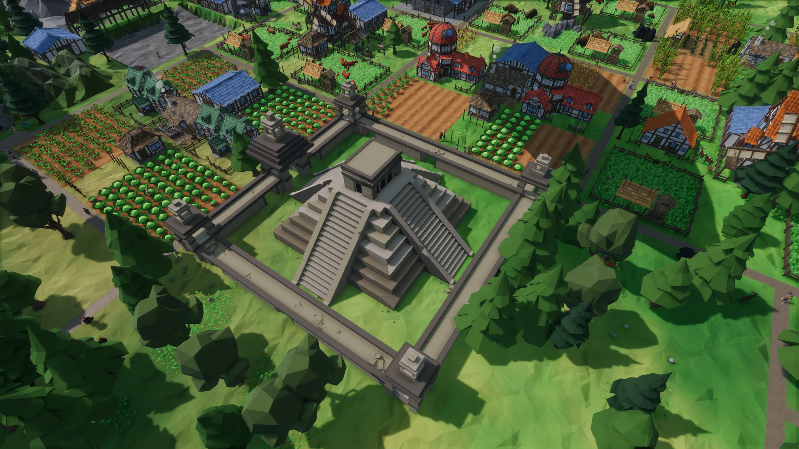


# Better Cattle

Upon reading level 2 reputation with Lorenzo, we got the ability to grow `hardwood` trees.  This in turn lead to the `Hardwood Pastures` that have double the capacity for cattle and animals.

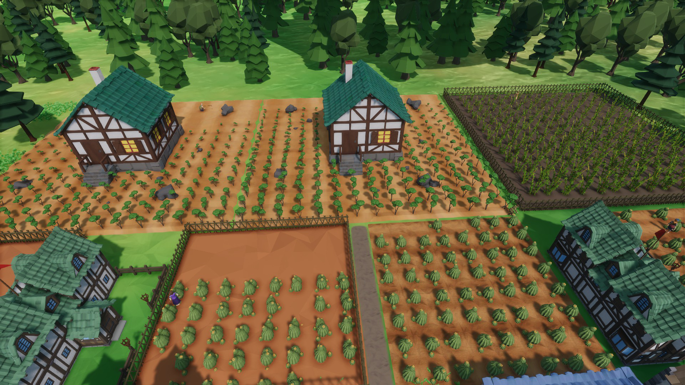