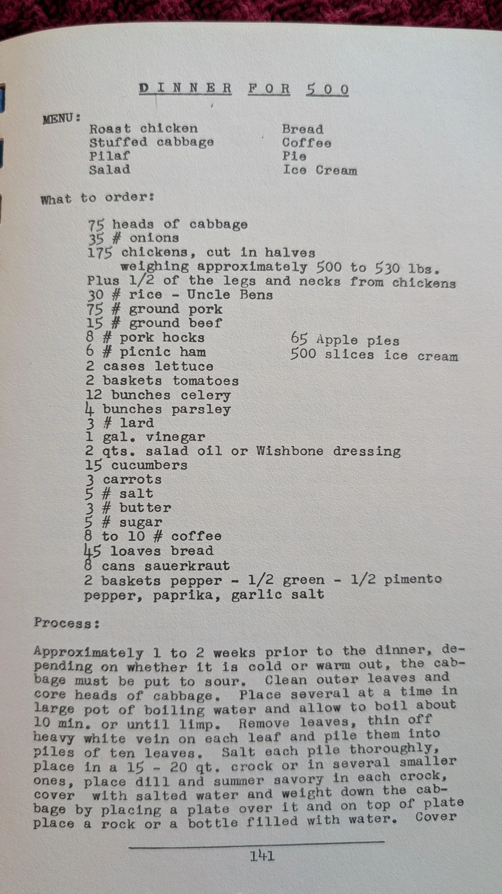
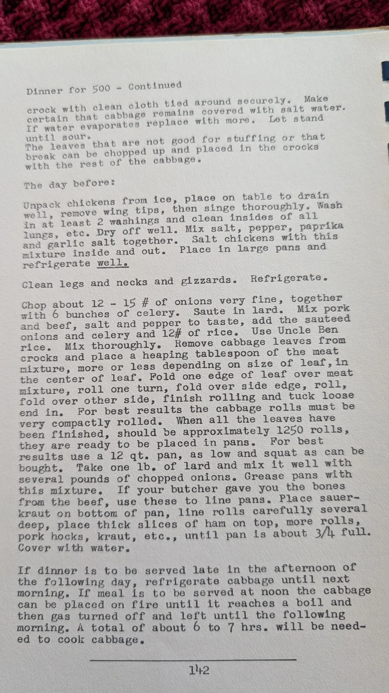
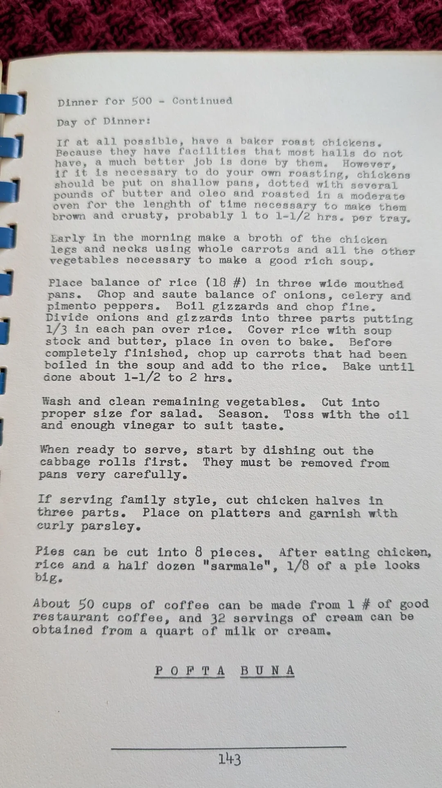
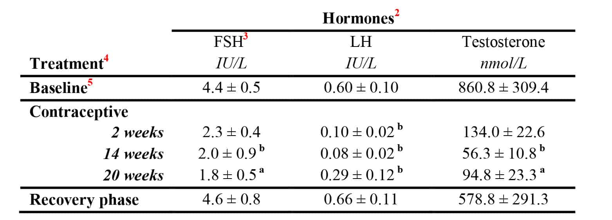
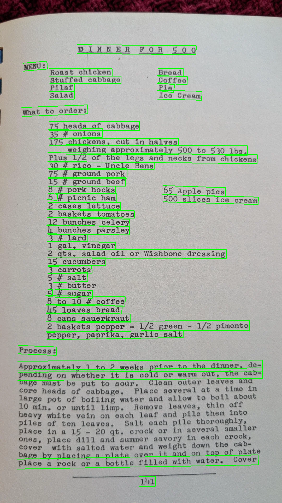
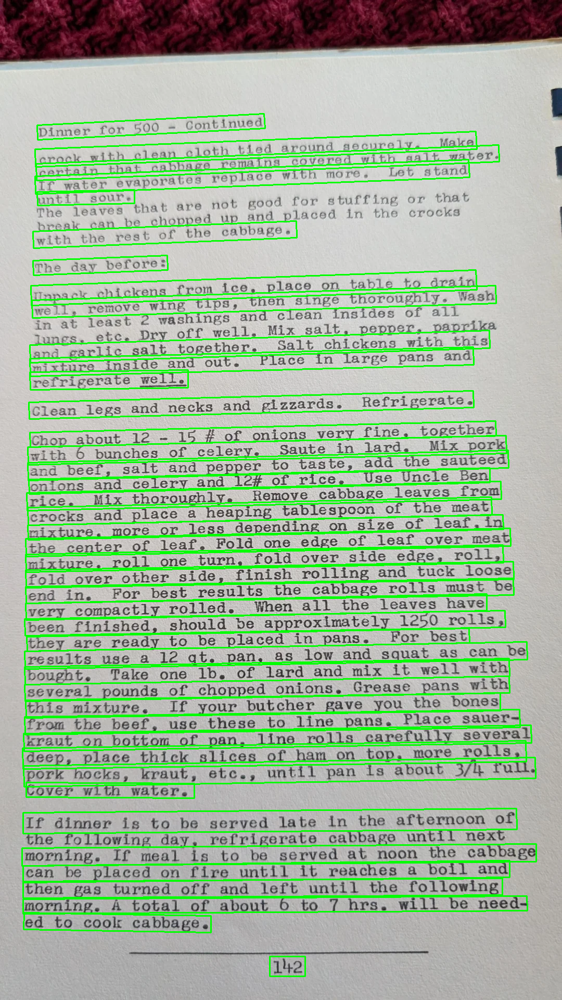
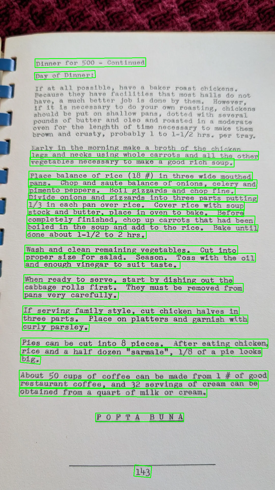
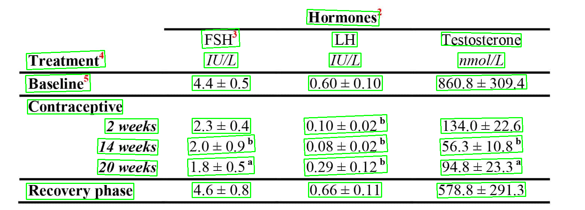

 ---
title: "Agentic OCR Intro"
author: "Derek Sollberger"
date: "2026-04-01"
format:
  html:
    toc: true
---

# Data

## Scans

> St. Mary's Romanian Orthodox Church, Cleveland Ohio cookbook. An absolute gem of a cookbook. Has a mix of wonderful old world cooking.

--- Redditor: TerriblePokemon

* r/OldRecipes [Reddit post](https://www.reddit.com/r/Old_Recipes/comments/1qr999h/anyone_want_to_cook_for_the_whole_village_dinner/)

:::: {.columns}

::: {.column width="30%"}
	
:::

::: {.column width="5%"}
	
:::

::: {.column width="30%"}

:::

::: {.column width="5%"}
	
:::

::: {.column width="30%"}

:::

::::

## Tables

	

* image source: [Writing Clear Science](https://www.writingclearscience.com.au/how-to-create-tables-from-data/)


# PyTesseract

::::: {.panel-tabset}

## code

```
!pip install pytesseract pillow

import pytesseract
from PIL import Image

recipe_3_file = "recipe_3.png"
recipe_3_image = Image.open(recipe_3_file)
recipe_3_text = pytesseract.image_to_string(recipe_3_image)
with open("recipe_3.txt", "w") as output_file:
    output_file.write(recipe_3_text)
```

* adapted from a [blog post](https://www.nutrient.io/blog/how-to-use-tesseract-ocr-in-python/) by Hulya Masharipov

## recipe_1

:::: {.columns}

::: {.column width="45%"}

:::

::: {.column width="10%"}
	
:::

::: {.column width="45%"}
ee

DINNER F.OR 5.0.0

Roast chicken Bread
Stuffed cabbage ' Coffee
Pilaf Pie

Salad Ice Cream

what to order:

75 heads of cabbage

35 # onions

175 chickens, cut in halves

weighing approximately 500 to 530 lbs.

Plus 1/2 of the legs and necks from chickens
30 # rice - Uncle Bens

75 # ground pork
15 # ground beef
8 # pork hocks 65 Apple pies
6 # picnic ham 500 slices ice cream
2 cases lettuce
2 baskets tomatoes

12 bunches celery
h bunches parsley

3 # lard

1 gal. vinegar
2 qts. salad oil or Wishbone dressing

15 cucumbers

3 carrots
5 # salt

3 # butter
5 # sugar
8 to 10 # coffee

5 loaves bread

cans sauerkraut

2 baskets pepper - 1/2 green - 1/2 pimento

pepper, paprika, garlic salt

Process:

Approximately 1 to 2 weeks prior to the dinner, de-
pending on whether it is cold or warm out, the cab-
bage must be put to sour. Clean outer leaves and
core heads of cabbage. Place several at a time in
large pot of boiling water and allow to boll about
10 min. or until limp. Remove leaves, thin off
heayy white vein on each leaf and pile them into
piles of ten leaves. Salt each pile thoroughly,
place in a 15 ~ 20 qt. crock or in several smaller
ones, place dill and summer savory in each eraeks
cover with salted water and weight down the ee
bage by placing a plate over it and on top of pla
place a rock or a bottle filled with water, Cover

SSE ie SE es
L41

:::

::::

## recipe_2

:::: {.columns}

::: {.column width="45%"}
	
:::

::: {.column width="10%"}
	
:::

::: {.column width="45%"}
   

Continued

Dinner for 500 =

crock with clean cloth tied around securely. Make
certain that cabbage remains covered with salt water.
If water evaporates yeplace with more. Let stand

til sour.
Th ‘ for stuffing or that

The leaves that are not good
the crocks

break can be chopped up and placed in
with the rest of the cabbage.

The day pefore:
chickens from ice, place on table to drain
well, remove wing tips, then singe thoroughly. Wash
in at least 2 washings and clean insides of all
lungs, etc. Dry off well. Mix salt, pepper, paprika
and garlic salt together. Salt chickens with this
mixture inside and out. Place in large pans and
refrigerate well.

Unpack

Glean legs and necks and gizzards. Refrigerate.
of onions very fine, together

Chop about 12 - 15 #
Saute in lard. Mix pork

with 6 bunches of celery.
and beef, salt and pepper to taste, add the sauteed

onions and celery and 12# of rice. Use Uncle Ben
rice. Mix thoroughly. Remove cabbage leaves from
crocks and place a heaping tablespoon of the meat
mixture, more or less depending on size of leaf, in
the center of leaf. Fold one edge of leaf over meat
mixture, roll one turn, fold over side edge, roll,
fold over other side, finish rolling and tuck loose
end in. For best results the cabbage rolls must be
very compactly rolled. When all the leaves have

been finished, should be approximately 1250 rolls,
they are ready to be placed in pans. For best
results use a 12 qt. pan, as low and squat as can be
bought. Take one 1b. of lard and mix it well with
several pounds of chopped onions. Grease pans with
this mixture. If your butcher gave you the bones
from the beef, use these to line pans. Place sauer=-
kraut on bottom of pan, line rolls carefully several
deep, place thick slices of ham on top, more rolls,
pork hocks, kraut, etc., until pan is about 3/4 full.

Cover with water.

If dinner is to be served late in the afternoon of
the following day, refrigerate cabbage until next
morning. If meal is to be served at noon the cabbage
can be placed on fire until it reaches a boil and
then gas turned off and left until the following
morning. A total of about 6 to 7 hrs. will be need-

ed to cook cabbage.

 

142

:::

::::

## recipe_3

:::: {.columns}

::: {.column width="45%"}
	
:::

::: {.column width="10%"}
	
:::

::: {.column width="45%"}
 

Continued

Dinner for 500 =

Day of Dinner?

If at all possible, have a baker roast chickens,
Because they have facilities that most halls do not
have, a much better job is done by them, However,

if it is necessary to do your own roasting, chickens
should be put on shallow pans, dotted with severa L
pounds of butter and oleo and roasted in a mode rate
oven for the lenghth of time necessary to make them
brown and crusty, probably 1 to 1-1/2 hrs. per tray.

Early in the morning make a broth of the chicken
legs and necks using whole carrots and all the other

vegetables necessary to make a good rich soup,

Place balance of rice (18 #) in three wide mouthed
pans. Chop and saute balance of onions, celery and
pimento peppers. Boil gizzards and chop fine.
Divide onions and gizzards into three parts putting
1/3 in each pan over rice. Cover rice with soup
stock and butter, place in oven to bake. Before

completely finished, chop up carrots that had been
boiled in the soup and add to the rice. Bake until

Gone about 1-1/2 to 2 hrs.

Wash and clean remaining vegetables. Cut into
proper size for salad. Season. Toss with the oil
and enough vinegar to suit taste.

When ready to serve, start by dishing out the
cabbage rolls first. They must be removed from

pans very carefully.

If serving family style, cut chicken halves in
three parts. Place on platters and garnish with

curly parsley.

Pies can be cut into 8 pieces. After eating chicken,
rice and a half dozen "sarmale", 1/8 of a pie looks

big.

About 50 cups of coffee can be made from 1 # of good
restaurant coffee, and 32 servings of cream can be
obtained from a quart of milk or cream.

POFTA BUNA

143

> "POFTA BUNA" is "Good appetite" in Romanian

:::

::::

## sample_table

:::: {.columns}

::: {.column width="45%"}
	
:::

::: {.column width="10%"}
	
:::

::: {.column width="45%"}
Treatment’
Baseline’

Contraceptive
2 weeks
14 weeks
20 weeks

Recovery phase

FSH°
IU/L
44+0.5

 

2.3+04
2.0+0.9"
1.8+0.5"

46+£08

 

 

Hormones”
LH
IU/L
0.60 + 0.10

 

0.10+0.02°
0.08 + 0.02°
0.29+0.12>
0.66 +0.11

 

 

Testosterone
nmol/L
860.8 + 309.4

 

134.0 + 22.6
56.3 + 10.8°
94.8 + 23.37

578.8 + 291.3

:::

::::

:::::


# PaddleOCR

## Installer

At the moment, I used the [stand-alone installer](https://github.com/timminator/PaddleOCR-Standalone/releases/tag/v.1.0.0) made by [timminator](https://github.com/timminator)

* Python package dependencies were tough
* heard through [Reddit](https://old.reddit.com/r/MachineLearning/comments/1iab2w2/p_standalone_paddleocr_executable_simplified_ocr/)

## CLI

* point to image file
* pick language (e.g. English)
* `use_angle_cls`

  * `true`: allows for rotated text (e.g. 90, 180, or 270 degrees)
  * `false`: faster performance

```
paddleocr --image_dir recipe_3.png --lang en --use_angle_cls true
```

::: {.callout-note collapse="true"}
### Workflow

Caution: this workflow is not optimal; it's just what I did here in early explorations

* navigate to image directory (to reduce CLI code)
* run CLI command(s)
* copy-and-paste output into a text file

  * find-and-replace timestamps/line numbers with nothing
  
* load output text file into Python and process with `cv2`
:::

## Output

This procedure scans an image and produces (for each group of text)

1. bounding box
2. the text
3. a confidence score

```
[[[296.0, 170.0], [751.0, 174.0], [750.0, 208.0], [296.0, 204.0]], ('DINNERFORSOO', 0.9840278625488281)]
 [[[87.0, 241.0], [179.0, 233.0], [181.0, 263.0], [89.0, 271.0]], ('MENU:', 0.9722374081611633)]
 [[[189.0, 262.0], [429.0, 262.0], [429.0, 290.0], [189.0, 290.0]], ('Roast chicken', 0.9721485376358032)]
 [[[604.0, 260.0], [701.0, 260.0], [701.0, 290.0], [604.0, 290.0]], ('Bread', 0.9978684186935425)]
 [[[191.0, 290.0], [463.0, 290.0], [463.0, 318.0], [191.0, 318.0]], ('Stuffed cabbage', 0.979429304599762)]
```


## Results

::::: {.panel-tabset}

### code

```
import ast
import cv2
import numpy as np

image_path = "recipe_2.png"
result_path = "recipe_2_paddle.txt"
boxed_image_path = "recipe_2_boxes.png"

with open(result_path, "r") as file:
    result = [line.strip() for line in file]
n = len(result)

boxes = [ast.literal_eval(result[line])[0] for line in range(n)]
txts = [ast.literal_eval(result[line])[1][0] for line in range(n)]
scores = [ast.literal_eval(result[line])[1][1] for line in range(n)]

img = cv2.imread(image_path)
for coords in boxes:
    # Draw closed polygon, green color (0, 255, 0), thickness of 2 px
    cv2.polylines(img, pts = [np.array(coords, np.int32)], isClosed = True, color = (0, 255, 0), thickness = 2)
cv2.imwrite(boxed_image_path, img)
```

### recipe_1



### recipe_2



### recipe_3



### sample_table



:::::


# Agentic OCR

::: {.callout-tip}
## Adding AI Tools

* topic modeling

  * combine lines into paragraphs (even across pages)
  * distinguish asides
  
* retrieval augmented generation (RAG)

  * ask database of scans
  * maintain data privacy
  
* research assistant

  * scan PDFs and their tables
  * summarize quantities and results
  
[Other projects](https://github.com/timminator/PaddleOCR-Standalone/blob/release/3.4-custom/awesome_projects.md) stemming from PaddleOCR can be found in their GitHub repositories.

:::


# Thanks!

:::: {.columns}

::: {.column width="30%"}

:::

::: {.column width="10%"}
	
:::

::: {.column width="60%"}
Derek Sollberger

* Lecturer of Data Science
* Princeton University

    * Center for Statistics and Machine Learning
    
* dsollberger[at]princeton[dot]edu
:::

::::


::: {.callout-note collapse="true"}
## Session Info

```{r}
sessionInfo()
```
:::


:::: {.columns}

::: {.column width="45%"}
	
:::

::: {.column width="10%"}
	
:::

::: {.column width="45%"}

:::

::::

::::: {.panel-tabset}


:::::