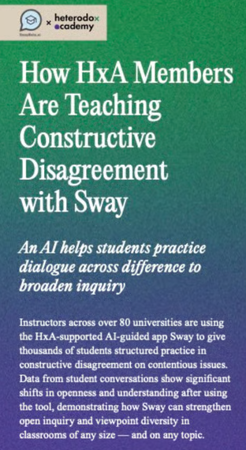

# Agile Ethics Workshop

<!---
preimplantation genetic testing 
--->

## Learning Objectives

:::: {.columns}

::: {.column width="45%"}
- View results of prompt engineering
- Discuss governmental regulation in PGT
- Participate in agile ethics
:::

::: {.column width="10%"}

:::

::: {.column width="45%"}


* image source: [MAR&Gen](https://www.clinicamargen.com/en/treatments/preimplantation-genetic-testing)
:::

::::

# Scene

Picture a biotech startup that specializes in next-generation sequencing (NGS). Their software processes large DNA data files in parallel. At the beginning, such sequencing cost about \$2.5 billion during the Human Genome Project, but that can now be done with NGS for about \$500

The startup's founders strive to use their understanding of reproductive genetics to improve in vitro fertilization (IVF).  Their teams use NGS on embryos, sequence the DNA, and help parents choose which embryos to cultivate. Overall, this frontier is called **preimplantation genetic testing** (PGT).

The leadership, in hopes of preparing to address a Congressional subcommittee, recruit a diverse set of voices to discuss and debate the issues.

1. Founder scientist
2. Disability rights advocate
3. Public health expert
4. Sickle-cell anemia patient


# Agile Ethics

:::: {.columns}

::: {.column width="30%"}
	

* Lecturer in the University Center of Human Values

:::

::: {.column width="10%"}
	
:::

::: {.column width="60%"}
> Technologists can be caught flat-footed, failing to anticipate the social and moral implications of their work. How do we teach students cutting-edge technical skills while also raising their awareness of potential pitfalls before they happen? Our approach, “[Agile Ethics](https://kellercenter.princeton.edu/people/startups-teams/agile-ethics),” **brings together technical skills development through coursework with moral awareness through interactive role-plays**. Agile Ethics role-plays can be plugged into any computing course, anywhere in the country or across the world. Techno-moral decision-making skills are reinforced by simulating the development of products using the tech taught in class. Moral awareness begins with foreseeing the sometimes-hidden consequences of any action (Rest, 1986; and others). In the Agile Ethics simulations, students inhabit roles on an Agile team (engineers, project managers, etc.), while others take on roles in stakeholder groups (corporate board members, tech writers, end users, etc.) to experience ethical dilemmas as they emerge in real tech work. The students make technical and design choices, then discover through successive “sprints” how they can address the moral wrongs they have caused.

---Keller Center at Princeton University
:::

::::


# Prompt Engineering

My students, perhaps as a reflection of the learning environment that I create, are a quiet group of people.  In fact, I set up an anonymous Slido poll each week to receive questions rather than having the students raise their hands.  With that in mind, asking them to vocalize a debate will be quite a shift in expectations.  

To mitigate that aberrant request, I want to give each student a 3-page **character sheet** to on-board them into the roles (stated above). I hope that each character sheet provides several possible talking points to encourage and guide the debate.

Even after I read some materials (below in the "RAG" section), I find that I myself am not a writer of debates.  Thus, I shall employ **prompt engineering** to create the bullet-point lists of talking points.  The idea of debate roles lends itself well for the prompt engineering tool.

Following materials found in Chapter 6 of [Hands-On Large Language Models](https://github.com/HandsOnLLM/Hands-On-Large-Language-Models) (by Jay Alammar and Maarten Grootendorst), we can construct an LLM prompt with parts like ...

::: {.callout-tip}
## Persona

[We will provide this below]
:::

::: {.callout-note}
## Instruction

Provide possible debate points and *support a stance*.
:::

::: {.callout-tip}
## Context

The list should *express several key points* that can help a debate team and quickly state important information for the scene.
:::

::: {.callout-note}
## Format

Create a bullet-point overview that summarizes the *debate stance* and also provide a concise paragraph that initiates the debate.
:::

::: {.callout-tip}
## Audience

We are at a USA government meeting with a subcommitee of Congress.  We are hoping to inform our Congress members about the issues about *governmental regulation in PGT*.
:::

::: {.callout-note}
## Tone

The tone should be informative and professional.
:::

::: {.callout-tip}
## Data

[https://en.wikipedia.org/wiki/Preimplantation_genetic_diagnosis](https://en.wikipedia.org/wiki/Preimplantation_genetic_diagnosis)
:::

Continuing with the materials found in Chapter 6 of [Hands-On Large Language Models](https://github.com/HandsOnLLM/Hands-On-Large-Language-Models), I used the [Phi-3-mini-4k-instruct](https://huggingface.co/microsoft/Phi-3-mini-4k-instruct) LLM (made by Microsoft) and its tokenizer to process these prompts.


## RAG

So far, I have found neat resources that include

* **American College of Obstetricians and Gynecologists**: [Preimplantation Genetic Testing: Committee of Genetics](https://www.acog.org/clinical/clinical-guidance/committee-opinion/articles/2020/03/preimplantation-genetic-testing)
* **American Society for Reproductive Medicine**: [Indications and management of preimplantation genetic testing for monogenic conditions: a committee opinion](https://www.asrm.org/practice-guidance/practice-committee-documents/indications-and-management-of-preimplantation-genetic-testing-for-monogenic-conditions-a-committee-opinion-2023/)
* **Cleveland Clinic**: [Preimplantation Genetic Testing (PGT)](https://my.clevelandclinic.org/health/diagnostics/preimplantation-genetic-testing-pgt)
* **Human Fertilization & Embryology Authority**: [Pre-implantation genetic testing for monogenic disorders (PGT-M) and Pre-implantation genetic testing for chromosomal structural rearrangements (PGT-SR)](https://www.hfea.gov.uk/treatments/embryo-testing-and-treatments-for-disease/pre-implantation-genetic-testing-for-monogenic-disorders-pgt-m-and-pre-implantation-genetic-testing-for-chromosomal-structural-rearrangements-pgt-sr)
* **Journal of General and Family Medicine**: [Ethical considerations of gene editing and genetic selection](https://pmc.ncbi.nlm.nih.gov/articles/PMC7260159/)

::: {.callout-note}
### Revisions

Take on a **retrieval-augmented generation** (RAG) mindset by either having each persona ask for more debate points from the specialized literature (i.e. more specialized than just the Wikipedia article) or simply augment the data first and then perform the prompt engineering again.
:::


## Python

Most of this code comes from [Chapter 6](https://colab.research.google.com/github/HandsOnLLM/Hands-On-Large-Language-Models/blob/main/chapter06/Chapter%206%20-%20Prompt%20Engineering.ipynb) of *Hands-On Large Language Models* by Jay Alammar and Maarten Grootendorst

::::: {.panel-tabset}

### loading

```{python}
#| eval: false

import torch
from transformers import AutoModelForCausalLM, AutoTokenizer, BitsAndBytesConfig, logging, pipeline

# load texts
with open('genetic_testing.txt', 'r') as file:
    genetic_testing = file.read()

text_data = genetic_testing
```

### tokenizer

```{python}
#| eval: false

model = AutoModelForCausalLM.from_pretrained(
    "microsoft/Phi-3-mini-4k-instruct",
    device_map="cuda",
    # quantization_config=quant_config,
    torch_dtype="auto",
    trust_remote_code=False,
)
tokenizer = AutoTokenizer.from_pretrained("microsoft/Phi-3-mini-4k-instruct")
```

### pipeline

```{python}
#| eval: false

pipe = pipeline(
    "text-generation",
    model=model,
    tokenizer=tokenizer,
    return_full_text=False,
    max_new_tokens=5000,
    do_sample=False,
)
```

### prompt engineering

```{python}
#| eval: false

persona_ceo = ...
persona_dra = ...
persona_ph = ...
persona_patient = ...

instruction = "Provide possible debate points and support a stance.\n"
context = "The list should express several key points that can help a debate team and quickly state important information for the scene.\n"
data_format = "Create a bullet-point overview that summarizes the debate stance and also provide a concise paragraph that initiates the debate.\n"
audience = "We are at a government meeting with a subcommitee of Congress. We are hoping to inform our Congress members about the issues about governmental regulation in preimplantation genetic testing.\n"
tone = "The tone should be informative and professional.\n"
text = text_data  # the underlying data
data = f"Text to summarize: {text}"
```

### text generation

```{python}
#| eval: false

query = persona_ceo + instruction + context + data_format + audience + tone + data
messages = [{"role": "user", "content": query}]

outputs = pipe(messages)
print(outputs[0]["generated_text"])
```

:::::

## Prompt Construction

```{python}
#| eval: false

query = persona_ceo + instruction + context + data_format + audience + tone + data
```

<span style = "color:#FF0000;">You are one of the scientists behind next-generation sequencing (NGS) and the co-founder of a NGS firm.  You helped build PGT-A because you believe in giving families the most complete information available is essential to preventing avoidable suffering. You see screenings for trisomes---including Down Syndrome---as part of responsible clinical transparency.  Patients deserve full knowledge about the embryos they may implant, and you feel strongly that withholding medically relevant information violates their trust.</span><span style = "color:#FFA500;">Provide possible debate points and support a stance.</span><span style = "color:#FFFF00;">The list should express several key points that can help a debate team and quickly state important information for the scene.</span><span style = "color:#008000;">Create a bullet-point overview that summarizes the debate stance and also provide a concise paragraph that initiates the debate.</span><span style = "color:#0000FF;">We are at a government meeting with a subcommitee of Congress. We are hoping to inform our Congress members about the issues about governmental regulation in preimplantation genetic testing.</span><span style = "color:#4B0082;">The tone should be informative and professional.</span><span style = "color:#EE82EE;">Text to summarize: [the websites' text]


# Roles

Upon consultation with Dr Steven Kelts, I took his advice and clarified the objective for each role.  The AI LLM created the rest of the character sheets via prompt engineering (outlined above) along with more data (i.e. more text articles) and the objectives

::::: {.panel-tabset}

## Founder/Scientist

::: {.callout-note}
### persona

You are one of the scientists behind next-generation sequencing (NGS) and the co-founder of a NGS firm.  You helped build PGT-A because you believe in giving families the most complete information available is essential to preventing avoidable suffering. You see screenings for trisomes---including Down Syndrome---as part of responsible clinical transparency.  Patients deserve full knowledge about the embryos they may implant, and you feel strongly that withholding medically relevant information violates their trust.
:::

::: {.callout-tip}
### objective

Protect Patient Access to Comprehensive Genetic Information Through Responsible PGT-A Regulation.
:::

## Disability Rights Advocate

::: {.callout-note}
### persona

You are a disability rights advocate invited into the advisory panel.  Many of your family have Down Syndrome and you have witnessed their joy, dignity, and social contributions. You worry that including Down Syndrome in early embryo screening implicitly sends a message that people like your loved ones are less valued or undesirable.  You are concerned this could worsen stigma, reduce societal support, and undermine ongoing efforts toward inclusion and disability justice.
:::

::: {.callout-tip}
### objective

Regulate PGT in a Way That Protects Disability Rights, Human Dignity, and Social Inclusion
:::


## Public Health Expert

::: {.callout-note}
### persona

You are a public health expert specializing in genetic diversity who now works at the NGS firm.  You are deeply worried about population-level effects of large-scale selection against monogenic mutations.  Selecting against harmful mutation also reduces genetic variation in the surrounding region---a process whose consequences we cannot fully predict. You often cite examples like dog breeding, where selecting for temperament unintentionally changed snout shape and coat color.  Furthermore, lack of genetic diversity can also make us more susceptible to pathogens.  You believe caution is necessary to avoid unintended long-term consequences that could affect the entire population, so we should only use PGT-M when absolutely necessary.
:::

::: {.callout-tip}
### objective

Preserve Genetic Diversity and Apply PGT-M Only When Medically Justified
:::


## Sickle-Cell Anemia Patient

::: {.callout-note}
### persona

You are a member of the advisory group and someone living with sickle cell anemia.  You know the chronic pain, hospital visits, and life-limiting complications of the disease firsthand. You want future families---incluiding your own---to have the option to avoid passing this on.  You feel frustrated that discussions about population-level diversity overshadowed the lived realities of those suffering now.  You believe individiuals deserve the right to protect their children from debilitating disorders.
:::

::: {.callout-tip}
### objective

Protect Access to PGT-M for Serious Genetic Diseases and Respect the Reproductive Choices of Affected Families
:::

:::::


# Activity

Materials can be found in our [QUBES resource page](https://qubeshub.org/publications/5991/supportingdocs/1)

::: {.callout-note}
## Breakout Rooms

* **Breakout Room 1**: [PGT_CEO](PGT_CEO.pdf)
* **Breakout Room 2**: [PGT_DRA](PGT_DRA.pdf)
* **Breakout Room 3**: [PGT_PH](PGT_PH.pdf)
* **Breakout Room 4**: [PGT_Patient](PGT_Patient.pdf)

:::

::: {.callout-tip}
## Consolidation (15 minutes)

* Read your 3-page character sheet
* Discuss the talking points with your group
:::

::: {.callout-warning}
## Debate (15 minutes)

* We will cycle through the groups in order

   * Say one talking point per turn
   
* Try to share speaking duties with fellow group members
:::

# Assessment

::: {.callout-tip collapse="true"}
## Reflect of Other Group's Talking Points (5 minutes)

In the Slido poll, type a talking point from another group that you found interesting, important, etc.
:::

::: {.callout-warning}
## Let's create a grading rubric (15 minutes)
:::

# Future Directions

:::: {.columns}

::: {.column width="45%"}

:::

::: {.column width="10%"}
	
:::

::: {.column width="45%"}
## Sway

* AI-aided debate software

> Instructors across over 80 universities are using the HxA-supported AI-guided app [Sway](https://www.swaybeta.ai/) to give thousands of students structured practice in constructive disagreement on contentious issues. Data from student conversations show significant shifts in openness and understanding after using the tool, demonstrating how Sway can strengthen open inquiry and viewpoint diversity in classrooms of any size — and on any topic.

:::

::::


# Thanks!

:::: {.columns}

::: {.column width="45%"}
## Thanks to

* Steven Kelts, Agile Ethics

* Teaching Controversial Issues FWG

    * QUBES
    * Pathways Project

* SML 301
:::

::: {.column width="10%"}
	
:::

::: {.column width="45%"}
## Speaker Info

* Derek Sollberger
* Lecturer of Data Science
* Princeton University

    * Data and Intelligent Systems
:::

::::


# Footnotes

::: {.callout-note collapse="true"}
## Session Info

```{r}
sessionInfo()
```
:::


:::: {.columns}

::: {.column width="45%"}
	
:::

::: {.column width="10%"}
	
:::

::: {.column width="45%"}

:::

::::

::::: {.panel-tabset}


:::::