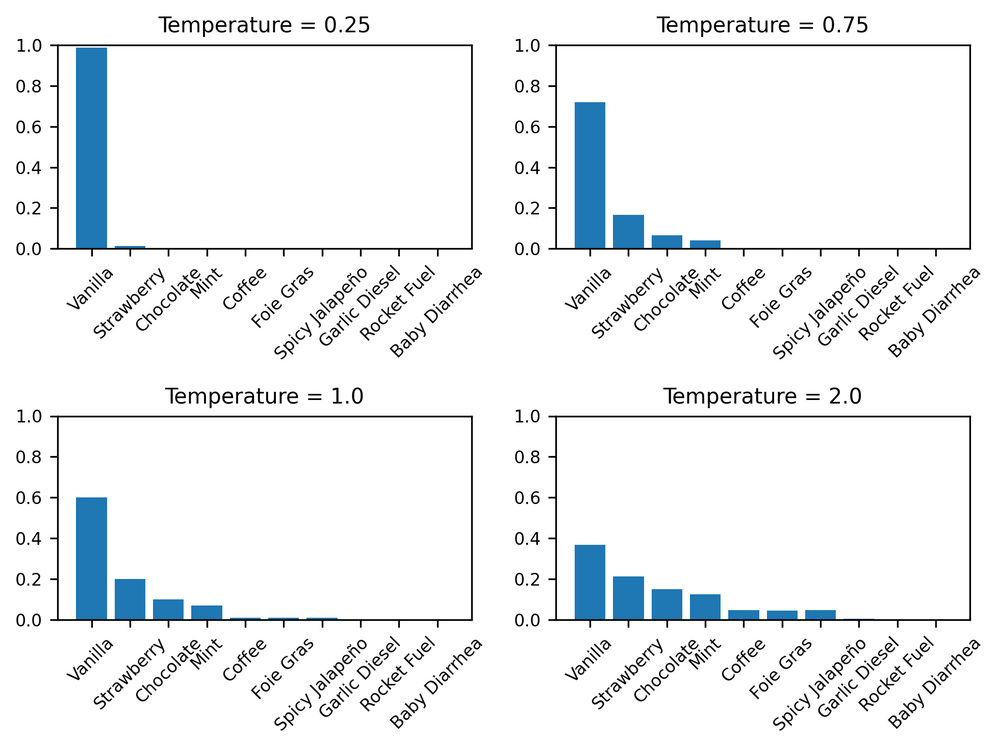
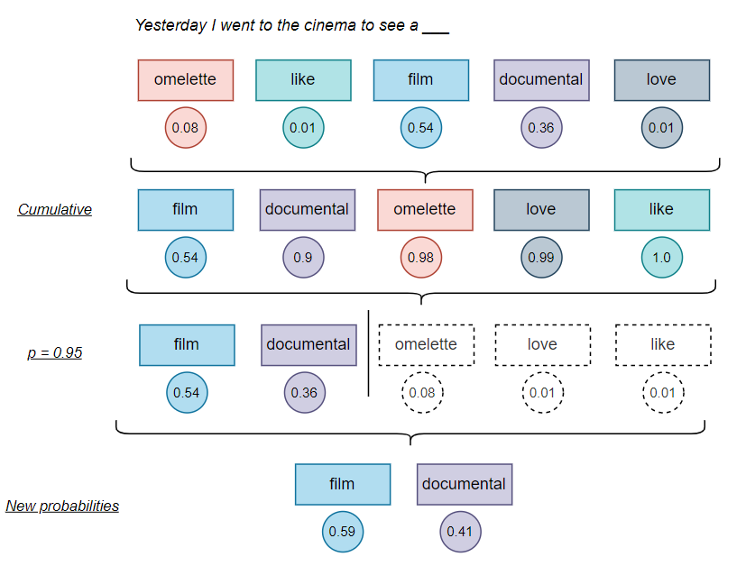
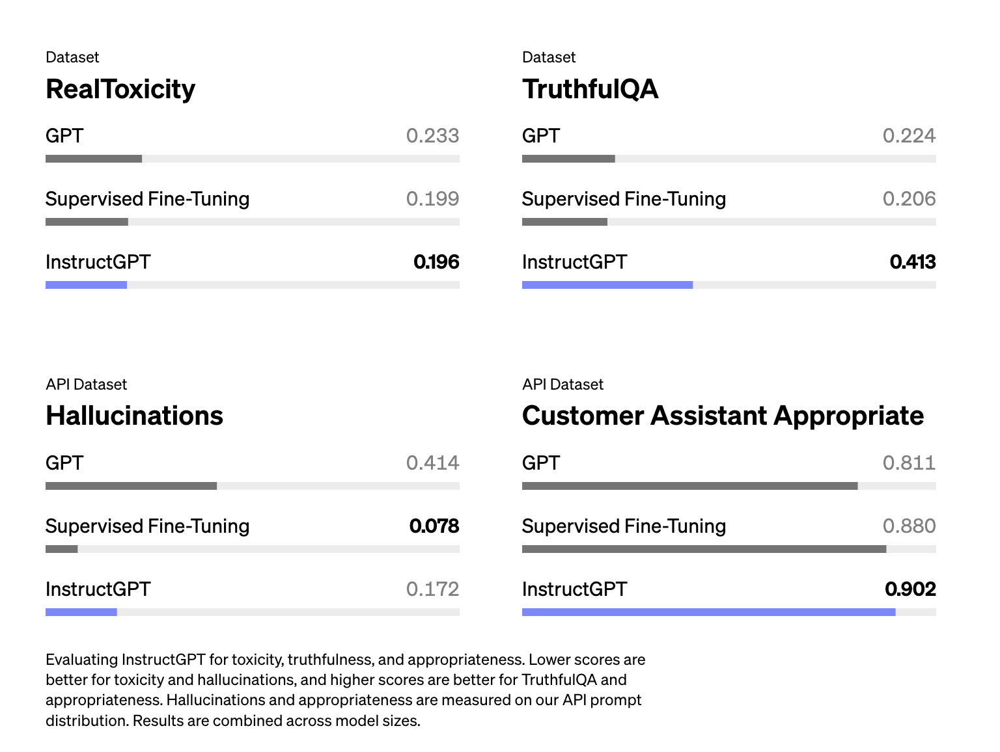
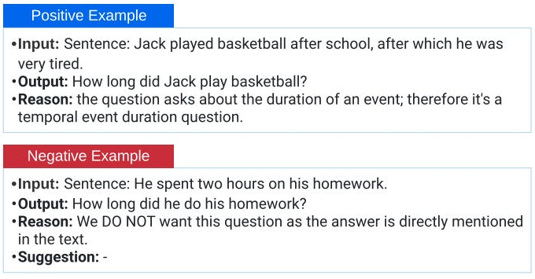
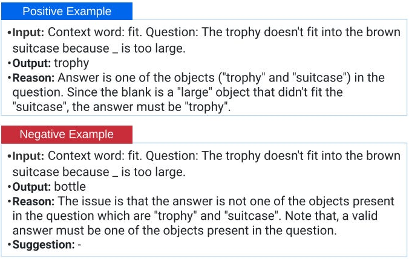
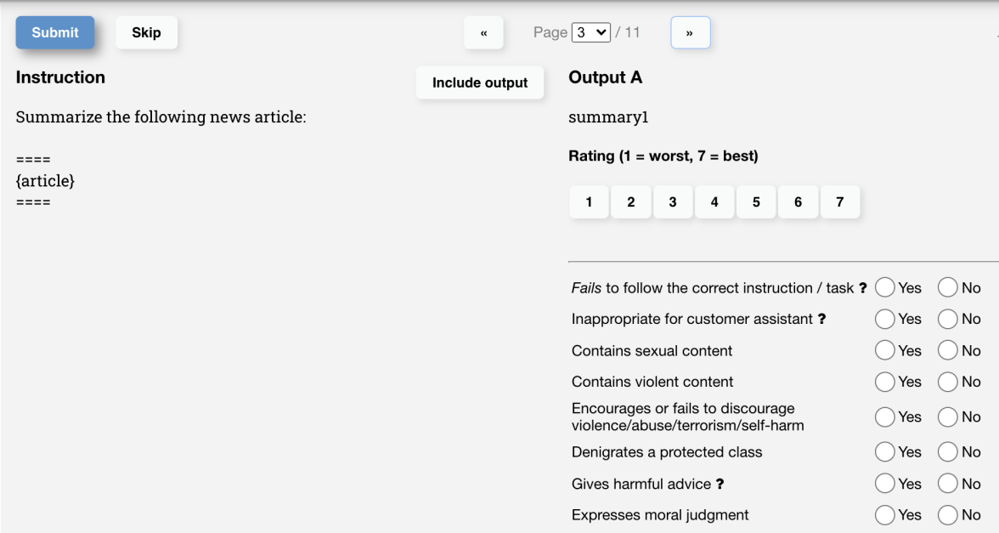
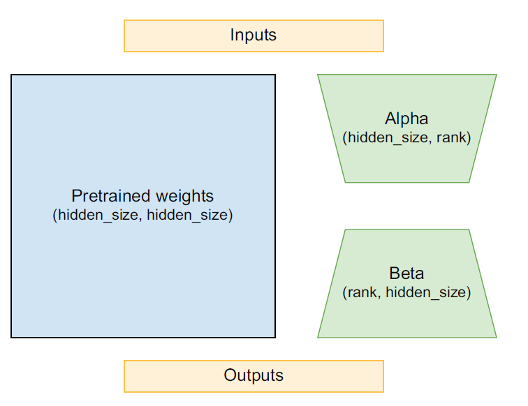
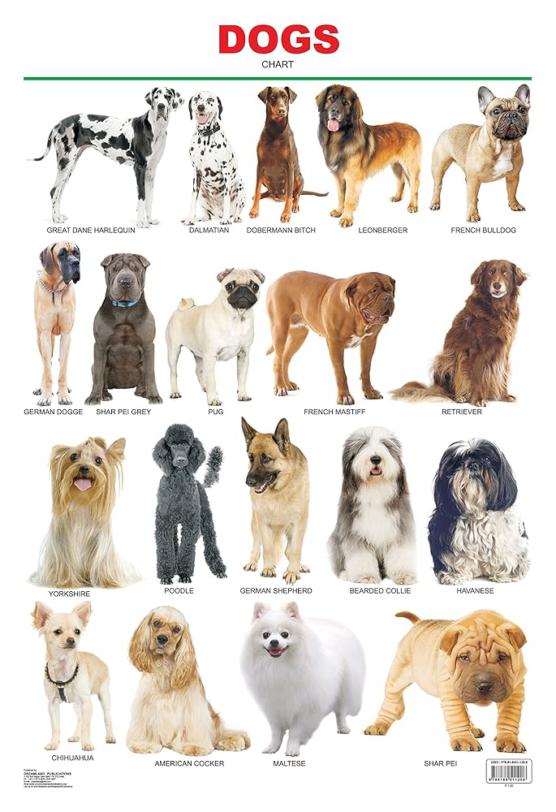
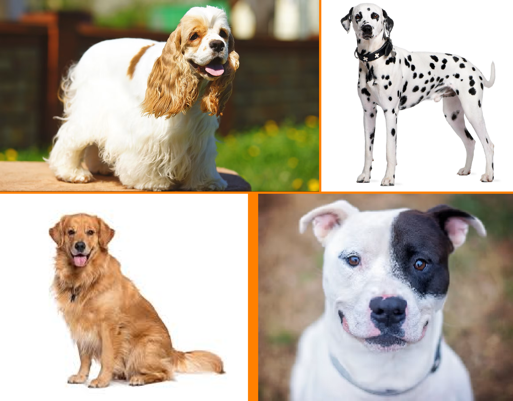
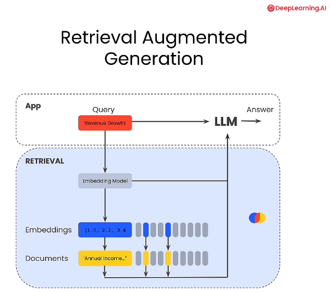

```{r}
#| echo: false
#| message: false
#| warning: false


```


# Overview

This is a glance at the materials in Chapter 16---**Text Generation**---of [Deep Learning with Python](https://deeplearningwithpython.io/chapters/) by Francois Chollet and Matthew Watson

Previously:

* Chapter 14: Text Classification
* Chapter 15: Transformers


## History

A brief history of sequence generation:

::::: {.columns}

:::: {.column width="60%"}
:::: {.timeline .vertical}
::: {.event data-label="2002"}
**LSTM**
for music generation (Douglas Eck)
:::
::: {.event data-label="2013"}
**RNN**
recurrent networks ([Alex Graves](https://www.cs.toronto.edu/~graves/))
:::
::: {.event data-label="2018"}
**Attention**
*Attention is All you Need* (Vasami, et al.)
:::
::: {.event data-label="2019"}
**GPT**
GPT-2 released
:::
::::	
::::

:::: {.column width="10%"}
	
::::

::: {.column width="30%"}
> Generating sequential
data is the closest computers get to dreaming.

--- [Alex Graves](https://www.cs.toronto.edu/~graves/)
::::

:::::


# Training a Mini-GPT

## Building

::::: {.panel-tabset}

## C4

* Colossal Clean Crawled
Corpus ("C4")

```{python}
#| eval: false

import keras
import pathlib

extract_dir = keras.utils.get_file(
    fname="mini-c4",
    origin=(
        "https://hf.co/datasets/mattdangerw/mini-c4/resolve/main/mini-c4.zip"
    ),
    extract=True,
)
extract_dir = pathlib.Path(extract_dir) / "mini-c4"
```

## Tokenizer

* needed by SentencePiece library

```{python}
#| eval: false

import keras_hub
import numpy as np
vocabulary_file = keras.utils.get_file(
origin="https://hf.co/mattdangerw/spiece/resolve/main/vocabulary.proto",
)
tokenizer = keras_hub.tokenizers.SentencePieceTokenizer(vocabulary_file)
```

```
>>> tokenizer.tokenize("The quick brown fox.")
array([ 450, 4996, 17354, 1701, 29916, 29889], dtype=int32)
>>> tokenizer.detokenize([450, 4996, 17354, 1701, 29916, 29889])
"The quick brown fox."
```

## Preprocessing

```{python}
#| eval: false

import tensorflow as tf

batch_size = 64
sequence_length = 256
suffix = np.array([tokenizer.token_to_id("<|endoftext|>")])

def read_file(filename):
    ds = tf.data.TextLineDataset(filename)
    ds = ds.map(lambda x: tf.strings.regex_replace(x, r"\\n", "\n"))  # <1>
    ds = ds.map(tokenizer, num_parallel_calls=8) # <2>
    return ds.map(lambda x: tf.concat([x, suffix], -1)) # <3>

files = [str(file) for file in extract_dir.glob("*.txt")]
ds = tf.data.Dataset.from_tensor_slices(files)
ds = ds.interleave(read_file, cycle_length=32, num_parallel_calls=32) # <4>
ds = ds.rebatch(sequence_length + 1, drop_remainder=True) # <5>
ds = ds.map(lambda x: (x[:-1], x[1:])) # <6>
ds = ds.batch(batch_size).prefetch(8)
```

1. restores newlines
2. tokenizes data
3. adds `<|endoftext|>` token
4. concatenates files into single dataset
5. uniform sequence length window
6. splits labels

## Transformer

```{python}
#| eval: false

from keras import layers

class TransformerDecoder(keras.Layer):
    def __init__(self, hidden_dim, intermediate_dim, num_heads):
        super().__init__()
        key_dim = hidden_dim // num_heads
        self.self_attention = layers.MultiHeadAttention(
            num_heads, key_dim, dropout=0.1
        ) # <1>
        self.self_attention_layernorm = layers.LayerNormalization() # <1>
        self.feed_forward_1 = layers.Dense(intermediate_dim,  activation="relu") # <2>
        self.feed_forward_2 = layers.Dense(hidden_dim) # <2>
        self.feed_forward_layernorm = layers.LayerNormalization() # <2>
        self.dropout = layers.Dropout(0.1)

    def call(self, inputs):
        residual = x = inputs
        x = self.self_attention(query=x, key=x, value=x, use_causal_mask=True) # <3>
        x = self.dropout(x) # <3>
        x = x + residual # <3>
        x = self.self_attention_layernorm(x) # <3>
        residual = x
        x = self.feed_forward_1(x) # <4>
        x = self.feed_forward_2(x) # <4>
        x = self.dropout(x) # <4>
        x = x + residual # <4>
        x = self.feed_forward_layernorm(x) # <4>
        return x
```

1. self-attention layers
2. feedforward layers
3. self-attention computation
4. feedforward computation

## PE

```{python}
#| eval: false

from keras import ops

class PositionalEmbedding(keras.Layer):
    def __init__(self, sequence_length, input_dim, output_dim):
        super().__init__()
        self.token_embeddings = layers.Embedding(input_dim, output_dim)
        self.position_embeddings = layers.Embedding(sequence_length, output_dim)

    def call(self, inputs, reverse=False):
        if reverse:
            token_embeddings = self.token_embeddings.embeddings
            return ops.matmul(inputs, ops.transpose(token_embeddings))
        positions = ops.cumsum(ops.ones_like(inputs), axis=-1) - 1
        embedded_tokens = self.token_embeddings(inputs)
        embedded_positions = self.position_embeddings(positions)
        return embedded_tokens + embedded_positions
```

:::::

## Pre-Training

::: {.callout-warning}
### Run Time

> If you can run the following with a Colab Pro GPU, we suggest you do so. This `fit()` call will take many hours on free tier GPUs. You can also reduce steps_per_epoch to try the code with a less trained model.

:::

::::: {.panel-tabset}

## Scheduler

```{python}
#| eval: false

class WarmupSchedule(keras.optimizers.schedules.LearningRateSchedule):
    def __init__(self):
        self.rate = 2e-4
        self.warmup_steps = 1_000.0

    def __call__(self, step):
        step = ops.cast(step, dtype="float32")
        scale = ops.minimum(step / self.warmup_steps, 1.0)
        return self.rate * scale
```

## Fit

```{python}
#| eval: false

num_epochs = 8
steps_per_epoch = num_train_batches // num_epochs
validation_steps = num_val_batches

mini_gpt.compile(
    optimizer=keras.optimizers.Adam(schedule),
    loss=keras.losses.SparseCategoricalCrossentropy(from_logits=True),
    metrics=["accuracy"],
)
mini_gpt.fit(
    train_ds,
    validation_data=val_ds,
    epochs=num_epochs,
    steps_per_epoch=steps_per_epoch,
    validation_steps=validation_steps,
)
```

## Decoding

```{python}
#| eval: false

def generate(prompt, max_length=64):
    tokens = list(ops.convert_to_numpy(tokenizer(prompt)))
    prompt_length = len(tokens)
    for _ in range(max_length - prompt_length):
        prediction = mini_gpt(ops.convert_to_numpy([tokens]))
        prediction = ops.convert_to_numpy(prediction[0, -1])
        tokens.append(np.argmax(prediction).item())
    return tokenizer.detokenize(tokens)
```

```
>>> prompt = "A piece of advice"
>>> generate(prompt)
A piece of advice, and the best way to get a feel for yourself is to get a sense
of what you are doing.
If you are a business owner, you can get a sense of what you are doing. You can
get a sense of what you are doing, and you can get a sense of what
```
:::::

::: {.callout-tip}
### Cached Generation

> Each time we call our model, we call it for an entire sequence and then throw away
everything but the predictions for a single position. This is wasteful—our sequence
only changes by a single token between generation steps.

> So if we cache all key and value vectors, at each layer of the Transformer,
we have the equivalent of an RNN’s state. We can use it to compute Transformer
outputs for a single position at a time.
:::

# Pre-Trained LLM

::::: {.panel-tabset}

## HuggingFace

```{python}
#| eval: false

import keras
import keras_hub
import torch

from huggingface_hub import notebook_login
notebook_login()
```

* consent to terms of use from Gemma
* get access key from HuggingFace
* checkbox yes for "Read access to contents of all public gated repos you can access"

## Gemma

```{python}
#| eval: false

from transformers import AutoTokenizer, Gemma3ForCausalLM

ckpt = "google/gemma-3-1b-pt" # 1 billion parameters
tokenizer = AutoTokenizer.from_pretrained(ckpt)
model = Gemma3ForCausalLM.from_pretrained(
    ckpt,
    torch_dtype=torch.bfloat16, #quanticized to be smaller
    device_map="auto"
)
```

## Architecture

```{python}
#| eval: false

print(model)

total_params = model.num_parameters()
trainable_params = model.num_parameters(only_trainable=True)
print(f"Total Parameters: {total_params:,}")
print(f"Trainable Parameters: {trainable_params:,}")
```

```
Gemma3ForCausalLM(
  (model): Gemma3TextModel(
    (embed_tokens): Gemma3TextScaledWordEmbedding(262144, 1152, padding_idx=0)
    (layers): ModuleList(
      (0-25): 26 x Gemma3DecoderLayer(
        (self_attn): Gemma3Attention(
          (q_proj): Linear(in_features=1152, out_features=1024, bias=False)
          (k_proj): Linear(in_features=1152, out_features=256, bias=False)
          (v_proj): Linear(in_features=1152, out_features=256, bias=False)
          (o_proj): Linear(in_features=1024, out_features=1152, bias=False)
          (q_norm): Gemma3RMSNorm((256,), eps=1e-06)
          (k_norm): Gemma3RMSNorm((256,), eps=1e-06)
        )
        (mlp): Gemma3MLP(
          (gate_proj): Linear(in_features=1152, out_features=6912, bias=False)
          (up_proj): Linear(in_features=1152, out_features=6912, bias=False)
          (down_proj): Linear(in_features=6912, out_features=1152, bias=False)
          (act_fn): GELUTanh()
        )
        (input_layernorm): Gemma3RMSNorm((1152,), eps=1e-06)
        (post_attention_layernorm): Gemma3RMSNorm((1152,), eps=1e-06)
        (pre_feedforward_layernorm): Gemma3RMSNorm((1152,), eps=1e-06)
        (post_feedforward_layernorm): Gemma3RMSNorm((1152,), eps=1e-06)
      )
    )
    (norm): Gemma3RMSNorm((1152,), eps=1e-06)
    (rotary_emb): Gemma3RotaryEmbedding()
  )
  (lm_head): Linear(in_features=1152, out_features=262144, bias=False)
)
Total Parameters: 999,885,952
Trainable Parameters: 999,885,952
```

## Tool Use

```{python}
#| eval: false

model_inputs = tokenizer(prompt, return_tensors="pt").to(model.device)

input_len = model_inputs["input_ids"].shape[-1]

with torch.inference_mode():
    generation = model.generate(**model_inputs, max_new_tokens=50, do_sample=False)
    generation = generation[0][input_len:]
decoded = tokenizer.decode(generation, skip_special_tokens=True)
print(decoded)
```

:::::

::: {.callout-note collapse="true"}
# Prompt: "Eiffel tower is located in"

> the heart of Paris, France.The Eiffel Tower is a symbol of Paris and France.The Eiffel Tower is a symbol of Paris and France.The Eiffel Tower is a symbol of Paris and France.The Eiffel Tower is a symbol

:::

::: {.callout-warning collapse="true"}
# Prompt: "The winner of the 2026 World Cup was"

> announced on Monday, with the United States and Argentina emerging as the two finalists. The United States and Argentina will face off in the final match of the 2026 World Cup on Sunday, November 18, 202

:::

# Sampling Strategies

### Greedy Algorithm

```{python}
#| eval: false

def greedy_search(preds):
    return ops.argmax(preds)

compiled_generate(prompt, greedy_search)
```

### Temperature

::: {.callout-note}
#### Temperature

For this hyperparameter, **temperature** rescales logits before applying a softmax

$$p_{i} = \frac{e^{z_{i}/T}}{\sum_{i=1}^{n} e^{z_{i}/T}}$$

* $T = 0$: greedy selection of softmax
* low temperature (e.g. $T = 0.301$): more deterministic output
* high temperature (e.g. $T = 1.301$): more creative output
:::



* image source: [Marcus D.R. Klarqvist](https://www.mdrk.io/temperature-samplig-in-ai/)


### Top-p

::: {.callout-note}
#### Top-p

For this hyperparameter, **top-p** (aka **nucleus sampling**) restricts the possible outputs to those whose *cumulative softmax* is at most $P_{\text{top}}$

$$i \text{ where } \sum_{j = 1}^{i} \frac{e^{z_{i}}}{\sum_{i=1}^{n} e^{z_{i}}} \leq P_{\text{top}}$$

* low top-p (e.g. `top_p` = 0.301): more deterministic output
* high top-p (e.g. `top_p` = 0.903): more creative output
:::



* image source: [Daniel Puente Viejo](https://www.linkedin.com/pulse/science-control-how-temperature-topp-topk-shape-large-puente-viejo-u88yf/)


### Application

::: {.callout-tip}
#### hyperparameter tuning intuition

* high temperature, high `top-p`: brainstorming
* low temperature, low `top-p`: email generation
* high temperature, low `top-p`: creative writing
* low temperature, high `top-p`: translation

**Table 6-1** from *Hands-On Large Language Models* by Jay Alammar and Maarten Grottendorst

:::

::: {.callout-note}
#### Prompt: "Tell me a joke about machine learning"
:::

::: {.callout-note collapse="true"}
#### email generation (T = 0.3, p = 0.3)

> I’m not sure I can do it.

> I’m not sure I can do it because I’m not a machine learning expert.

> I’m not sure I can do it because I’m not a programmer.

> I’m not sure I can do it because I’m not a data scientist.

> I’m not sure I can do it because I’m not a data analyst.

> I’m not sure I can do it because I

:::

::: {.callout-note collapse="true"}
#### creative writing (T = 1.3, p = 0.3)

> I’ll tell you a joke about machine learning.

> Tell me a joke about machine learning. I’ll tell you a joke about machine learning.

> Tell me a joke about machine learning. I’ll tell you a joke about machine learning.

> Tell me a joke about machine learning. I’ll tell you a joke about machine learning.

> Tell me a joke about machine learning. I’ll tell you a joke about machine learning.

> Tell me a joke about machine learning

:::

::: {.callout-note collapse="true"}
#### translation (T = 0.3, p = 0.7)

> I’m not sure I can do that.

> I’m not sure I can do that because I’m not sure I know what machine learning is.

> I’m not sure I know what machine learning is because I’m not sure I know what a joke is.

> I’m not sure I know what a joke is because I’m not sure I know what a joke is.

> I’m not sure I know what a joke is because I’

:::

::: {.callout-note collapse="true"}
#### brainstorming (T = 1.3, p = 0.7)

> and I will show you how to solve a deep neural network.
Telling jokes is a good thing, but it’s a hard problem. This is because the joke is a complex sequence of symbols. If you think about how you construct jokes, you’ll realize that there are two components to it: the jokes and the context. Jokes are always paired with a context, and this context provides the jokes’ information. If the joke context is correct, it helps the joke be funny.

:::

# Future Directions

## Hallucinations

::: {.callout-warning}
#### Hallucinations

"Hallucination happens when an AI model makes stuff up. It’s a big reason why many companies are hesitant to incorporate LLMs into their workflows." --- [Chip Huyen](https://huyenchip.com/2023/05/02/rlhf.html)

:::



* image source: [Ouyang et al, 2022](https://huyenchip.com/2023/05/02/rlhf.html) paper about RLHF (reinforcement learning with human feedback)

## Remedies

::::: {.panel-tabset}

## Instruct Fine-Tuning

:::: {.columns}

::: {.column width="45%"}
### Natural Instructions: Q

	
:::

::: {.column width="10%"}
	
:::

::: {.column width="45%"}
### Natural Instructions: A


:::

::::

## RLHF



* image source: [Chip Huyen](https://huyenchip.com/2023/05/02/rlhf.html) by Chip Huyen (author)

## LoRA

* low-rank adaptation



:::: {.columns}

::: {.column width="45%"}

:::

::: {.column width="10%"}
	
:::

::: {.column width="45%"}

:::

::::

## RAG



:::::

::: {.callout-note collapse="true"}
# Reasonsing Models

"Show your work ..."
:::

::: {.callout-note collapse="true"}
# Prompt Engineering

"You are a {role} with knowledge of {vector database} ..."
:::


::: {.callout-note collapse="true"}
# Session Info

```{r}
sessionInfo()
```
:::


:::: {.columns}

::: {.column width="45%"}
	
:::

::: {.column width="10%"}
	
:::

::: {.column width="45%"}

:::

::::

::::: {.panel-tabset}


:::::