# Typst in 2026

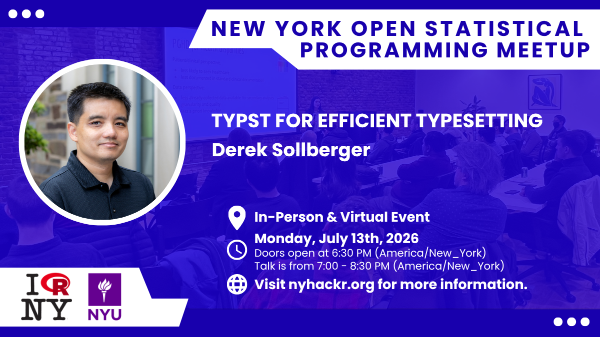

::::: {.panel-tabset}

## Learning Objectives

* Introduce Typst for typesetting
* Explore layouts
* Updates from the past year
* Reveal some works in progress

## Founders

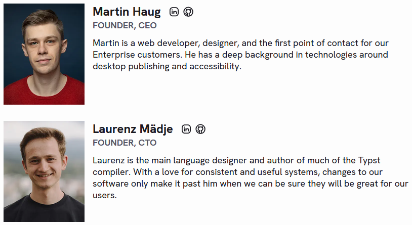

[Typst Team](https://typst.app/about/)

## Inspiration

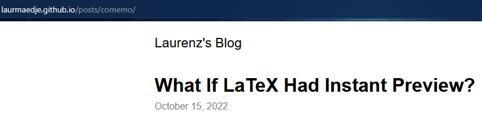

[Laurenz's blog post](https://laurmaedje.github.io/posts/comemo/)

## Pitch

* compile in milliseconds ([Rust](https://www.youtube.com/watch?v=yWWVhbyOWWE))
* data loading: XML, JSON, CSV
* accessible documents by default
* styling and layouts
* scripting language
* lightweight (about 40 MB)
* secure binary
* actively maintained

    * over 300 open-source volunteers
    
* integration: CLI, Rust library

    * [Typst blog](https://typst.app/blog/2025/automated-generation)

## Editors

* [Typst app](https://typst.app)
* [Quarto](https://quarto.org/docs/output-formats/typst.html)

  * [extensions](https://old.reddit.com/r/rstats/comments/1uru1t5/installing_quarto_typst_extensions_from_r_script/)
  * `system2("quarto", c("add", "mcanouil/quarto-highlight-text@2.3.0"))`
  * `quarto::quarto_add_extension(extension = "mcanouil/quarto-highlight-text@2.3.0")`

* [VS Code](https://marketplace.visualstudio.com/items?itemName=myriad-dreamin.tinymist)
* [Collabst](https://forum.typst.app/t/introducing-collabst-a-self-hosted-collaborative-workspace-for-typst/8856) collaboration

## Universe

* [Typst Universe](https://typst.app/universe/)
* [many packages](https://typst.app/universe/search/?kind=packages)

:::::


# Syntax

::::: {.panel-tabset}

## Markup

* [blank line for a paragraph break]

```
*strong face*
_emphasized text_
`verbatim text`
https://nyhackr.org/
```

## Organization

```
#set heading(numbering: "1.")
#set heading(numbering: "1.a")

= Header 1
== Header 2
=== Header 3

+ ordered
+ list

- unordered
- list

- nested
  - list
```

## Math

```
${x}_(i=1)^n$
$sin(alpha + beta x)$
$display(lim_(n arrow.r oo)) frac(1, 1 + n)$
$ sum_(k=0)^n k
    &= 1 + ... + n  && "definition of summation" \
    &= (n(n+1)) / 2 && "proved by induction"$
    
#let year = 2026
$#year > 42$
$ mat(..#range(1, 17).chunks(4)) $
#math.equation(
  alt: "output equals weights times inputs plus bias",
  block: true,
  $ y = wx + b $,
)
```

* [math symbols available](https://typst.app/docs/reference/symbols/sym/)

:::::


# Syllabus

::::: {.panel-tabset}

## Inspiration

Ever since Carlos Scheidegger's talk at `posit::conf(2023)`, I have wanted to try to use `Typst` to create a course syllabus. Over the past day, I have been aided by YouTube videos and the documentation on the Typst website to guide me into creating a fairly creative deliverable.  In this blog post, I wanted to elaborate on some design decision and jot down some Typst code just in case I try to teach these materials in the future.

## Splash

I should mention that for the past year, I have simply made straightforward syllabi in LaTex (via Overleaf).  I later learned that my university has a welcoming culture that encourages creativity in teaching. For the first page, I realized that I didn't need the official labels (course description, course learning outcomes) to appear immediately, so I relegated those to page two.  Instead, I found libraries in the `Typst Universe` that allowed me to make diagrams---with the markup language!

* `treet`: make file organization trees
* `fletcher`: one (of several) libraries that make flow charts.  I chose this one since the syntax was similar to `Mermaid`

I start out the syllabus with an orange `#block`, and containers in Typst still allow for markdown such as level-one headers.  I proceed with more headers.  Like Quarto markdown, syntax are treated as void tags (instead of needing to worry about opening and closing environments).

While Typst allows for creation of `columns`, the column settings tend to be too powerful as they pertain to all pages.  One could make exceptions here and there.

Instead, like the documentation implied, I quickly preferred to use the `#grid` function for the **layout**.

::::: {.panel-tabset}

### Main

### Tree

```
#text(black, tree-list(
  marker: text(rgb("f58025"))[├── ],
  last-marker: text(rgb("f58025"))[└── ],
  indent: text(rgb("f58025"))[│#h(1.5em)],
  empty-indent: h(2em),
)[
  - Machine Learning
    - Supervised Learning
      - Regression
        - Penalization
      - Classification
        - Decision Trees
        - Random Forests
          - Boosting
        - SVMs
          - Kernels
    - Unsupervised Learning
      - Clustering
      - KNN
  - Neural Networks
    - Perceptrons
    - Backpropagtion
    - Image Processing
    
  - Large Language Models
    - Text Tokenization
    - Prompt Engineering
    - Developer Tools
]
```


### Network

```
#diagram(
	node-stroke: .1em,
	node-fill: gradient.radial(rgb("f58025").lighten(80%), rgb("f58025"), center: (30%, 20%), radius: 60%),
	spacing: 4em,

 node((0.5,1), "S", radius: 1.5em),
 node((1.5,1), "M", radius: 1.5em),
 node((2.5,1), "L", radius: 1.5em),
 
 node((0.5,2), "3", radius: 1.5em),
 node((1.5,2), "0", radius: 1.5em),
 node((2.5,2), "1", radius: 1.5em),
 
 node((0,3), "F", radius: 1em),
 node((1,3), "A", radius: 1em),
 node((2,3), "L", radius: 1em),
 node((3,3), "L", radius: 1em),
 
	node((0,4), "2", radius: 1em),
 node((1,4), "0", radius: 1em),
 node((2,4), "2", radius: 1em),
 node((3,4), "5", radius: 1em),

 edge((0.5,1), (0.5, 2), "-|>"),
 edge((0.5,1), (1.5, 2), "-|>"),
 edge((0.5,1), (2.5, 2), "-|>"),
 edge((1.5,1), (0.5, 2), "-|>"),
 edge((1.5,1), (1.5, 2), "-|>"),
 edge((1.5,1), (2.5, 2), "-|>"),
 edge((2.5,1), (0.5, 2), "-|>"),
 edge((2.5,1), (1.5, 2), "-|>"),
 edge((2.5,1), (2.5, 2), "-|>"),

 edge((0.5,2), (0, 3), "-|>"),
 edge((0.5,2), (1, 3), "-|>"),
 edge((0.5,2), (2, 3), "-|>"),
 edge((0.5,2), (3, 3), "-|>"),
 edge((1.5,2), (0, 3), "-|>"),
 edge((1.5,2), (1, 3), "-|>"),
 edge((1.5,2), (2, 3), "-|>"),
 edge((1.5,2), (3, 3), "-|>"),
 edge((2.5,2), (0, 3), "-|>"),
 edge((2.5,2), (1, 3), "-|>"),
 edge((2.5,2), (2, 3), "-|>"),
 edge((2.5,2), (3, 3), "-|>"),

 edge((0,3), (0, 4), "-|>"),
 edge((0,3), (1, 4), "-|>"),
 edge((0,3), (2, 4), "-|>"),
 edge((0,3), (3, 4), "-|>"),
 edge((1,3), (0, 4), "-|>"),
 edge((1,3), (1, 4), "-|>"),
 edge((1,3), (2, 4), "-|>"),
 edge((1,3), (3, 4), "-|>"),
 edge((2,3), (0, 4), "-|>"),
 edge((2,3), (1, 4), "-|>"),
 edge((2,3), (2, 4), "-|>"),
 edge((2,3), (3, 4), "-|>"),
 edge((3,3), (0, 4), "-|>"),
 edge((3,3), (1, 4), "-|>"),
 edge((3,3), (2, 4), "-|>"),
 edge((3,3), (3, 4), "-|>"),
)
```


:::::

:::: {.columns}

::: {.column width="45%"}
```
#import "@preview/fletcher:0.5.8" as fletcher: diagram, node, edge
#import "@preview/showybox:2.0.4": showybox
#import "@preview/treet:1.0.0": *

#set page("us-letter") //thanks Europeans!
#set text(
  font: "New Computer Modern",
  size: 14pt
)

#set align(center)
#block(
  fill: rgb("f58025"),
  inset: 14pt,
  width: 100%,
  [= SML 301: Data Intelligence
= Modern Data Science Methods]
)

== Instructor: Derek Sollberger
=== (teacher email)

#set align(center)


#grid(
  columns: (1fr, 1fr),
  [== Post-Docs:

- person name (person email)
- person name (person email)],
  [== Teaching Assistants:

- person name (person email)
- person name (person email)
- person name (person email)
], [], [],
)

#set align(left+horizon)
#set text(
  font: "New Computer Modern",
  size: 12pt
)

#grid(
  columns: (1fr, 1fr),
  [
#text(black, tree-list(
  marker: text(rgb("f58025"))[├── ],
  last-marker: text(rgb("f58025"))[└── ],
  indent: text(rgb("f58025"))[│#h(1.5em)],
  empty-indent: h(2em),
)[...])
    
  ],
  [
#diagram(...)    
  ]
)
```
	
:::

::: {.column width="10%"}
	
:::

::: {.column width="45%"}
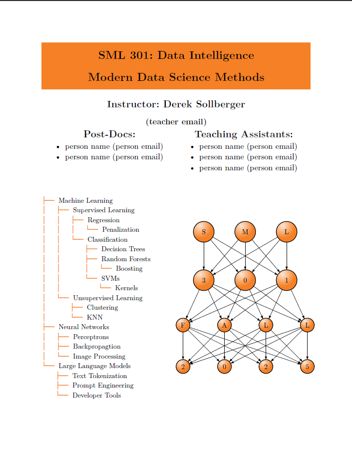
:::

::::


## Page 2

Now, we get to a page with a lot of text.  I deploy a `#grid` to create two columns.

* `columns: (1fr, 4fr)` computes that 20% of the width is allocated for the first column, and the remaining 80% is allocated for the second column
* `align: horizon` aligns the content of the grid boxes with the vertical midpoint.

I also increase the font size to fill out space right up to before when an additional page would have been necessary.

:::: {.columns}

::: {.column width="45%"}
```
#pagebreak()
// Course Description and CLOs
#set align(left)
#set text(
  font: "New Computer Modern",
  size: 14pt
)

#grid(
  align: horizon,
  columns: (1fr, 4fr),
  fill: (rgb("f58025"), none),
  gutter: 12pt,
  [],
  [== Course Description
  ...
  
  == Course Learning Outcomes
...

=== Prerequisites
...
]
)
```
	
:::

::: {.column width="10%"}
	
:::

::: {.column width="45%"}
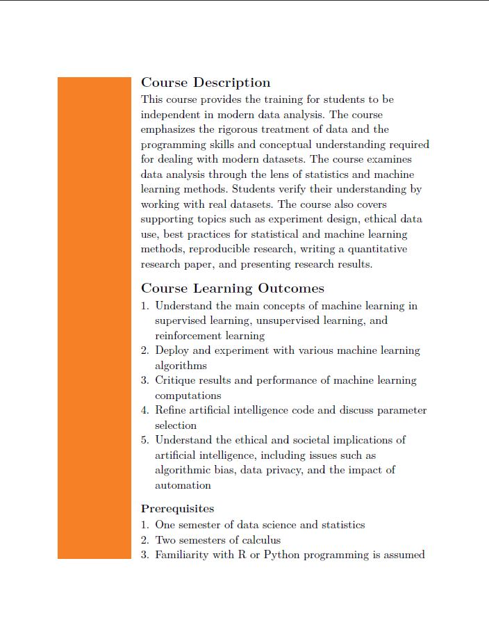
:::

::::


## Mosaic

For the course reading list, I wanted to show off and combine images of some of the several books that I have read in the past couple of years. I start out by making a `#grid` with 6 rows and 5 columns (i.e. 4x3 matrix of images, and then some padding). The `square()` function literally draws a square, and I used that to draft the layout.  Then, the `image()` function loads the images (where I have placed the images in an "image" subdirectory out of habit). Finally, I type out the book titles and authors in the padding for accessibility purposes. It is nice that text is automatically wrapped within grid cells.

:::: {.columns}

::: {.column width="45%"}
```
== Reading List
// Grid of Suggested Books
#set text(
  font: "New Computer Modern",
  size: 10pt
)

#grid(
  align: center+horizon,
  columns: (1fr, 1fr, 1fr, 1fr, 1fr),
  rows: (1fr, 1fr, 1fr, 1fr, 1fr, 1fr),
  square(fill: rgb("f58025")),
  [_Deep Learning Illustrated_ \ Jon Krohn et al],
  [_ISLP_ \ James, Witten, Hastie, Tibshirani, Taylor],
  [_ML Cookbook_ \ Gallatin, Albon],
  square(fill: rgb("f58025")),
  square(fill: rgb("f58025")),
  image("images/Deep_Learning_Illustrated.png"),
  image("images/ISLP.png"),
  image("images/Machine_Learning_Cookbook.png"),
  square(fill: rgb("f58025")),
  [_DL with Python_ \ Francois Chollet],
  image("images/Deep_Learning_with_Python.png"),
  image("images/Hands_On_LLMs.png"),
  image("images/Statquest_Neural_Networks.png"),
  [_StatQuest AI_ \ Josh Starmer],
  [_Probabilistic ML_ \ Kevin P Murphy],
  image("images/PML.png"),
  image("images/Programmers_Brain.png"),
  image("images/Why_Machines_Learn.png"),
  [_Why Machines Learn_ \ Anil Ananthaswamy],
  [_Co-Intelligence_ \ Ethan Mollick],
  image("images/Co_Intelligence.png"),
  image("images/How_Data_Happened.png"),
  image("images/Weapons_of_Math_Destruction.png"),
  [_Weapons of Math Destruction_ \ Cathy O'Neil],
  square(fill: rgb("f58025")),
  [_Hands-On LLMs_ \ Allammar, Grootendorst],
  [_How Data Happened_ \ Wiggins, Jones],
  [_Programmer's Brain_ \ Felienne Hermans],
  square(fill: rgb("f58025")),
)
```
	
:::

::: {.column width="10%"}
	
:::

::: {.column width="45%"}
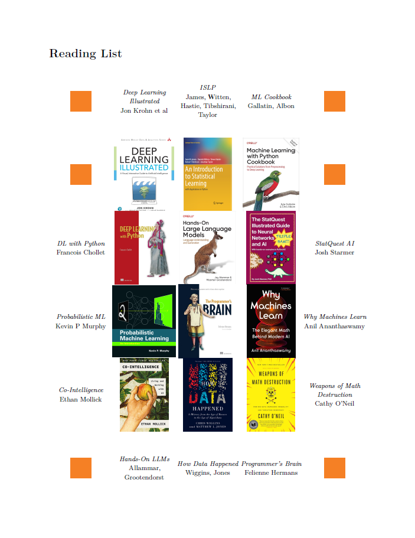
:::

::::


## Table

What finally sold me on Typst was the notion that I would not need "yet another markdown language" for making tables.  In fact, Typst is more than a markup language.  Here, we literally `#let` a data file exist as an object in a variable name, and then print the variable with a `for` loop.

For further appeal, if need be, the tables

* can be rotated (say, to landscape mode)
* can be set to automatically split themselves across pages `#show figure: set block(breakable: true)`

:::: {.columns}

::: {.column width="45%"}
```
== Lecture Schedule
// Table of Lecture Sessions (one column)

#set text(
  font: "New Computer Modern",
  size: 10pt
)

//load schedule data
#let lecture_schedule = csv("SML_301_Fall_2025_lecture_schedule.csv", row-type: array).slice(2)

//header row bold
#show table.cell.where(y: 0): set text(weight: "bold")

//allow table to be split across pages!
#show figure: set block(breakable: true)

//main table code
#table(
  align: center,
  columns: 7,
  table.header[Week][Date][Topic][Python][Matplotlib][Precept][Projects],
  ..for(.., Week, Date, Topic, Python, Matplotlib, Precept, Projects) in lecture_schedule{
    (Week, Date, Topic, Python, Matplotlib, Precept, Projects)
  },
  fill: (none, none, rgb("f58025"), none, none, none, rgb("f58025")),
)
```
	
:::

::: {.column width="10%"}
	
:::

::: {.column width="45%"}
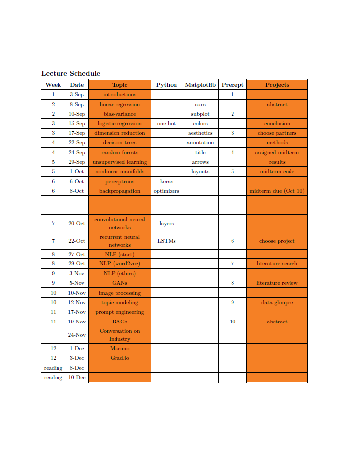
:::

::::


## Page 5

You may have noticed that I reduced the font size for materials that are of less importance to the reader.  That is, there are some sections that I do not need students to read right away, but at the same time I want to assure them that these matters are available in the syllabus.

:::: {.columns}

::: {.column width="45%"}
```
#set text(
  font: "New Computer Modern",
  size: 10pt
)

#grid(
  align: horizon,
  columns: (1fr, 4fr),
  fill: (rgb("f58025"), none),
  gutter: 12pt,
  [],
  [= Class Policies
- Lecture sections: ...
- Precepts ...
- Late policy: ...
- Computers: ...
- Special Accommodations:  ...
- Academic Integrity: ...
],
)

```
	
:::

::: {.column width="10%"}
	
:::

::: {.column width="45%"}
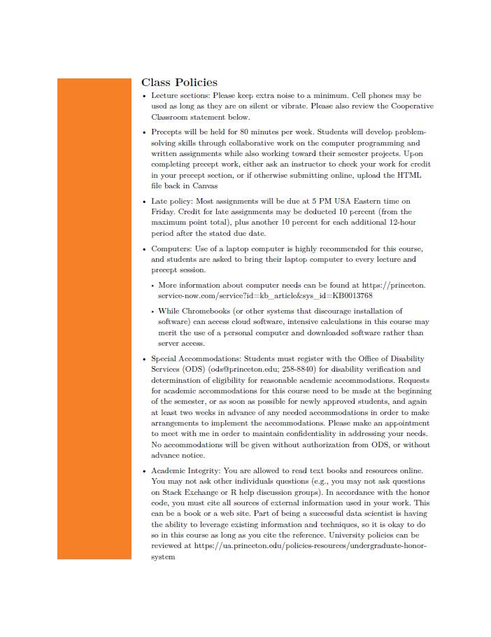
:::

::::

## Take Home

In contrast, there are some unique materials in my syllabi.  In Quarto, I love using `callout` boxes (as they remind me of textbooks from when I was a student).  Here in the Typst Universe, the `showybox` library is the analogue.  I quickly adapt its syntax while also being mindful of colors and readability.

Also, `footnote()` is still as convenient as its LaTeX counterpart.

:::: {.columns}

::: {.column width="45%"}
```
#showybox(...)

#showybox(...)

#showybox(
  frame: (
    //border-color: red.darken(50%),
    title-color: rgb("f58025"),
    body-color: rgb("f58025")
  ),
  title-style: (
    color: black,
    weight: "bold",
    align: center
  ),
  shadow: (
    offset: 5pt,
  ),
  title: "Typst",
  [This syllabus document was created with Typst!
  https://typst.app
  ], 
)
```
	
:::

::: {.column width="10%"}
	
:::

::: {.column width="45%"}
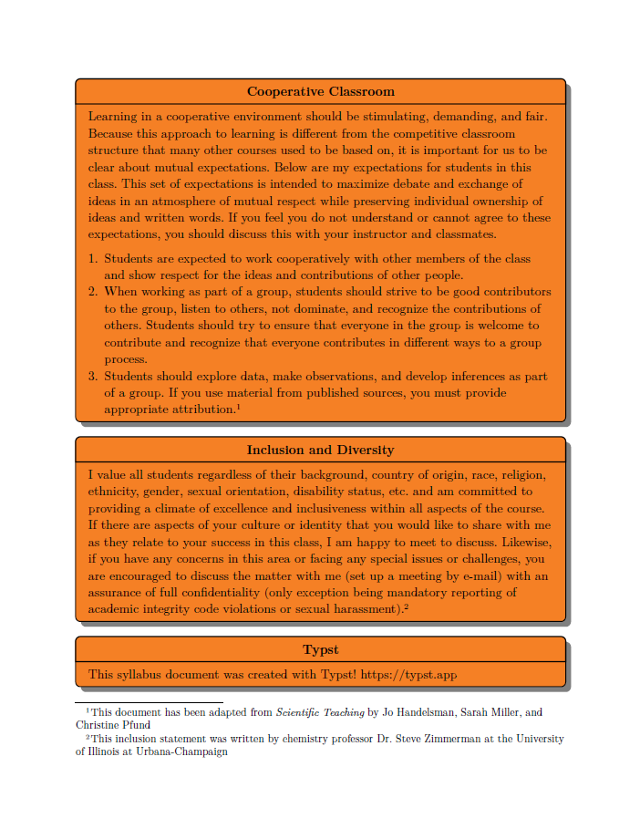
:::

::::

:::::


# Recent Patches

## Accessibility

:::: {.columns}

::: {.column width="45%"}
```
#figure(
  stack(
    dir: ltr,
    spacing: 0.5em,
    rect[Tagged PDF],
    text(2em, sym.arrow.long),
    rect[Accessibility],
  ),
  alt: "Diagram with two rectangles. The first is labelled 'Tagged PDF'. An arrow points to the second, labelled 'Accessibility'",
  caption: [
    Tags enable PDF accessibility
  ],
)
```
:::

::: {.column width="10%"}
	
:::

::: {.column width="45%"}


* image source: [Typst blog](https://typst.app/blog/2025/typst-0.14)
:::

::::

## PDFs standards

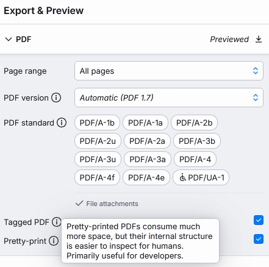

* image source: [Typst app](https://typst.app/blog/2025/typst-0.14)
* Patch 0.15: *multiple* PDF standards simultaneously

## PDFs as Images

:::: {.columns}

::: {.column width="45%"}
```
#figure(
  image(
    "world_cup_semis.pdf",
    alt: "Semi final bracket for World Cup 2026: France, Spain, England, Argentina"
  ),
  caption: [
    Semi-final bracket for World Cup 2026: France, Spain, England, Argentina
  ],
)
```
:::

::: {.column width="10%"}
	
:::

::: {.column width="45%"}


* image source: [NY Times](https://www.nytimes.com/athletic/7425134/2026/07/09/france-morocco-world-cup-result-mbappe-dembele/)
:::

::::

## Character-Level Justification

:::: {.columns}

::: {.column width="45%"}
```
#set par(
  justify: true,
  leading: 0.50em,
)
#lorem(256)
```
:::

::: {.column width="10%"}
	
:::

::: {.column width="45%"}
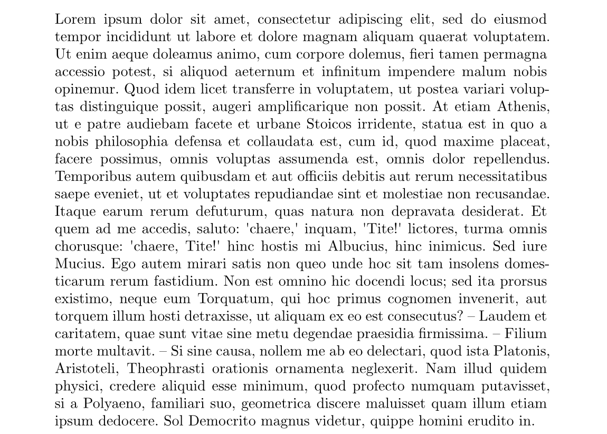
:::

::::

> Typst uses the same fundamental algorithm as LaTeX does to optimize paragraphs ... as character-level justification is a feature that LaTeX does **not** support.

* [Typst blog](https://typst.app/blog/2025/typst-0.14)

## Variable Fonts

:::: {.columns}

::: {.column width="45%"}
```
#set text(font: "Lora")

#for weight in range(
  400,
  700,
  step: 50,
  inclusive: true,
) [
  #text(weight: weight)[All this has happened before,]
  \
]
```
:::

::: {.column width="10%"}
	
:::

::: {.column width="45%"}
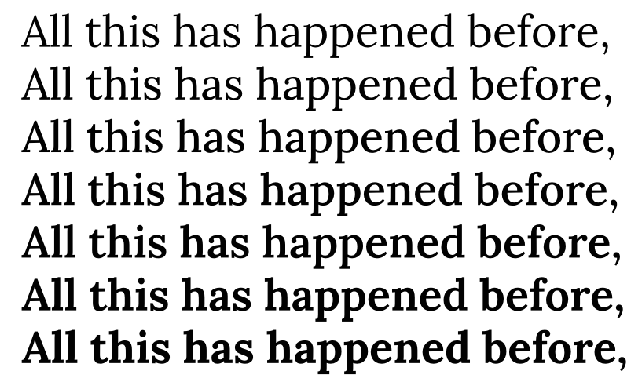
:::

::::

* remember to mouseover the `text(font: "Lora")` setting to see available variations through a tooltip

::: {.callout-tip collapse="true"}
## MathML

native support for equations with MathML

* selectable text
* screen readers
* high resolution for browsers
:::

::: {.callout-warning collapse="true"}
## Bundle Export

* experimental (beta)

```
#document("index.html", title: [Home])[
  #title()
  #link(<blog>)[Go to blog]
]

#document("blog.html", title: [Blog])[
  #title()
  Welcome to my blog!
] <blog>

#asset("robots.txt", "Disallow: *")
```

* [Typst blog](https://typst.app/blog/2026/typst-0.15)

:::

::: {.callout-note collapse="true"}
## Multiple Bibliographies

* by-*chapter* bibliographies
* by-*topic* bibliographies
:::


# Works in Progress

## Flash Cards

::::: {.panel-tabset}

### code

:::: {.columns}

::: {.column width="45%"}
```
#set text(
  font: "New Computer Modern",
  size: 36pt
)
#set page(paper: "us-letter", 
          margin: (x: 1cm, y: 1cm), )
#set align(center+horizon)

#grid(
  columns: (1fr, 1fr, 1fr),
  rows: (1fr, 1fr, 1fr),
  [Dwight \ Schrute],
  [Creed \ Bratton],
  [Angela \ Kinsey],
  [Meredith \ Palmer],
  [Jim \ Halpert],
  [Kevin \ Malone],
  [Stanley \ Hudson],
  [Phyllis \ Vance],
  [Pam \ Beesley],
)
```
:::

::: {.column width="10%"}
	
:::

::: {.column width="45%"}
```
#set align(center+horizon)
#grid(
  columns: (1fr, 1fr, 1fr),
  rows: (1fr, 1fr, 1fr),
  gutter: 5pt,
  [#image("angela_kinsey.png")],
  [#image("creed_bratton.png")],
  [#image("dwight_schrute.png")],
  [#image("kevin_malone.png")],
  [#image("jim_halpert.png")],
  [#image("meredith_palmer.png")],
  [#image("pam_beesley.png")],
  [#image("phyllis_vance.png")],
  [#image("stanley_hudson.png")],
)
```
:::

::::

### names

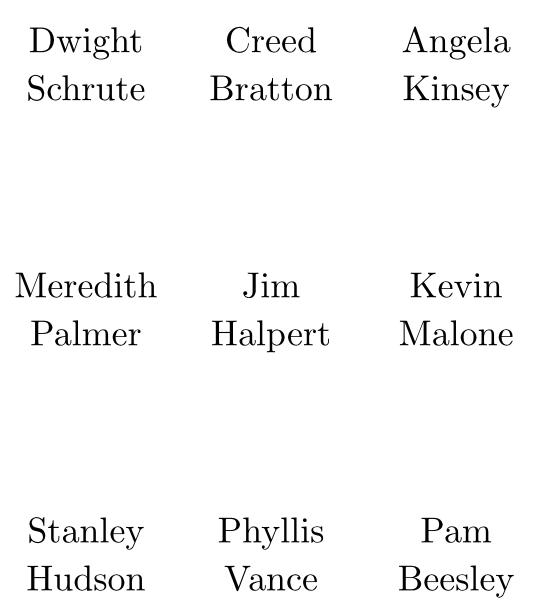

### pictures

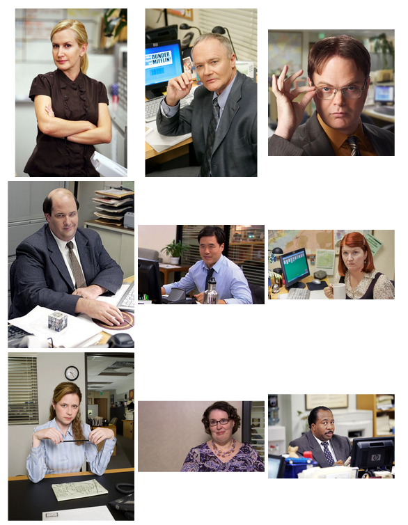

:::::

## MCQ Organizer

::::: {.panel-tabset}

### Typst

:::: {.columns}

::: {.column width="45%"}
```
#set enum(numbering: "1).A)")

+ Which employee is known for his chili?
  + Kevin Malone
  + Creed Bratton
  + Ryan Howard
  + Andy Bernard
  + Darryl Philbin

+ Which employee is known for his "thoughts" blog?
  + Creed Bratton
  + Kevin Malone
  + Ryan Malone
  + Andy Bernard
  + Darryl Philbin
  
#let mcq_example = csv("mcq_example.csv")

#show table.cell.where(y: 0): set text(weight: "bold")

#rotate(
  -90deg,
  reflow: true,
table(
  align: center,
  columns: 6,
  //table.header[Question][Correct][Alt2][Alt3][Alt4][Alt5],
  ..for(.., Question, Correct, alt2, alt3, alt4, alt5) in mcq_example{
    (Question, Correct, alt2, alt3, alt4, alt5)
  },
  fill: (rgb("f58025"), rgb("f58025"), none, none , none, none),
)
)
```
:::

::: {.column width="10%"}
	
:::

::: {.column width="45%"}
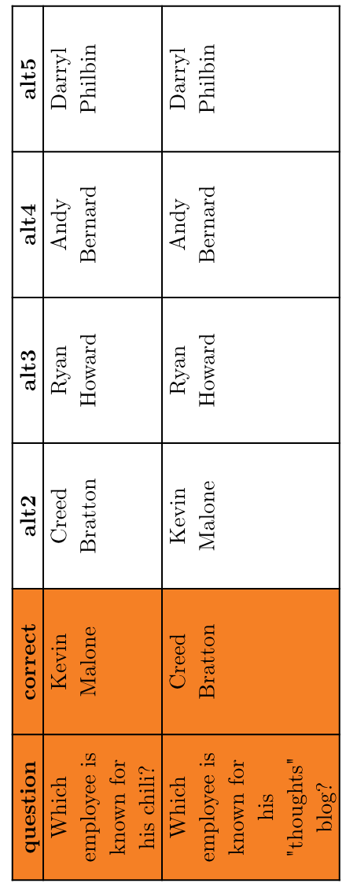
:::

::::

### Workflow

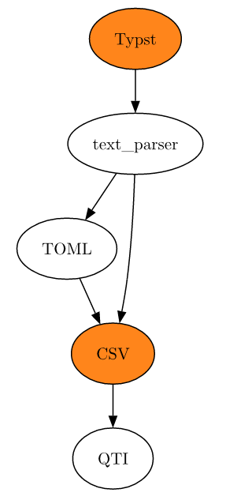

:::::

## Interactive Machine Learning

### Ridge Regression

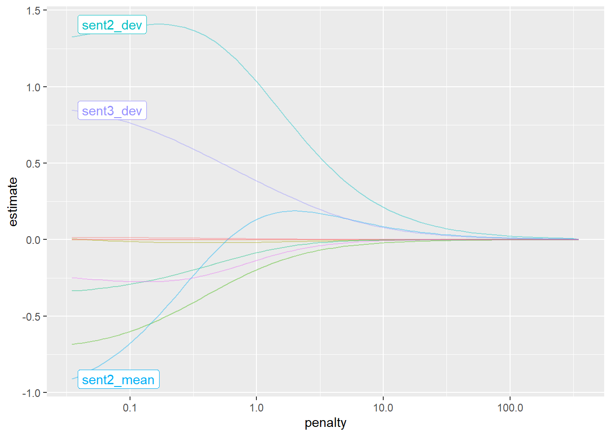

* $\lambda = 0.1:$

$$\hat{y} = 7.550 - 0.292X_{1} - 0.678X_{2} - 0.274X_{3}$$

* $\lambda = 1.0:$

$$\hat{y} = 7.840 - 0.085X_{1} + 0.132X_{2} - 0.135X_{3}$$

* **Typst** and *Marimo*?


## Music Notes

::::: {.panel-tabset}

### staves

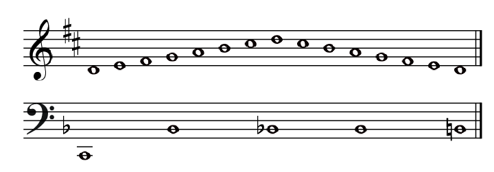

### tabs

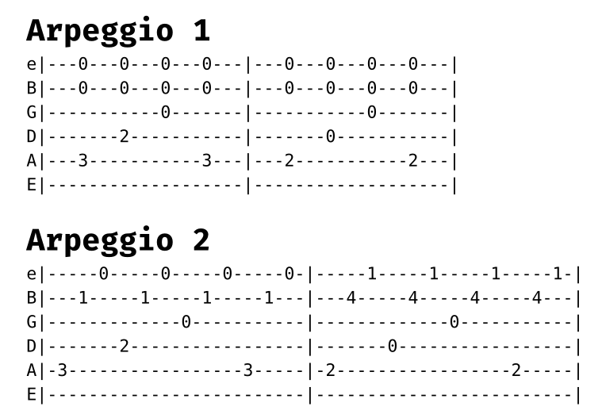

### chordx

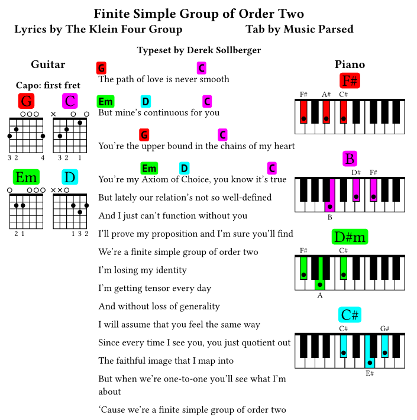

:::::

## Causal Graphs

Using the `autograph` package in Typst

::::: {.panel-tabset}

### Case Study

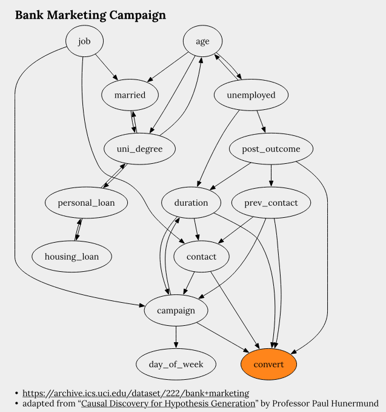

### Chain

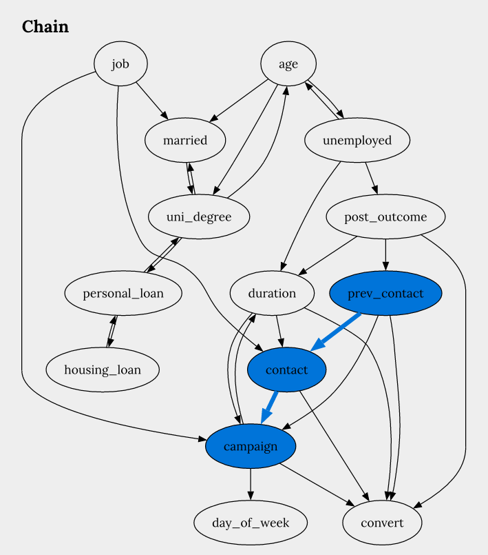

### Confounder

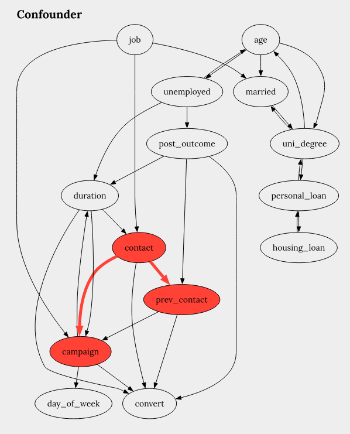

### Collider

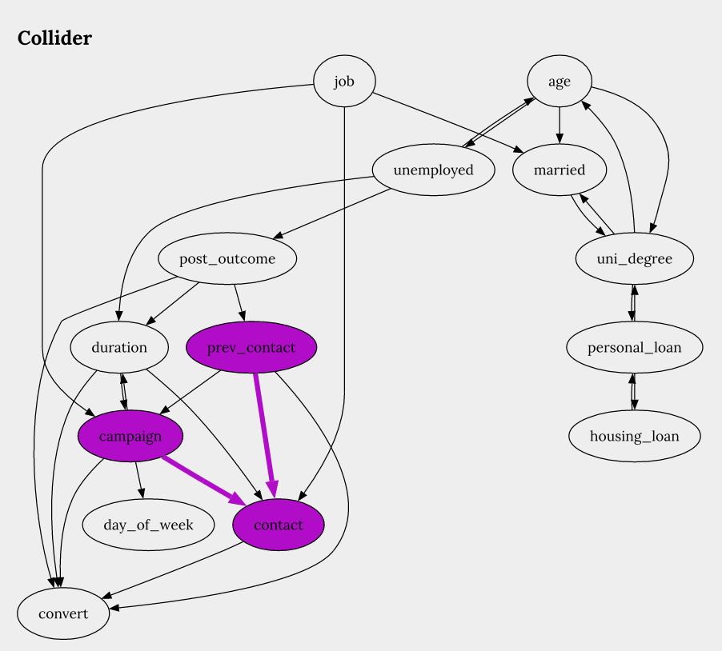

:::::


## Evidence of Attention

::::: {.panel-tabset}

### Attention

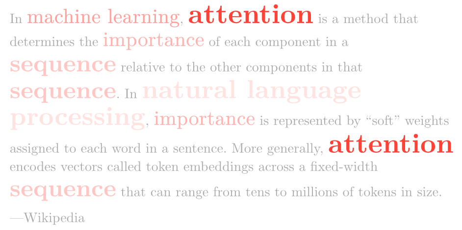

### Typst

```
#set text(fill: rgb("#AAAAAA"),
weight: 400)

In #text(fill: red.lighten(50%), size: 1.5em, weight: 500)[machine learning], #text(fill: red, size: 2.0em, weight: 700)[attention] is a method that determines the #text(fill: red.lighten(60%), size: 1.5em, weight: 550)[importance] of each component in a #text(fill: red.lighten(70%), size: 1.75em, weight: 600)[sequence] relative to the other components in that #text(fill: red.lighten(70%), size: 1.75em, weight: 600)[sequence]. In #text(fill: red.lighten(85%), size: 1.9em, weight: 650)[natural language processing], #text(fill: red.lighten(60%), size: 1.5em, weight: 550)[importance] is represented by "soft" weights assigned to each word in a sentence. More generally, #text(fill: red, size: 2.0em, weight: 700)[attention] encodes vectors called token embeddings across a fixed-width #text(fill: red.lighten(70%), size: 1.75em, weight: 600)[sequence] that can range from tens to millions of tokens in size.

---Wikipedia
```

:::::

* color gradients
* variable fonts
* scripting language
* in interactive production?

# Coda

::::: {.panel-tabset}

## Improvement

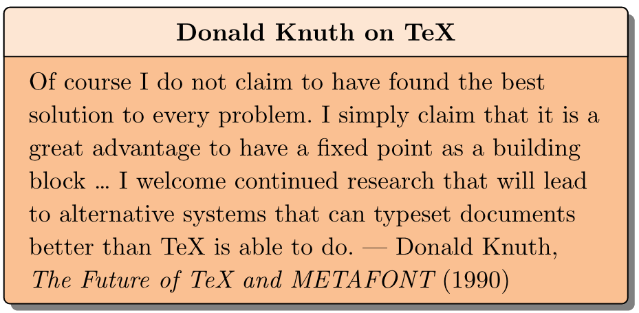

* quote source: [Y Combinator](https://news.ycombinator.com/item?id=15733381)

## Thanks


:::::

::: {.callout-note collapse="true"}
## Session Info

```{r}
sessionInfo()
```
:::


:::: {.columns}

::: {.column width="45%"}
	
:::

::: {.column width="10%"}
	
:::

::: {.column width="45%"}

:::

::::

::::: {.panel-tabset}


:::::